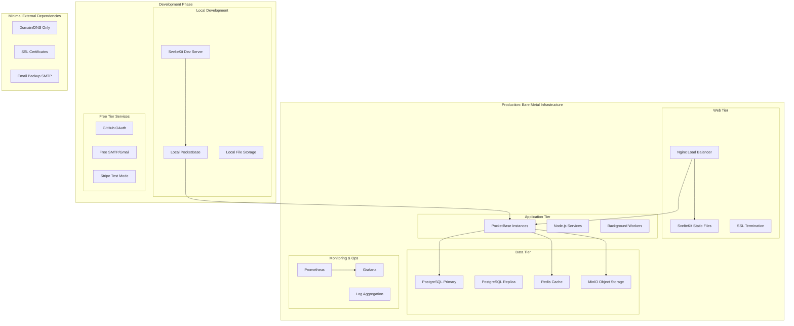
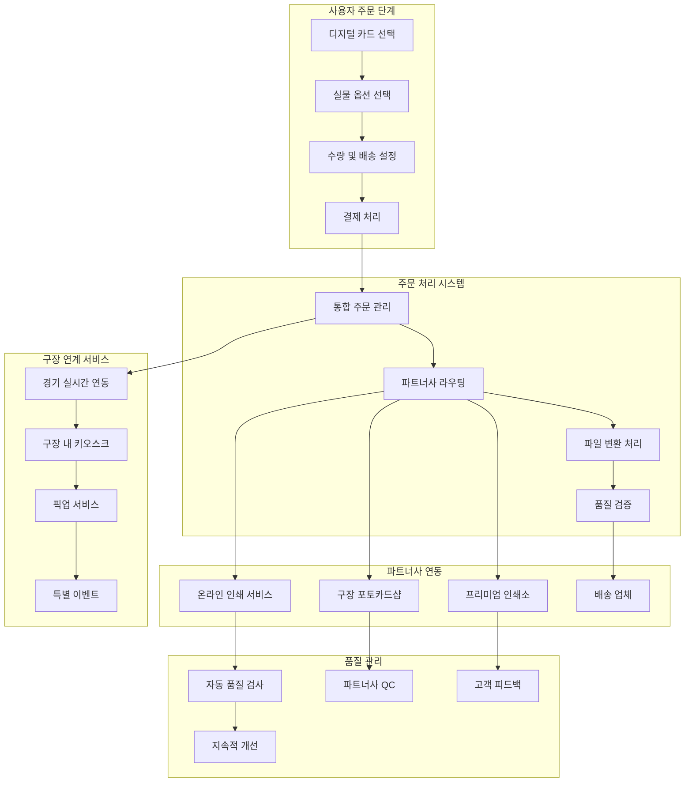
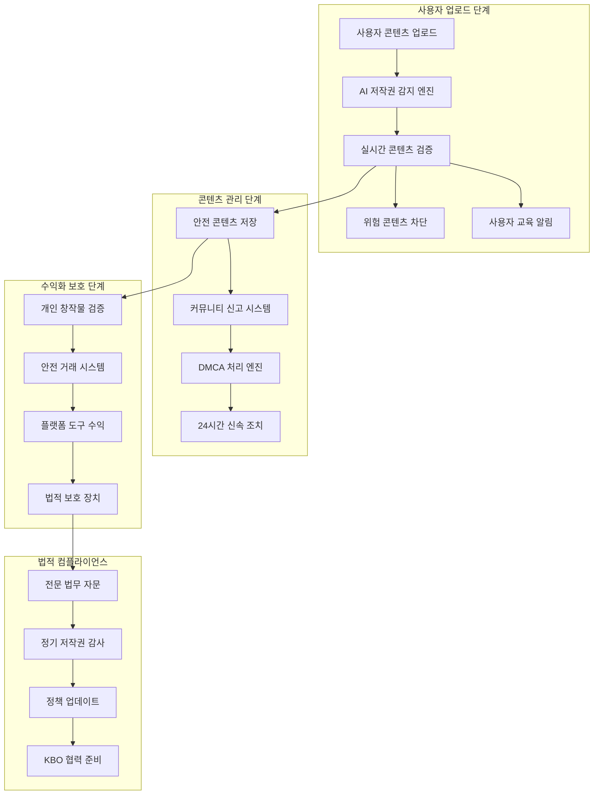

# Design Document

## Overview

홀로그래픽 효과 야구 카드 갤러리 커뮤니케이션 서비스는 **Civitai.com의 AI 아트 커뮤니티 모델**을 KBO 홀로그래픽 카드 문화에 적용한 혁신적인 플랫폼입니다. 사용자들이 자신만의 디지털 홀로그래픽 카드를 제작하고, 템플릿을 공유하며, 커뮤니티와 상호작용할 수 있는 종합적인 창작자 생태계를 구축합니다. **Apple 수준의 시각적 디자인 품질**과 **Civitai 스타일의 커뮤니티 기능**을 결합하여, 야구팬들에게 감동적인 디지털 경험을 제공합니다.

### Civitai-Inspired Core Features

#### 1. 템플릿 & 모델 공유 시스템 (저작권 안전)
- **개인 창작 템플릿**: 사용자 직접 제작 홀로그래픽 카드 템플릿만 공유
- **버전 관리**: 개인 창작물의 업데이트와 개선사항 추적
- **안전 라이선스**: Creative Commons, 개인 창작물 한정 라이선스
- **창작 계보 추적**: 팬아트 기반 파생 작품들의 합법적 계보 관리

#### 2. 커뮤니티 중심 평가 시스템
- **다차원 평점**: 창의성, 기술력, 완성도, 독창성 개별 평가
- **건설적 리뷰**: 저작권 준수 범위 내 개선 제안
- **크리에이터 평판**: 합법적 창작 활동 기반 신뢰도 시스템
- **안전 콘텐츠 큐레이션**: 저작권 검증된 우수 작품만 선별

#### 3. 소셜 네트워킹 & 발견 시스템
- **팔로우 시스템**: 합법적 창작자 팔로우 및 피드 구독
- **AI 추천 엔진**: 저작권 안전 콘텐츠 기반 맞춤 추천
- **트렌딩 시스템**: 검증된 콘텐츠만 Featured, Hot, New 분류
- **안전 태그 탐색**: 저작권 위험 없는 태그와 필터링

#### 4. 법적 안전 창작자 생태계
- **안전 수익화**: 개인 창작물, 플랫폼 도구, 교육 서비스만 수익화
- **크리에이터 등급**: 저작권 준수 기반 Bronze → Diamond 등급
- **합법 멘토링**: 저작권 교육 포함 신규 사용자 지원
- **법적 보호 혜택**: 저작권 준수 크리에이터 대상 법적 지원

#### 5. 저작권 보호 핵심 시스템
- **AI 저작권 감지**: KBO/구단 로고, 공식 콘텐츠 자동 차단
- **DMCA 준수**: 24시간 신속 신고 처리 시스템
- **사용자 교육**: 지속적인 저작권 인식 개선 프로그램
- **법적 컴플라이언스**: 전문 법무 자문 및 정기 감사

## Architecture

### Bare Metal Self-Hosted Architecture



### Bare Metal Self-Hosted Technology Stack

#### Development Environment (로컬 개발)
**Frontend**
- **Framework**: SvelteKit with TypeScript
- **Styling**: CSS3 (Advanced Holographic Effects), Tailwind CSS
- **State Management**: Svelte Stores, Svelte Spring (Physics)
- **Image Processing**: Canvas API, WebGL for effects
- **Dev Server**: Vite dev server with HMR

**Backend (로컬 개발)**
- **Primary Backend**: PocketBase (단일 바이너리)
- **Database**: SQLite (개발용)
- **Authentication**: GitHub OAuth (무료)
- **File Storage**: 로컬 파일 시스템
- **Email**: Gmail SMTP (무료 한도)

#### Production Environment (베어메탈 서버)
**Web Tier**
- **Reverse Proxy**: Nginx with SSL termination
- **Static Assets**: SvelteKit static build
- **CDN**: Nginx caching + gzip compression
- **SSL**: Let's Encrypt (무료 인증서)

**Application Tier**
- **Backend**: PocketBase with PostgreSQL
- **Real-time**: PocketBase built-in WebSocket
- **Background Jobs**: PocketBase hooks + cron jobs
- **Image Processing**: Sharp.js integration

**Data Tier**
- **Primary Database**: PostgreSQL 15+
- **Cache**: Redis (세션, 캐시)
- **File Storage**: MinIO (S3-compatible)
- **Backup**: pg_dump + rsync to external storage

**Monitoring & Operations**
- **Monitoring**: Prometheus + Grafana
- **Logging**: systemd journal + logrotate
- **Process Management**: systemd services
- **Backup**: Automated scripts with retention policy

### Physical Card Production & Partnership Architecture

#### 실물 카드 제작 시스템 아키텍처


#### 파트너십 통합 기술 스택
```typescript
interface PartnershipTechStack {
  // 인쇄 서비스 API 통합
  printingAPIs: {
    printful: {
      endpoint: "https://api.printful.com/",
      features: ["제품 카탈로그", "주문 생성", "배송 추적"],
      authentication: "Bearer Token",
      rateLimit: "120 requests/minute"
    },
    snaps: {
      endpoint: "https://api.snaps.com/",
      features: ["한국 특화 서비스", "당일 배송", "모바일 최적화"],
      authentication: "API Key",
      rateLimit: "100 requests/minute"
    },
    vistaprint: {
      endpoint: "https://api.vistaprint.com/",
      features: ["대량 인쇄", "비즈니스 카드", "글로벌 배송"],
      authentication: "OAuth 2.0",
      rateLimit: "200 requests/minute"
    }
  },
  
  // 구장 파트너 시스템
  stadiumPartners: {
    jamsilCardShop: {
      location: "잠실야구장 내",
      services: ["즉석 인쇄", "픽업 서비스", "사인회 연계"],
      integration: "Custom API",
      operatingHours: "경기일 기준 운영"
    },
    gocheokCardShop: {
      location: "고척스카이돔 내",
      services: ["키움 특화", "팬존 키오스크"],
      integration: "Custom API",
      operatingHours: "경기일 + 평일 운영"
    }
  },
  
  // 품질 관리 시스템
  qualityManagement: {
    fileProcessing: {
      colorConversion: "RGB → CMYK 자동 변환",
      resolutionUpscale: "AI 기반 해상도 향상",
      bleedAreaGeneration: "재단선 자동 생성",
      printabilityCheck: "인쇄 적합성 검증"
    },
    
    qualityAssurance: {
      partnerAudit: "파트너사 정기 품질 감사",
      sampleTesting: "무작위 샘플 품질 테스트",
      customerFeedback: "고객 만족도 추적",
      defectTracking: "불량률 모니터링"
    }
  }
}
```

### Legal Compliance & Copyright Protection Architecture

#### 저작권 보호 시스템 아키텍처


#### 저작권 보호 기술 스택
```typescript
interface CopyrightProtectionStack {
  // AI 기반 콘텐츠 감지
  aiDetection: {
    logoRecognition: "KBO/구단 로고 자동 감지",
    imageMatching: "공식 사진 유사도 검사",
    watermarkDetection: "워터마크 및 저작권 표시 인식",
    audioFingerprinting: "저작권 음악 자동 감지"
  },
  
  // 실시간 콘텐츠 필터링
  contentFiltering: {
    uploadBlocking: "위험 콘텐츠 업로드 차단",
    userWarning: "저작권 위험 실시간 경고",
    educationalPrompt: "안전한 대안 제안",
    guidanceSystem: "단계별 저작권 가이드"
  },
  
  // DMCA 준수 시스템
  dmcaCompliance: {
    reportingAPI: "24시간 신고 접수 API",
    autoTakedown: "자동 콘텐츠 삭제 시스템",
    userNotification: "즉시 사용자 통지",
    appealProcess: "이의 제기 처리 워크플로우"
  },
  
  // 안전한 수익화 시스템
  safeMonetization: {
    creatorVerification: "개인 창작물 검증 시스템",
    platformRevenue: "플랫폼 도구 수익 관리",
    legalProtection: "거래 법적 보호 장치",
    transparentAccounting: "투명한 수익 정산"
  }
}
```

#### 법적 안전 데이터 모델
```typescript
interface LegalSafeDataModel {
  // 사용자 콘텐츠 (저작권 안전)
  userContent: {
    personalPhotos: "개인 직관 사진",
    fanArt: "사용자 직접 창작 일러스트",
    personalStories: "개인 야구 추억 스토리",
    originalTemplates: "개인 제작 카드 템플릿"
  },
  
  // 공개 데이터 (합법적 이용)
  publicData: {
    playerStats: "공개된 선수 통계",
    gameResults: "언론 보도 경기 결과",
    historicalRecords: "공개 역사 기록",
    newsArticles: "언론 기사 (출처 명시)"
  },
  
  // 금지 콘텐츠 (저작권 위험)
  prohibitedContent: {
    officialLogos: "KBO/구단 공식 로고",
    broadcastFootage: "방송 영상 캡처",
    officialPhotos: "구단/선수 공식 사진",
    copyrightedMusic: "저작권 보호 음악"
  }
}
```

### Self-Hosted Service Architecture

#### Core Services Stack
```typescript
// 베어메탈 서버 서비스 구성
interface SelfHostedServices {
  webServer: NginxConfig
  application: PocketBaseConfig
  database: PostgreSQLConfig
  cache: RedisConfig
  storage: MinIOConfig
  monitoring: PrometheusConfig
}

// CSP (Content Security Policy) 보안 강화
interface SecurityConfig {
  csp: {
    // 인라인 스크립트 금지로 XSS 방지
    scriptSrc: "'self'",
    styleSrc: "'self' 'unsafe-inline'",
    imgSrc: "'self' data: https:",
    connectSrc: "'self' wss:",
    fontSrc: "'self' https://fonts.gstatic.com",
    // 외부 리소스 제한
    defaultSrc: "'self'"
  },
  // SvelteKit 컴포넌트 기반 스크립트 관리
  scriptManagement: {
    // 모든 JavaScript를 Svelte 컴포넌트 내에서 실행
    inlineScripts: false,
    externalScripts: false,
    componentBasedLogic: true
  }
}

const productionConfig: SelfHostedServices = {
  webServer: {
    port: 80,
    sslPort: 443,
    staticPath: '/var/www/holographic-cards',
    proxyPass: 'http://localhost:8090'
  },
  application: {
    port: 8090,
    database: 'postgresql://localhost:5432/holographic_cards',
    filesDir: '/var/lib/pocketbase/files',
    hooksDir: '/var/lib/pocketbase/hooks'
  },
  database: {
    port: 5432,
    dataDir: '/var/lib/postgresql/data',
    maxConnections: 100,
    sharedBuffers: '256MB'
  },
  cache: {
    port: 6379,
    maxMemory: '512MB',
    persistence: 'rdb'
  },
  storage: {
    port: 9000,
    dataDir: '/var/lib/minio/data',
    buckets: ['holographic-cards', 'user-avatars']
  }
}
```

#### Authentication Strategy
```typescript
// 최소 비용 인증 전략 + 보안 강화
interface AuthConfig {
  primary: 'github-oauth'  // 무료
  fallback: 'email-password'  // PocketBase 내장
  smtp: {
    host: 'smtp.gmail.com'  // Gmail 무료 한도 활용
    port: 587
    user: 'your-gmail@gmail.com'
    dailyLimit: 500  // Gmail 무료 한도
  },
  // SvelteKit 컴포넌트 기반 초기화
  initialization: {
    // AppInit.svelte 컴포넌트로 테마/성능 관리
    componentBased: true,
    // CSP 준수를 위한 외부 스크립트 제거
    inlineScripts: false,
    // 브라우저 호환성 보장
    fallbackSupport: true
  }
}

// OAuth 설정 (무료 서비스 활용)
const oauthProviders = {
  github: {
    clientId: process.env.GITHUB_CLIENT_ID,
    clientSecret: process.env.GITHUB_CLIENT_SECRET,
    cost: 0  // 완전 무료
  },
  google: {
    clientId: process.env.GOOGLE_CLIENT_ID,
    clientSecret: process.env.GOOGLE_CLIENT_SECRET,
    cost: 0  // 무료 한도 내
  }
}
```

#### File Storage & CDN
```typescript
// 자체 호스팅 파일 관리
class SelfHostedStorage {
  private minioClient: MinIO.Client
  private nginxCacheDir = '/var/cache/nginx/holographic-cards'
  
  async uploadFile(file: File, path: string): Promise<string> {
    // MinIO에 파일 업로드
    await this.minioClient.putObject('holographic-cards', path, file)
    
    // Nginx 캐시 무효화
    await this.invalidateNginxCache(path)
    
    return `https://your-domain.com/files/${path}`
  }
  
  async optimizeImage(file: File): Promise<Buffer> {
    // Sharp.js로 이미지 최적화 (서버 내에서 처리)
    return sharp(file)
      .resize(660, 921, { fit: 'cover' })
      .webp({ quality: 85 })
      .toBuffer()
  }
}
```

### Cost Structure (베어메탈 기준)

#### 개발 단계 (무료)
- **도메인**: $10-15/년 (필수)
- **SSL 인증서**: $0 (Let's Encrypt)
- **OAuth**: $0 (GitHub/Google 무료)
- **이메일**: $0 (Gmail 무료 한도)
- **개발 도구**: $0 (오픈소스)
- **총 비용**: ~$15/년

#### 운영 단계 (최소 비용)
- **도메인**: $10-15/년
- **SSL 인증서**: $0 (Let's Encrypt 자동 갱신)
- **전력/인터넷**: 기존 인프라 활용
- **백업 스토리지**: $5-10/월 (외부 백업용)
- **모니터링**: $0 (자체 호스팅)
- **총 비용**: ~$75-135/년 ($6-11/월)

#### 확장 시 추가 비용
- **CDN**: Cloudflare 무료 플랜 활용
- **이메일**: Gmail → 자체 SMTP 서버 구축
- **결제**: Stripe (거래 수수료만)
- **인쇄**: 주문 시에만 비용 발생

### Deployment Strategy

#### 단계별 배포 계획
```bash
# Phase 1: 로컬 개발 환경
npm create svelte@latest holographic-cards
cd holographic-cards
npm install
# PocketBase 다운로드 및 실행
./pocketbase serve

# Phase 2: 베어메탈 서버 배포
# Docker 없이 직접 설치로 리소스 절약
sudo apt update && sudo apt install -y nginx postgresql redis-server
# PocketBase 바이너리 배포
# 정적 파일 빌드 및 배포
npm run build
sudo cp -r build/* /var/www/holographic-cards/

# Phase 3: 모니터링 및 백업 설정
# Prometheus + Grafana 설치
# 자동 백업 스크립트 설정
```

이제 베어메탈 인프라를 최대한 활용하면서 비용을 최소화하는 현실적인 아키텍처가 완성되었습니다!

## Backend-as-a-Service Integration

### PocketBase Configuration

#### Collections Schema
```javascript
// PocketBase Collections 정의
const collections = {
  users: {
    fields: {
      username: 'text',
      displayName: 'text', 
      avatar: 'file',
      grade: 'select',
      bio: 'text',
      stats: 'json',
      preferences: 'json'
    },
    auth: true,
    oauth2: ['google', 'github']
  },
  
  cards: {
    fields: {
      title: 'text',
      description: 'text',
      image: 'file',
      holographicEffect: 'json',
      elements: 'json',
      isPublic: 'bool',
      tags: 'relation',
      userId: 'relation'
    },
    indexes: ['userId', 'isPublic', 'created']
  },
  
  comments: {
    fields: {
      content: 'text',
      cardId: 'relation',
      userId: 'relation',
      parentId: 'relation'
    },
    realtime: true
  },
  
  likes: {
    fields: {
      cardId: 'relation',
      userId: 'relation'
    },
    unique: ['cardId', 'userId']
  }
}
```

#### Custom Business Logic Hooks
```javascript
// PocketBase hooks for custom logic
onRecordAfterCreateRequest((e) => {
  if (e.collection.name === 'cards') {
    // 카드 생성 시 사용자 통계 업데이트
    updateUserStats(e.record.userId, 'cardsCreated')
    
    // 홀로그래픽 효과 처리
    processHolographicEffect(e.record)
  }
}, 'cards')

onRecordAfterCreateRequest((e) => {
  if (e.collection.name === 'likes') {
    // 실시간 알림 발송
    sendNotification(e.record.cardId, 'like')
    
    // 사용자 등급 재계산
    recalculateUserGrade(e.record.userId)
  }
}, 'likes')
```

### External Service Integrations

#### Authentication Service Integration
```typescript
// @auth/sveltekit 설정
import { SvelteKitAuth } from "@auth/sveltekit"
import Google from "@auth/core/providers/google"
import GitHub from "@auth/core/providers/github"

export const { handle, signIn, signOut } = SvelteKitAuth({
  providers: [
    Google({
      clientId: GOOGLE_CLIENT_ID,
      clientSecret: GOOGLE_CLIENT_SECRET,
    }),
    GitHub({
      clientId: GITHUB_CLIENT_ID,
      clientSecret: GITHUB_CLIENT_SECRET,
    })
  ],
  callbacks: {
    async signIn({ user, account, profile }) {
      // PocketBase에 사용자 정보 동기화
      await syncUserToPocketBase(user, account, profile)
      return true
    }
  }
})
```

#### Payment Service Integration
```typescript
// Stripe 결제 처리
import Stripe from 'stripe'

class PaymentService {
  private stripe = new Stripe(STRIPE_SECRET_KEY)
  
  async createPaymentIntent(amount: number, cardId: string) {
    return await this.stripe.paymentIntents.create({
      amount: amount * 100, // cents
      currency: 'krw',
      metadata: { cardId }
    })
  }
  
  async handlePrintOrder(cardId: string, options: PrintOptions) {
    // Printful API 연동
    const printfulOrder = await this.createPrintfulOrder(cardId, options)
    
    // PocketBase에 주문 정보 저장
    await pb.collection('orders').create({
      cardId,
      printfulOrderId: printfulOrder.id,
      status: 'pending'
    })
  }
}
```

#### Email Service Integration
```typescript
// Resend 이메일 서비스
import { Resend } from 'resend'

class EmailService {
  private resend = new Resend(RESEND_API_KEY)
  
  async sendWelcomeEmail(user: User) {
    await this.resend.emails.send({
      from: 'welcome@holographic-cards.com',
      to: user.email,
      subject: '홀로그래픽 카드 커뮤니티에 오신 것을 환영합니다!',
      html: this.getWelcomeTemplate(user)
    })
  }
  
  async sendCardLikeNotification(cardOwner: User, liker: User, card: Card) {
    await this.resend.emails.send({
      from: 'notifications@holographic-cards.com',
      to: cardOwner.email,
      subject: `${liker.displayName}님이 회원님의 카드를 좋아합니다`,
      html: this.getLikeNotificationTemplate(cardOwner, liker, card)
    })
  }
}
```

#### Image Processing Service
```typescript
// Cloudinary 이미지 처리
import { v2 as cloudinary } from 'cloudinary'

class ImageService {
  constructor() {
    cloudinary.config({
      cloud_name: CLOUDINARY_CLOUD_NAME,
      api_key: CLOUDINARY_API_KEY,
      api_secret: CLOUDINARY_API_SECRET
    })
  }
  
  async optimizeCardImage(file: File): Promise<string> {
    const result = await cloudinary.uploader.upload(file, {
      folder: 'holographic-cards',
      transformation: [
        { width: 660, height: 921, crop: 'fill' },
        { quality: 'auto', format: 'auto' }
      ]
    })
    
    return result.secure_url
  }
  
  async generateThumbnail(imageUrl: string): Promise<string> {
    return cloudinary.url(imageUrl, {
      transformation: [
        { width: 200, height: 280, crop: 'fill' },
        { quality: 'auto', format: 'webp' }
      ]
    })
  }
}
```

## Components and Interfaces

### Core Components

#### 0. Copyright Protection Component (최우선)
```typescript
interface CopyrightProtection {
  // 업로드 시 저작권 검증
  validateUpload(file: File): Promise<ValidationResult>
  
  // AI 기반 콘텐츠 감지
  detectCopyrightedContent(content: any): Promise<DetectionResult>
  
  // 사용자 교육 및 가이드
  showCopyrightGuidance(riskLevel: RiskLevel): void
  
  // DMCA 신고 처리
  processDMCAReport(report: DMCAReport): Promise<void>
  
  // 안전한 콘텐츠 추천
  suggestSafeAlternatives(blockedContent: any): SafeContent[]
}

interface ValidationResult {
  isAllowed: boolean
  riskLevel: 'safe' | 'caution' | 'high' | 'blocked'
  detectedIssues: CopyrightIssue[]
  recommendations: string[]
  educationalContent: EducationMaterial[]
}

interface DetectionResult {
  hasKBOLogo: boolean
  hasTeamLogo: boolean
  hasOfficialPhoto: boolean
  hasBroadcastContent: boolean
  hasWatermark: boolean
  confidenceScore: number
}

interface SafeContent {
  type: 'template' | 'image' | 'sound' | 'text'
  description: string
  source: 'user_created' | 'public_domain' | 'creative_commons'
  license: string
}
```

#### 1. Physical Card Production Component
```typescript
interface PhysicalCardProduction {
  // 주문 생성 및 관리
  createOrder(cardId: string, options: PrintOptions): Promise<Order>
  
  // 파트너사 선택 및 라우팅
  selectOptimalPartner(requirements: PrintRequirements): Promise<Partner>
  
  // 파일 변환 및 최적화
  prepareForPrint(digitalCard: Card): Promise<PrintFile>
  
  // 주문 상태 추적
  trackOrder(orderId: string): Promise<OrderStatus>
  
  // 품질 검증
  validatePrintQuality(printFile: PrintFile): Promise<QualityReport>
}

interface PrintOptions {
  size: 'standard' | 'jumbo' | 'custom'
  material: 'standard' | 'premium' | 'holographic' | 'metal'
  finish: 'matte' | 'glossy' | 'uv_coating' | 'laminated'
  quantity: number
  shipping: 'standard' | 'express' | 'stadium_pickup'
  customizations?: CustomizationOptions
}

interface PrintRequirements {
  urgency: 'standard' | 'rush' | 'same_day'
  quality: 'basic' | 'premium' | 'collector'
  location: 'domestic' | 'international'
  specialFeatures: string[]
}

interface Partner {
  id: string
  name: string
  type: 'online_service' | 'stadium_vendor' | 'premium_printer'
  capabilities: string[]
  pricing: PricingStructure
  leadTime: number
  qualityRating: number
}

interface Order {
  id: string
  userId: string
  cardId: string
  partnerId: string
  options: PrintOptions
  status: OrderStatus
  totalPrice: number
  estimatedDelivery: Date
  trackingInfo?: TrackingInfo
}

interface OrderStatus {
  stage: 'pending' | 'processing' | 'printing' | 'quality_check' | 'shipping' | 'delivered'
  progress: number
  estimatedCompletion: Date
  updates: StatusUpdate[]
}
```

#### 2. Stadium Integration Component
```typescript
interface StadiumIntegration {
  // 구장 연계 서비스
  getStadiumServices(stadiumId: string): Promise<StadiumService[]>
  
  // 경기 실시간 연동
  connectToLiveGame(gameId: string): Promise<LiveGameData>
  
  // 즉석 카드 제작
  createInstantCard(gameHighlight: GameHighlight): Promise<Card>
  
  // 구장 내 픽업 서비스
  schedulePickup(orderId: string, pickupLocation: string): Promise<PickupSchedule>
  
  // 특별 이벤트 연계
  getSpecialEvents(stadiumId: string, date: Date): Promise<SpecialEvent[]>
}

interface StadiumService {
  id: string
  stadiumId: string
  type: 'instant_print' | 'pickup_service' | 'kiosk' | 'special_event'
  name: string
  description: string
  availability: ServiceAvailability
  pricing: PricingInfo
}

interface LiveGameData {
  gameId: string
  homeTeam: string
  awayTeam: string
  score: GameScore
  highlights: GameHighlight[]
  currentInning: number
  gameStatus: 'pre_game' | 'in_progress' | 'post_game'
}

interface GameHighlight {
  id: string
  type: 'home_run' | 'great_play' | 'strikeout' | 'steal' | 'walk_off'
  player: string
  team: string
  inning: number
  description: string
  videoUrl?: string
  timestamp: Date
}
```

#### 3. Card Editor Component
```typescript
interface CardEditor {
  // 이미지 업로드 및 처리
  uploadImage(file: File): Promise<string>
  
  // 홀로그래픽 효과 적용
  applyHolographicEffect(type: HolographicType): void
  
  // 텍스트 및 스티커 추가
  addTextElement(text: string, style: TextStyle): void
  addStickerElement(sticker: Sticker, position: Position): void
  
  // 실시간 미리보기
  renderPreview(): void
  
  // 카드 저장
  saveCard(): Promise<Card>
}

interface HolographicType {
  name: string
  cssClass: string
  parameters: EffectParameters
}

interface EffectParameters {
  intensity: number
  colorShift: number
  reflectionAngle: number
  animationSpeed: number
}
```

#### 2. Gallery Component
```typescript
interface Gallery {
  // 카드 목록 조회
  getCards(filter: GalleryFilter): Promise<Card[]>
  
  // 그리드 레이아웃 관리
  renderGrid(cards: Card[]): void
  
  // 무한 스크롤
  loadMoreCards(): Promise<Card[]>
  
  // 정렬 및 필터링
  sortCards(criteria: SortCriteria): void
  filterCards(filter: CardFilter): void
}

interface GalleryFilter {
  userId?: string
  isPublic?: boolean
  tags?: string[]
  dateRange?: DateRange
}
```

#### 3. Community Feed Component
```typescript
interface CommunityFeed {
  // 피드 조회
  getFeedItems(pagination: Pagination): Promise<FeedItem[]>
  
  // 상호작용 기능
  likeCard(cardId: string): Promise<void>
  commentOnCard(cardId: string, comment: string): Promise<void>
  shareCard(cardId: string): Promise<void>
  
  // 실시간 업데이트
  subscribeToUpdates(): void
}
```

#### 4. User Management Component
```typescript
interface UserManagement {
  // 사용자 등급 관리
  calculateUserGrade(userId: string): Promise<UserGrade>
  updateUserGrade(userId: string, grade: UserGrade): Promise<void>
  
  // 팔로우 시스템
  followUser(targetUserId: string): Promise<void>
  unfollowUser(targetUserId: string): Promise<void>
  
  // 프로필 관리
  updateProfile(profile: UserProfile): Promise<void>
}

enum UserGrade {
  GENERAL = "일반유저",
  PHOTOGRAPHER = "전문야구 찍사",
  JOURNALIST = "스포츠 기자",
  MASTER = "포토카드 장인"
}
```

## Data Models

### Copyright Compliance Models

#### Copyright Verification Model
```typescript
interface CopyrightVerification {
  id: string
  contentId: string
  userId: string
  verificationStatus: 'pending' | 'approved' | 'rejected' | 'flagged'
  aiDetectionResults: AIDetectionResult[]
  humanReviewRequired: boolean
  riskAssessment: RiskAssessment
  createdAt: Date
  reviewedAt?: Date
  reviewedBy?: string
}

interface AIDetectionResult {
  detectionType: 'logo' | 'image' | 'audio' | 'text' | 'watermark'
  detected: boolean
  confidenceScore: number
  matchedContent?: string
  riskLevel: 'low' | 'medium' | 'high' | 'critical'
}

interface RiskAssessment {
  overallRisk: 'safe' | 'caution' | 'high' | 'critical'
  specificRisks: string[]
  recommendations: string[]
  legalNotes: string[]
}
```

#### DMCA Report Model
```typescript
interface DMCAReport {
  id: string
  reporterId: string
  contentId: string
  contentType: 'card' | 'template' | 'comment' | 'profile'
  claimType: 'copyright' | 'trademark' | 'personality_rights'
  description: string
  evidence: Evidence[]
  status: 'submitted' | 'reviewing' | 'action_taken' | 'dismissed'
  actionTaken?: string
  responseDeadline: Date
  createdAt: Date
  resolvedAt?: Date
}

interface Evidence {
  type: 'url' | 'file' | 'description'
  content: string
  description: string
}
```

#### Legal Safe Content Model
```typescript
interface LegalSafeContent {
  id: string
  contentType: 'image' | 'audio' | 'template' | 'text'
  source: 'user_original' | 'public_domain' | 'creative_commons' | 'licensed'
  license: string
  attribution?: string
  commercialUse: boolean
  verificationStatus: 'verified' | 'pending' | 'rejected'
  createdBy: string
  verifiedBy?: string
  verifiedAt?: Date
}
```

### Physical Card Production Models

#### Print Order Model
```typescript
interface PrintOrder {
  id: string
  userId: string
  cardId: string
  partnerId: string
  orderDetails: {
    options: PrintOptions
    quantity: number
    customizations: CustomizationOptions
    specialInstructions?: string
  }
  pricing: {
    basePrice: number
    materialUpgrade: number
    quantityDiscount: number
    shippingCost: number
    totalPrice: number
  }
  status: OrderStatus
  timeline: {
    orderPlaced: Date
    processingStarted?: Date
    printingStarted?: Date
    qualityChecked?: Date
    shipped?: Date
    delivered?: Date
  }
  shipping: {
    method: 'standard' | 'express' | 'stadium_pickup'
    address?: ShippingAddress
    pickupLocation?: PickupLocation
    trackingNumber?: string
    carrier?: string
  }
  qualityReport?: QualityReport
  customerFeedback?: CustomerFeedback
}

interface PrintFile {
  id: string
  orderId: string
  originalCardId: string
  processedFiles: {
    frontSide: FileInfo
    backSide?: FileInfo
    bleedVersion: FileInfo
    proofVersion: FileInfo
  }
  specifications: {
    dimensions: { width: number; height: number }
    resolution: number
    colorProfile: 'CMYK' | 'RGB'
    fileFormat: 'PDF' | 'PNG' | 'TIFF'
  }
  processingLog: ProcessingStep[]
  qualityChecks: QualityCheck[]
}

interface Partner {
  id: string
  name: string
  type: 'online_service' | 'stadium_vendor' | 'premium_printer'
  contactInfo: {
    email: string
    phone: string
    address: Address
    website?: string
  }
  capabilities: {
    supportedSizes: string[]
    supportedMaterials: string[]
    supportedFinishes: string[]
    maxQuantity: number
    minQuantity: number
  }
  performance: {
    qualityRating: number
    deliveryRating: number
    customerServiceRating: number
    averageLeadTime: number
    defectRate: number
  }
  pricing: PricingStructure
  integration: {
    apiEndpoint: string
    authMethod: string
    webhookUrl?: string
    lastSync: Date
  }
  status: 'active' | 'inactive' | 'maintenance'
}
```

#### Stadium Integration Models
```typescript
interface Stadium {
  id: string
  name: string
  location: {
    city: string
    address: string
    coordinates: { lat: number; lng: number }
  }
  homeTeams: string[]
  facilities: {
    cardShops: CardShop[]
    kiosks: Kiosk[]
    pickupPoints: PickupPoint[]
  }
  operatingSchedule: {
    gameDay: TimeSlot[]
    nonGameDay: TimeSlot[]
    specialEvents: SpecialEventSchedule[]
  }
  partnerships: {
    partnerId: string
    services: string[]
    exclusiveRights: boolean
    contractExpiry: Date
  }[]
}

interface CardShop {
  id: string
  stadiumId: string
  name: string
  location: string
  services: {
    instantPrint: boolean
    pickupService: boolean
    customDesign: boolean
    signatureService: boolean
  }
  equipment: {
    printers: PrinterInfo[]
    kiosks: KioskInfo[]
    paymentSystems: string[]
  }
  staff: {
    capacity: number
    languages: string[]
    specialSkills: string[]
  }
  inventory: {
    materials: MaterialStock[]
    supplies: SupplyStock[]
  }
}

interface GameEvent {
  id: string
  gameId: string
  stadiumId: string
  homeTeam: string
  awayTeam: string
  gameDate: Date
  gameTime: Date
  season: string
  gameType: 'regular' | 'playoff' | 'championship'
  specialEvents: {
    openingDay: boolean
    fanAppreciation: boolean
    playerRetirement: boolean
    recordBreaking: boolean
  }
  cardPromotions: {
    limitedEdition: boolean
    commemorative: boolean
    playerSpecial: boolean
    teamMilestone: boolean
  }
}
```

### Card Model
```typescript
interface Card {
  id: string
  userId: string
  title: string
  description: string
  imageUrl: string
  holographicEffect: HolographicType
  elements: CardElement[]
  isPublic: boolean
  tags: string[]
  likes: number
  views: number
  createdAt: Date
  updatedAt: Date
  
  // 저작권 보호 필드 추가
  copyrightVerification: CopyrightVerification
  contentSource: 'user_original' | 'fan_art' | 'public_domain' | 'licensed'
  licenseType: string
  attribution?: string
  commercialUseAllowed: boolean
  copyrightNotes?: string
  dmcaReports: DMCAReport[]
  legalStatus: 'safe' | 'under_review' | 'restricted' | 'removed'
}

interface CardElement {
  id: string
  type: 'text' | 'sticker' | 'shape'
  content: string
  position: Position
  style: ElementStyle
  zIndex: number
}
```

### User Model
```typescript
interface User {
  id: string
  email: string
  username: string
  displayName: string
  avatar: string
  grade: UserGrade
  bio: string
  stats: UserStats
  preferences: UserPreferences
  createdAt: Date
}

interface UserStats {
  cardsCreated: number
  totalLikes: number
  followers: number
  following: number
  gradePoints: number
}
```

### Community Model
```typescript
interface Comment {
  id: string
  cardId: string
  userId: string
  content: string
  parentId?: string
  likes: number
  createdAt: Date
}

interface Like {
  id: string
  cardId: string
  userId: string
  createdAt: Date
}

interface Follow {
  id: string
  followerId: string
  followingId: string
  createdAt: Date
}
```

## Error Handling

### Error Types
```typescript
enum ErrorType {
  VALIDATION_ERROR = "VALIDATION_ERROR",
  AUTHENTICATION_ERROR = "AUTHENTICATION_ERROR",
  AUTHORIZATION_ERROR = "AUTHORIZATION_ERROR",
  RESOURCE_NOT_FOUND = "RESOURCE_NOT_FOUND",
  RATE_LIMIT_EXCEEDED = "RATE_LIMIT_EXCEEDED",
  FILE_UPLOAD_ERROR = "FILE_UPLOAD_ERROR",
  PAYMENT_ERROR = "PAYMENT_ERROR",
  
  // 저작권 보호 관련 에러
  COPYRIGHT_VIOLATION = "COPYRIGHT_VIOLATION",
  TRADEMARK_VIOLATION = "TRADEMARK_VIOLATION",
  PERSONALITY_RIGHTS_VIOLATION = "PERSONALITY_RIGHTS_VIOLATION",
  DMCA_TAKEDOWN = "DMCA_TAKEDOWN",
  CONTENT_BLOCKED = "CONTENT_BLOCKED",
  LICENSE_VIOLATION = "LICENSE_VIOLATION",
  UNSAFE_CONTENT = "UNSAFE_CONTENT"
}

interface AppError {
  type: ErrorType
  message: string
  details?: any
  timestamp: Date
}
```

### Error Handling Strategy
1. **Client-side Validation**: 사용자 입력 실시간 검증
2. **Server-side Validation**: API 레벨에서 데이터 무결성 보장
3. **Graceful Degradation**: 네트워크 오류 시 오프라인 모드 제공
4. **User-friendly Messages**: 기술적 오류를 사용자 친화적 메시지로 변환
5. **Error Logging**: 모든 오류를 로깅하여 모니터링 및 디버깅 지원

## Testing Strategy

### Testing Pyramid

#### Unit Tests (70%)
- 개별 컴포넌트 로직 테스트
- 홀로그래픽 효과 렌더링 테스트
- 데이터 모델 검증 테스트
- 유틸리티 함수 테스트

#### Integration Tests (20%)
- API 엔드포인트 테스트
- 데이터베이스 연동 테스트
- 파일 업로드/다운로드 테스트
- 실시간 기능 테스트
- **저작권 보호 시스템 테스트**
- **DMCA 처리 워크플로우 테스트**
- **AI 콘텐츠 감지 정확도 테스트**

#### E2E Tests (10%)
- 사용자 시나리오 테스트
- 카드 제작 플로우 테스트
- 커뮤니티 상호작용 테스트
- 결제 프로세스 테스트
- **저작권 준수 사용자 여정 테스트**
- **콘텐츠 차단 및 교육 플로우 테스트**
- **안전한 수익화 프로세스 테스트**

### Testing Tools
- **Unit Testing**: Vitest, Testing Library
- **E2E Testing**: Playwright
- **Visual Testing**: Chromatic
- **Performance Testing**: Lighthouse CI
- **API Testing**: Postman/Newman

## Design System & Look and Feel

### Apple-Inspired Premium Design System

#### Visual Identity & Brand Guidelines

**Design Philosophy**: 애플의 미니멀하고 혁신적인 디자인 철학과 Civitai의 세련된 커뮤니티 미학을 결합하여, 사용자들에게 신드롬을 일으킬 수 있는 프리미엄 디지털 경험을 제공합니다. "단순함 속의 완벽함"을 추구하며, 모든 인터랙션이 직관적이고 감동적이 되도록 설계합니다.

#### Apple-Style Design Principles

**1. Simplicity & Clarity (단순함과 명확함)**
- 불필요한 요소 제거, 핵심 기능에 집중
- 화이트스페이스를 활용한 여백의 미학
- 명확한 정보 계층구조와 타이포그래피

**2. Human-Centered Design (인간 중심 설계)**
- 사용자의 감정과 경험을 최우선으로 고려
- 직관적인 제스처와 자연스러운 인터랙션
- 접근성과 포용성을 고려한 디자인

**3. Premium Materials & Craftsmanship (프리미엄 소재와 장인정신)**
- 고품질 시각적 요소와 정교한 디테일
- 부드럽고 자연스러운 애니메이션
- 일관된 브랜드 경험과 품질 유지

**4. Innovation & Surprise (혁신과 놀라움)**
- 예상을 뛰어넘는 창의적 인터랙션
- 기술과 예술의 완벽한 조화
- 사용자에게 감동을 주는 마이크로 인터랙션

#### Apple-Inspired Premium Color System
```typescript
const colorSystem = {
  // Apple-Style Light Theme (Primary)
  light: {
    background: {
      primary: '#ffffff',      // 순백색 배경 (Apple 스타일)
      secondary: '#f8f9fa',    // 미묘한 그레이 (섹션 구분)
      tertiary: '#f1f3f4',     // 카드 배경
      elevated: '#ffffff',     // 모달/드롭다운 (그림자로 구분)
      glass: 'rgba(255, 255, 255, 0.8)'  // 글래스모피즘
    },
    surface: {
      primary: '#ffffff',      // 카드 표면
      secondary: '#f8f9fa',    // 입력 필드
      tertiary: '#e9ecef',     // 비활성 요소
      border: 'rgba(0, 0, 0, 0.06)'  // 미묘한 경계선
    },
    text: {
      primary: '#1d1d1f',      // Apple 스타일 진한 그레이
      secondary: '#6e6e73',    // 보조 텍스트
      tertiary: '#86868b',     // 비활성 텍스트
      accent: '#007aff'        // Apple 블루
    },
    accent: {
      primary: '#007aff',      // Apple 블루
      secondary: '#5856d6',    // Apple 퍼플
      success: '#34c759',      // Apple 그린
      warning: '#ff9500',      // Apple 오렌지
      error: '#ff3b30',        // Apple 레드
      info: '#5ac8fa'          // Apple 라이트 블루
    }
  },

  // Premium Dark Theme (Apple Dark Mode Inspired)
  dark: {
    background: {
      primary: '#000000',      // 순흑색 배경 (Apple Dark Mode)
      secondary: '#1c1c1e',    // 다크 그레이
      tertiary: '#2c2c2e',     // 카드 배경
      elevated: '#3a3a3c',     // 모달/드롭다운
      glass: 'rgba(28, 28, 30, 0.8)'  // 다크 글래스모피즘
    },
    surface: {
      primary: '#1c1c1e',      // 카드 표면
      secondary: '#2c2c2e',    // 입력 필드
      tertiary: '#3a3a3c',     // 비활성 요소
      border: 'rgba(255, 255, 255, 0.1)'  // 미묘한 경계선
    },
    text: {
      primary: '#ffffff',      // 순백색 텍스트
      secondary: '#ebebf5',    // 보조 텍스트
      tertiary: '#ebebf599',   // 비활성 텍스트 (60% 투명도)
      accent: '#0a84ff'        // Apple 다크모드 블루
    },
    accent: {
      primary: '#0a84ff',      // Apple 다크모드 블루
      secondary: '#5e5ce6',    // Apple 다크모드 퍼플
      success: '#30d158',      // Apple 다크모드 그린
      warning: '#ff9f0a',      // Apple 다크모드 오렌지
      error: '#ff453a',        // Apple 다크모드 레드
      info: '#64d2ff'          // Apple 다크모드 라이트 블루
    }
  },
  
  // Premium Holographic Spectrum (Apple 품질 기준)
  holographic: {
    // 더욱 정교하고 고급스러운 그라데이션
    rainbow: 'linear-gradient(135deg, #ff006e, #fb5607, #ffbe0b, #8338ec, #3a86ff)',
    cosmic: 'linear-gradient(135deg, #667eea, #764ba2, #f093fb, #f5576c, #4facfe)',
    aurora: 'linear-gradient(135deg, #a8edea, #fed6e3, #d299c2, #fef9d7, #85ffbd)',
    neon: 'linear-gradient(135deg, #12c2e9, #c471ed, #f64f59, #ff9a9e, #fecfef)',
    gold: 'linear-gradient(135deg, #ffd700, #ffed4e, #ffc107, #ffb300, #ff8f00)',
    silver: 'linear-gradient(135deg, #c0c0c0, #e8e8e8, #b8b8b8, #d4d4d4, #f0f0f0)',
    // KBO 팀 컬러 추가
    kbo: {
      lg: 'linear-gradient(135deg, #c41e3a, #ff69b4)',      // LG 트윈스
      doosan: 'linear-gradient(135deg, #131230, #4169e1)',   // 두산 베어스
      kt: 'linear-gradient(135deg, #000000, #ff0000)',       // KT 위즈
      samsung: 'linear-gradient(135deg, #074ca1, #87ceeb)',  // 삼성 라이온즈
      lotte: 'linear-gradient(135deg, #041e42, #c41e3a)',    // 롯데 자이언츠
      kia: 'linear-gradient(135deg, #ea002c, #000000)',      // KIA 타이거즈
      nc: 'linear-gradient(135deg, #315288, #c4a484)',       // NC 다이노스
      hanwha: 'linear-gradient(135deg, #ff6600, #000000)',   // 한화 이글스
      ssg: 'linear-gradient(135deg, #ce0e2d, #ffd700)',      // SSG 랜더스
      kiwoom: 'linear-gradient(135deg, #570514, #ffd700)'    // 키움 히어로즈
    }
  }
}
```

#### Apple-Inspired Typography System
```typescript
const typography = {
  fontFamilies: {
    // Apple 스타일 시스템 폰트 우선
    primary: '-apple-system, BlinkMacSystemFont, "SF Pro Display", "Segoe UI", system-ui, sans-serif',
    secondary: '"SF Pro Text", -apple-system, BlinkMacSystemFont, "Segoe UI", sans-serif',
    korean: '"Apple SD Gothic Neo", "Pretendard", "Noto Sans KR", -apple-system, sans-serif',
    mono: '"SF Mono", "Monaco", "Cascadia Code", "Roboto Mono", monospace',
    display: '"SF Pro Display", -apple-system, BlinkMacSystemFont, sans-serif'  // 대형 제목용
  },
  
  // Apple 스타일 타이포그래피 스케일
  scale: {
    // Apple Human Interface Guidelines 기반
    caption2: '0.6875rem',    // 11px - 가장 작은 텍스트
    caption1: '0.75rem',      // 12px - 캡션
    footnote: '0.8125rem',    // 13px - 각주
    subheadline: '0.9375rem', // 15px - 서브헤드라인
    callout: '1rem',          // 16px - 콜아웃
    body: '1.0625rem',        // 17px - 본문 (Apple 기본)
    headline: '1.0625rem',    // 17px - 헤드라인
    title3: '1.25rem',        // 20px - 제목 3
    title2: '1.375rem',       // 22px - 제목 2
    title1: '1.75rem',        // 28px - 제목 1
    largeTitle: '2.125rem',   // 34px - 대형 제목
    
    // 추가 디스플레이 사이즈
    display1: '3rem',         // 48px - 히어로 제목
    display2: '4rem',         // 64px - 메가 제목
    display3: '5rem'          // 80px - 초대형 제목
  },
  
  // Apple 스타일 폰트 웨이트
  weights: {
    ultralight: 100,  // SF Pro Ultralight
    thin: 200,        // SF Pro Thin
    light: 300,       // SF Pro Light
    regular: 400,     // SF Pro Regular
    medium: 500,      // SF Pro Medium
    semibold: 600,    // SF Pro Semibold
    bold: 700,        // SF Pro Bold
    heavy: 800,       // SF Pro Heavy
    black: 900        // SF Pro Black
  },
  
  // Apple 스타일 라인 하이트
  lineHeights: {
    tight: 1.2,       // 제목용
    normal: 1.4,      // 일반 텍스트
    relaxed: 1.6,     // 본문용
    loose: 1.8        // 긴 텍스트용
  },
  
  // Apple 스타일 레터 스페이싱
  letterSpacing: {
    tighter: '-0.02em',
    tight: '-0.01em',
    normal: '0',
    wide: '0.01em',
    wider: '0.02em',
    widest: '0.1em'
  }
}
```

#### Spacing & Layout System
```typescript
const spacing = {
  // 8px base unit system
  px: '1px',
  0: '0',
  0.5: '0.125rem',  // 2px
  1: '0.25rem',     // 4px
  2: '0.5rem',      // 8px
  3: '0.75rem',     // 12px
  4: '1rem',        // 16px
  5: '1.25rem',     // 20px
  6: '1.5rem',      // 24px
  8: '2rem',        // 32px
  10: '2.5rem',     // 40px
  12: '3rem',       // 48px
  16: '4rem',       // 64px
  20: '5rem',       // 80px
  24: '6rem',       // 96px
  32: '8rem',       // 128px
  
  // Container sizes
  container: {
    sm: '640px',
    md: '768px',
    lg: '1024px',
    xl: '1280px',
    '2xl': '1536px'
  }
}
```

#### Border Radius & Shadows
```typescript
const borderRadius = {
  none: '0',
  sm: '0.25rem',    // 4px
  md: '0.375rem',   // 6px
  lg: '0.5rem',     // 8px
  xl: '0.75rem',    // 12px
  '2xl': '1rem',    // 16px
  '3xl': '1.5rem',  // 24px
  card: '1rem',     // 카드 기본
  full: '9999px'    // 완전 둥근
}

const shadows = {
  // Civitai-style elevated shadows
  sm: '0 1px 2px 0 rgba(0, 0, 0, 0.05)',
  md: '0 4px 6px -1px rgba(0, 0, 0, 0.1), 0 2px 4px -1px rgba(0, 0, 0, 0.06)',
  lg: '0 10px 15px -3px rgba(0, 0, 0, 0.1), 0 4px 6px -2px rgba(0, 0, 0, 0.05)',
  xl: '0 20px 25px -5px rgba(0, 0, 0, 0.1), 0 10px 10px -5px rgba(0, 0, 0, 0.04)',
  
  // Holographic glow effects
  holographic: {
    subtle: '0 0 20px rgba(99, 102, 241, 0.15)',
    medium: '0 0 40px rgba(99, 102, 241, 0.25)',
    strong: '0 0 60px rgba(99, 102, 241, 0.35)'
  },
  
  // Glass morphism
  glass: '0 8px 32px 0 rgba(31, 38, 135, 0.37)',
  
  // Inner shadows for depth
  inner: 'inset 0 2px 4px 0 rgba(0, 0, 0, 0.06)'
}
```

#### Component Design Tokens
```typescript
interface ComponentTokens {
  // Button System
  button: {
    primary: {
      background: 'linear-gradient(135deg, #6366f1, #8b5cf6)',
      hover: 'linear-gradient(135deg, #5855eb, #7c3aed)',
      text: '#ffffff',
      shadow: shadows.md,
      borderRadius: borderRadius.lg
    },
    secondary: {
      background: colorSystem.dark.surface.secondary,
      hover: colorSystem.dark.surface.tertiary,
      text: colorSystem.dark.text.primary,
      border: '1px solid rgba(255, 255, 255, 0.1)'
    },
    ghost: {
      background: 'transparent',
      hover: 'rgba(99, 102, 241, 0.1)',
      text: colorSystem.dark.accent.primary
    },
    holographic: {
      background: colorSystem.holographic.cosmic,
      hover: 'brightness(1.1)',
      text: '#ffffff',
      shadow: shadows.holographic.medium
    }
  },
  
  // Card System
  card: {
    default: {
      background: colorSystem.dark.surface.primary,
      border: '1px solid rgba(255, 255, 255, 0.08)',
      borderRadius: borderRadius.card,
      shadow: shadows.lg,
      hover: {
        transform: 'translateY(-2px)',
        shadow: shadows.xl
      }
    },
    elevated: {
      background: colorSystem.dark.surface.secondary,
      shadow: shadows.xl,
      backdrop: 'blur(20px)'
    },
    holographic: {
      background: 'linear-gradient(135deg, rgba(99, 102, 241, 0.1), rgba(139, 92, 246, 0.1))',
      border: '1px solid rgba(99, 102, 241, 0.2)',
      shadow: shadows.holographic.subtle
    }
  },
  
  // Input System
  input: {
    default: {
      background: colorSystem.dark.surface.secondary,
      border: '1px solid rgba(255, 255, 255, 0.1)',
      borderRadius: borderRadius.lg,
      text: colorSystem.dark.text.primary,
      placeholder: colorSystem.dark.text.tertiary,
      focus: {
        border: `1px solid ${colorSystem.dark.accent.primary}`,
        shadow: `0 0 0 3px rgba(99, 102, 241, 0.1)`
      }
    }
  },
  
  // Navigation System
  navigation: {
    background: 'rgba(15, 15, 35, 0.95)',
    backdrop: 'blur(20px)',
    border: '1px solid rgba(255, 255, 255, 0.08)',
    item: {
      default: colorSystem.dark.text.secondary,
      hover: colorSystem.dark.text.primary,
      active: colorSystem.dark.accent.primary
    }
  }
}
```

#### Apple-Inspired Animation & Interaction System
```typescript
const animations = {
  // Apple 스타일 이징 함수 (iOS/macOS 기반)
  easing: {
    // Apple의 표준 이징 커브들
    standard: 'cubic-bezier(0.4, 0.0, 0.2, 1)',           // Material Design 표준
    decelerate: 'cubic-bezier(0.0, 0.0, 0.2, 1)',         // 감속
    accelerate: 'cubic-bezier(0.4, 0.0, 1, 1)',           // 가속
    sharp: 'cubic-bezier(0.4, 0.0, 0.6, 1)',              // 날카로운
    
    // Apple 고유 이징 (iOS 스타일)
    appleSmooth: 'cubic-bezier(0.25, 0.1, 0.25, 1)',      // 부드러운 Apple 스타일
    appleSpring: 'cubic-bezier(0.175, 0.885, 0.32, 1.275)', // 스프링 효과
    appleBounce: 'cubic-bezier(0.68, -0.55, 0.265, 1.55)', // 바운스 효과
    
    // 홀로그래픽 전용
    holographic: 'cubic-bezier(0.23, 1, 0.32, 1)',        // 홀로그래픽 카드용
    cardFlip: 'cubic-bezier(0.645, 0.045, 0.355, 1)'      // 카드 뒤집기용
  },
  
  // Apple 스타일 지속시간 (60fps 기준)
  duration: {
    instant: '0ms',       // 즉시
    fast: '200ms',        // 빠름 (12 frames)
    normal: '300ms',      // 보통 (18 frames)
    slow: '500ms',        // 느림 (30 frames)
    slower: '800ms',      // 더 느림 (48 frames)
    
    // 특수 애니메이션용
    cardFlip: '600ms',    // 카드 뒤집기
    holographic: '1200ms', // 홀로그래픽 효과
    pageTransition: '400ms' // 페이지 전환
  },
  
  // Apple 스타일 마이크로 인터랙션
  microInteractions: {
    // 버튼 인터랙션 (Apple 스타일)
    buttonPress: {
      transform: 'scale(0.95)',
      transition: `transform ${animations.duration.fast} ${animations.easing.appleSmooth}`,
      filter: 'brightness(0.9)'
    },
    
    buttonHover: {
      transform: 'translateY(-1px) scale(1.02)',
      transition: `all ${animations.duration.normal} ${animations.easing.appleSmooth}`,
      boxShadow: '0 8px 25px rgba(0, 0, 0, 0.15)'
    },
    
    // 카드 인터랙션 (프리미엄 느낌)
    cardHover: {
      transform: 'translateY(-8px) scale(1.03)',
      transition: `all ${animations.duration.slow} ${animations.easing.appleSpring}`,
      boxShadow: '0 20px 40px rgba(0, 0, 0, 0.2)',
      filter: 'brightness(1.05)'
    },
    
    cardPress: {
      transform: 'scale(0.98)',
      transition: `transform ${animations.duration.fast} ${animations.easing.sharp}`
    },
    
    // 홀로그래픽 효과
    holographicShimmer: {
      animation: 'shimmer 3s ease-in-out infinite',
      backgroundSize: '200% 200%'
    },
    
    holographicGlow: {
      animation: 'glow 2s ease-in-out infinite alternate',
      filter: 'drop-shadow(0 0 20px rgba(99, 102, 241, 0.5))'
    },
    
    // 페이지 전환 (Apple 스타일)
    pageSlideIn: {
      transform: 'translateX(100%)',
      opacity: 0,
      transition: `all ${animations.duration.pageTransition} ${animations.easing.appleSmooth}`
    },
    
    // 모달 애니메이션 (iOS 스타일)
    modalSlideUp: {
      transform: 'translateY(100%)',
      transition: `transform ${animations.duration.slow} ${animations.easing.appleSpring}`
    },
    
    // 로딩 애니메이션
    pulseLoading: {
      animation: 'pulse 1.5s ease-in-out infinite'
    }
  },
  
  // 고급 애니메이션 시퀀스
  sequences: {
    // 카드 등장 애니메이션
    cardEntrance: [
      { opacity: 0, transform: 'translateY(50px) scale(0.9)' },
      { opacity: 1, transform: 'translateY(0) scale(1)' }
    ],
    
    // 홀로그래픽 활성화
    holographicActivation: [
      { filter: 'brightness(1) saturate(1)' },
      { filter: 'brightness(1.2) saturate(1.5)' },
      { filter: 'brightness(1) saturate(1)' }
    ]
  }
}

// Apple 스타일 CSS 키프레임
const keyframes = `
@keyframes shimmer {
  0% { background-position: -200% 0; }
  100% { background-position: 200% 0; }
}

@keyframes glow {
  from { filter: drop-shadow(0 0 20px rgba(99, 102, 241, 0.3)); }
  to { filter: drop-shadow(0 0 30px rgba(99, 102, 241, 0.7)); }
}

@keyframes pulse {
  0%, 100% { opacity: 1; }
  50% { opacity: 0.5; }
}

@keyframes holographicRotate {
  0% { transform: rotateY(0deg); }
  100% { transform: rotateY(360deg); }
}

@keyframes floatUp {
  0% { transform: translateY(0px); opacity: 0; }
  50% { opacity: 1; }
  100% { transform: translateY(-30px); opacity: 0; }
}

/* Apple 스타일 페이드 인 */
@keyframes fadeInUp {
  from {
    opacity: 0;
    transform: translateY(30px);
  }
  to {
    opacity: 1;
    transform: translateY(0);
  }
}
`

// CSS Keyframes
const keyframes = `
@keyframes shimmer {
  0% { background-position: -200% 0; }
  100% { background-position: 200% 0; }
}

@keyframes holographicRotate {
  0% { transform: rotate(0deg); }
  100% { transform: rotate(360deg); }
}

@keyframes floatUp {
  0% { transform: translateY(0px); opacity: 0; }
  50% { opacity: 1; }
  100% { transform: translateY(-20px); opacity: 0; }
}
`
```

#### Layout Patterns
```typescript
interface LayoutPatterns {
  // Grid Systems
  gallery: {
    mobile: 'repeat(1, 1fr)',
    tablet: 'repeat(2, 1fr)',
    desktop: 'repeat(auto-fill, minmax(280px, 1fr))',
    gap: spacing[6]
  },
  
  masonry: {
    columns: {
      mobile: 1,
      tablet: 2,
      desktop: 3,
      wide: 4
    },
    gap: spacing[4]
  },
  
  // Container patterns
  pageContainer: {
    maxWidth: spacing.container.xl,
    margin: '0 auto',
    padding: `0 ${spacing[4]}`
  },
  
  sectionContainer: {
    padding: `${spacing[16]} 0`,
    marginBottom: spacing[12]
  }
}
```

### Responsive Design
- **Mobile First**: 모바일 우선 설계
- **Breakpoints**: 
  - Mobile: 320px - 768px
  - Tablet: 768px - 1024px
  - Desktop: 1024px+
- **Touch Interactions**: 터치 친화적 인터페이스

### Accessibility
- **WCAG 2.1 AA 준수**
- **키보드 네비게이션 지원**
- **스크린 리더 호환성**
- **고대비 모드 지원**
- **애니메이션 감소 옵션**

### Apple-Inspired Premium UI Components

#### Hero Section (애플 홈페이지 스타일)
```typescript
interface HeroSection {
  layout: {
    height: '100vh',
    background: 'linear-gradient(135deg, #000000, #1c1c1e)',
    display: 'flex',
    alignItems: 'center',
    justifyContent: 'center'
  },
  
  content: {
    title: {
      fontSize: typography.scale.display2,
      fontWeight: typography.weights.bold,
      color: colorSystem.dark.text.primary,
      textAlign: 'center',
      letterSpacing: typography.letterSpacing.tight,
      lineHeight: typography.lineHeights.tight
    },
    
    subtitle: {
      fontSize: typography.scale.title1,
      fontWeight: typography.weights.regular,
      color: colorSystem.dark.text.secondary,
      marginTop: spacing[6],
      textAlign: 'center'
    },
    
    cta: {
      marginTop: spacing[12],
      display: 'flex',
      gap: spacing[4],
      justifyContent: 'center'
    }
  },
  
  // 애플 스타일 패럴랙스 효과
  parallax: {
    backgroundCards: {
      position: 'absolute',
      animation: 'float 6s ease-in-out infinite',
      opacity: 0.1
    }
  }
}
```

#### Premium Card Component (애플 품질)
```typescript
interface PremiumCard {
  container: {
    background: colorSystem.light.surface.primary,
    borderRadius: borderRadius['2xl'],
    boxShadow: '0 8px 32px rgba(0, 0, 0, 0.12)',
    border: `1px solid ${colorSystem.light.surface.border}`,
    overflow: 'hidden',
    transition: `all ${animations.duration.normal} ${animations.easing.appleSmooth}`
  },
  
  hover: {
    transform: 'translateY(-8px) scale(1.02)',
    boxShadow: '0 20px 60px rgba(0, 0, 0, 0.25)',
    borderColor: colorSystem.light.accent.primary
  },
  
  content: {
    padding: spacing[6],
    display: 'flex',
    flexDirection: 'column',
    gap: spacing[4]
  },
  
  // 홀로그래픽 오버레이
  holographicOverlay: {
    position: 'absolute',
    top: 0,
    left: 0,
    right: 0,
    bottom: 0,
    background: 'linear-gradient(45deg, transparent 30%, rgba(255,255,255,0.1) 50%, transparent 70%)',
    transform: 'translateX(-100%)',
    transition: `transform ${animations.duration.holographic} ${animations.easing.holographic}`
  }
}
```

#### Navigation System (애플 스타일)
```typescript
interface AppleNavigation {
  header: {
    position: 'fixed',
    top: 0,
    left: 0,
    right: 0,
    height: '60px',
    background: 'rgba(255, 255, 255, 0.8)',
    backdropFilter: 'blur(20px)',
    borderBottom: `1px solid ${colorSystem.light.surface.border}`,
    zIndex: 1000
  },
  
  container: {
    maxWidth: spacing.container['2xl'],
    margin: '0 auto',
    padding: `0 ${spacing[6]}`,
    display: 'flex',
    alignItems: 'center',
    justifyContent: 'space-between',
    height: '100%'
  },
  
  logo: {
    fontSize: typography.scale.title2,
    fontWeight: typography.weights.bold,
    color: colorSystem.light.text.primary
  },
  
  menu: {
    display: 'flex',
    gap: spacing[8],
    alignItems: 'center'
  },
  
  menuItem: {
    fontSize: typography.scale.body,
    fontWeight: typography.weights.medium,
    color: colorSystem.light.text.secondary,
    textDecoration: 'none',
    transition: `color ${animations.duration.fast} ${animations.easing.appleSmooth}`,
    
    hover: {
      color: colorSystem.light.text.primary
    }
  }
}
```

#### Premium Button System
```typescript
interface PremiumButtons {
  primary: {
    background: colorSystem.light.accent.primary,
    color: '#ffffff',
    border: 'none',
    borderRadius: borderRadius.xl,
    padding: `${spacing[3]} ${spacing[6]}`,
    fontSize: typography.scale.body,
    fontWeight: typography.weights.semibold,
    cursor: 'pointer',
    transition: `all ${animations.duration.normal} ${animations.easing.appleSmooth}`,
    
    hover: {
      background: 'linear-gradient(135deg, #007aff, #5856d6)',
      transform: 'translateY(-2px)',
      boxShadow: '0 8px 25px rgba(0, 122, 255, 0.3)'
    },
    
    active: animations.microInteractions.buttonPress
  },
  
  secondary: {
    background: 'transparent',
    color: colorSystem.light.accent.primary,
    border: `2px solid ${colorSystem.light.accent.primary}`,
    borderRadius: borderRadius.xl,
    padding: `${spacing[3]} ${spacing[6]}`,
    fontSize: typography.scale.body,
    fontWeight: typography.weights.semibold,
    
    hover: {
      background: colorSystem.light.accent.primary,
      color: '#ffffff',
      transform: 'translateY(-1px)'
    }
  },
  
  ghost: {
    background: 'transparent',
    color: colorSystem.light.text.primary,
    border: 'none',
    borderRadius: borderRadius.xl,
    padding: `${spacing[3]} ${spacing[6]}`,
    
    hover: {
      background: 'rgba(0, 122, 255, 0.1)',
      color: colorSystem.light.accent.primary
    }
  }
}
```

#### Gallery Layout (애플 포토 앱 스타일)
```typescript
interface AppleGallery {
  container: {
    display: 'grid',
    gridTemplateColumns: 'repeat(auto-fill, minmax(300px, 1fr))',
    gap: spacing[6],
    padding: spacing[8],
    maxWidth: spacing.container['2xl'],
    margin: '0 auto'
  },
  
  // 마소니 레이아웃 (Pinterest/Apple Photos 스타일)
  masonry: {
    columns: {
      mobile: 1,
      tablet: 2,
      desktop: 3,
      wide: 4
    },
    gap: spacing[4],
    breakInside: 'avoid'
  },
  
  // 무한 스크롤 로딩
  infiniteScroll: {
    threshold: 0.1,
    rootMargin: '100px',
    loadingIndicator: {
      display: 'flex',
      justifyContent: 'center',
      padding: spacing[8],
      animation: animations.microInteractions.pulseLoading
    }
  }
}
```

### Performance Considerations (애플 수준 최적화)
- **60fps 보장**: 모든 애니메이션 60fps 유지
- **레티나 디스플레이 지원**: 고해상도 이미지 최적화
- **Progressive Loading**: 애플 스타일 점진적 로딩
- **Metal Performance**: GPU 가속 활용
- **Lazy Loading**: 뷰포트 기반 지연 로딩
- **Code Splitting**: 라우트별 번들 최적화
- **Image Optimization**: WebP, AVIF, HEIC 지원
- **Caching Strategy**: 애플 수준 캐싱 전략

## Holographic Effect Core System

### CSS Holographic Engine

홀로그래픽 효과는 이 플랫폼의 핵심 기능으로, 기존 Pokémon Cards CSS Holographic Effect와 동일한 코어 기술을 활용합니다.

#### Core CSS Variables System
```css
:root {
  /* 마우스/터치 포인터 위치 */
  --pointer-x: 50%;
  --pointer-y: 50%;
  --pointer-from-center: 0;
  --pointer-from-top: 0;
  --pointer-from-left: 0;
  
  /* 카드 변형 */
  --card-scale: 1;
  --card-opacity: 0;
  --rotate-x: 0deg;
  --rotate-y: 0deg;
  --translate-x: 0px;
  --translate-y: 0px;
  
  /* 배경 및 효과 위치 */
  --background-x: var(--pointer-x);
  --background-y: var(--pointer-y);
  
  /* 홀로그래픽 효과 자산 */
  --grain: url("assets/grain.webp");
  --glitter: url("assets/glitter.png");
  --foil: url("dynamic-foil-image");
  --mask: url("dynamic-mask-image");
}
```

#### Holographic Effect Types
```typescript
enum HolographicEffectType {
  BASIC = "basic",                    // 기본 반사 효과
  REVERSE_HOLO = "reverse-holo",      // 리버스 홀로
  HOLO_RARE = "holo-rare",           // 홀로포일 레어
  COSMOS = "cosmos",                  // 갤럭시/코스모스
  AMAZING = "amazing",                // 어메이징 레어
  RADIANT = "radiant",               // 레디언트
  RAINBOW = "rainbow",                // 레인보우 레어
  SECRET_GOLD = "secret-gold",        // 시크릿 골드
  TRAINER_GALLERY = "trainer-gallery" // 트레이너 갤러리
}

interface HolographicConfig {
  type: HolographicEffectType
  intensity: number              // 효과 강도 (0-1)
  colorShift: number            // 색상 변화 정도
  reflectionAngle: number       // 반사 각도
  animationSpeed: number        // 애니메이션 속도
  customMask?: string          // 커스텀 마스크 이미지
  customFoil?: string          // 커스텀 포일 이미지
}
```

#### Enhanced Realistic Card Physics System
```typescript
interface RealisticCardPhysics {
  // Enhanced Svelte Spring 설정 for realistic card behavior
  springInteractSettings: {
    stiffness: 0.1      // Reduced for smoother, more realistic movement
    damping: 0.8        // Increased for better control
  }
  
  springPopoverSettings: {
    stiffness: 0.15     // Faster response for pointer tracking
    damping: 0.9        // High damping for precise control
  }
  
  // 실물 카드 마우스 상호작용 계산
  calculatePointerPosition(event: MouseEvent | TouchEvent, element: HTMLElement): {
    absolute: { x: number, y: number }
    percent: { x: number, y: number }
    center: { x: number, y: number }
    fromCenter: number  // Distance from center (0-1)
  }
  
  // 실물 카드 3D 회전 계산 - Enhanced for realism
  calculateRealisticRotation(centerOffset: { x: number, y: number }, fromCenter: number): {
    x: number  // -35 ~ 35도 (increased range for dramatic effect)
    y: number  // -35 ~ 35도 (increased range for dramatic effect)
    intensity: number  // Dynamic intensity based on distance from center
  }
  
  // 실물 카드 Y축 회전 물리학
  calculateSpinPhysics(currentRotation: number, velocity: number): {
    rotation: number
    velocity: number
    isComplete: boolean
  }
  
  // 홀로그래픽 효과 위치 계산 - Enhanced
  calculateEffectPosition(percent: { x: number, y: number }, fromCenter: number): {
    glare: { x: number, y: number, opacity: number, size: number }
    background: { x: number, y: number }
    shadow: { x: number, y: number, blur: number, opacity: number }
  }
  
  // 실물 카드 리프팅 효과
  calculateCardLift(fromCenter: number, isHovered: boolean): {
    translateZ: number  // Z축 이동 (카드 들어올리기)
    scale: number       // 동적 스케일링
    shadowIntensity: number  // 그림자 강도
  }
}
```

#### Enhanced Realistic Card CSS Implementation
```css
.holographic-card {
  /* Enhanced 3D 변형 공간 설정 for realistic card physics */
  transform-style: preserve-3d;
  perspective: 1200px; /* Increased perspective for more dramatic 3D effect */
  
  transform: 
    perspective(1200px)
    rotateX(var(--rotate-x))
    rotateY(calc(var(--rotate-y) + var(--spin-rotation))) /* Y-axis spin support */
    scale(var(--card-scale))
    translate3d(var(--translate-x), var(--translate-y), var(--translate-z));
  
  /* Realistic card shadow that follows the tilt */
  filter: drop-shadow(
    calc(var(--rotate-y) * 0.1px) 
    calc(var(--rotate-x) * 0.1px + 8px) 
    calc(12px + var(--pointer-from-center) * 8px) 
    rgba(0, 0, 0, calc(0.2 + var(--pointer-from-center) * 0.15))
  );
  
  /* Enhanced performance and smoothness */
  will-change: transform, opacity, background-image, background-position;
  transition: transform 0.08s cubic-bezier(0.23, 1, 0.32, 1); /* Smoother easing */
}

/* Realistic hover effects */
.holographic-card:hover {
  --translate-z: 20px; /* Lift the card up */
  
  /* Enhanced shadow on hover */
  filter: drop-shadow(
    calc(var(--rotate-y) * 0.15px) 
    calc(var(--rotate-x) * 0.15px + 15px) 
    calc(25px + var(--pointer-from-center) * 15px) 
    rgba(0, 0, 0, calc(0.3 + var(--pointer-from-center) * 0.2))
  );
}

/* Realistic floating animation when idle */
.holographic-card:not(:hover) {
  animation: realistic-card-float 8s ease-in-out infinite;
}

@keyframes realistic-card-float {
  0%, 100% { 
    transform: 
      perspective(1200px)
      rotateX(0deg) 
      rotateY(0deg) 
      translateY(0px) 
      translateZ(0px);
  }
  25% { 
    transform: 
      perspective(1200px)
      rotateX(0.5deg) 
      rotateY(-0.3deg) 
      translateY(-1px) 
      translateZ(2px);
  }
  50% { 
    transform: 
      perspective(1200px)
      rotateX(0deg) 
      rotateY(0.5deg) 
      translateY(-2px) 
      translateZ(4px);
  }
  75% { 
    transform: 
      perspective(1200px)
      rotateX(-0.3deg) 
      rotateY(-0.2deg) 
      translateY(-1px) 
      translateZ(2px);
  }
}
```

.card__shine {
  /* 기본 반사 효과 */
  background: linear-gradient(
    var(--angle, 133deg),
    transparent 0%,
    rgba(255, 255, 255, 0.1) 45%,
    rgba(255, 255, 255, 0.3) 50%,
    rgba(255, 255, 255, 0.1) 55%,
    transparent 100%
  );
  background-position: var(--pointer-x) var(--pointer-y);
  background-size: 300% 300%;
  mix-blend-mode: color-dodge;
  opacity: var(--card-opacity);
}

.card__glare {
  /* 글레어 효과 */
  background: radial-gradient(
    circle at var(--pointer-x) var(--pointer-y),
    rgba(255, 255, 255, 0.8) 0%,
    rgba(255, 255, 255, 0.2) 20%,
    transparent 60%
  );
  mix-blend-mode: overlay;
  opacity: calc(var(--pointer-from-center) * var(--card-opacity));
}

/* 홀로포일 효과 (마스크 적용) */
.card--holo-rare .card__foil {
  background: 
    var(--foil),
    linear-gradient(var(--angle), 
      var(--red) 0%, 
      var(--yellow) 25%, 
      var(--green) 50%, 
      var(--blue) 75%, 
      var(--violet) 100%
    );
  background-position: var(--background-x) var(--background-y);
  background-size: 200% 200%, 400% 400%;
  clip-path: var(--mask);
  mix-blend-mode: color-dodge;
}

/* 레인보우 효과 */
.card--rainbow .card__foil {
  background: 
    var(--glitter),
    linear-gradient(45deg, 
      hsl(0, 100%, 50%) 0%,
      hsl(60, 100%, 50%) 16.66%,
      hsl(120, 100%, 50%) 33.33%,
      hsl(180, 100%, 50%) 50%,
      hsl(240, 100%, 50%) 66.66%,
      hsl(300, 100%, 50%) 83.33%,
      hsl(360, 100%, 50%) 100%
    );
  background-size: var(--glittersize), 200% 200%;
  background-position: 
    calc(var(--background-x) * -1) calc(var(--background-y) * -1),
    var(--background-x) var(--background-y);
  mix-blend-mode: color-burn, color-dodge;
}
```

#### Dynamic Effect Generation System
```typescript
class HolographicEffectGenerator {
  // 사용자 업로드 이미지에서 마스크 생성
  generateMaskFromImage(imageData: ImageData, options: MaskOptions): string {
    // 이미지 분석하여 홀로그래픽 효과가 적용될 영역 결정
    // 얼굴, 유니폼, 특정 영역 등을 자동 감지
    return this.createSVGMask(detectedRegions)
  }
  
  // 동적 포일 패턴 생성
  generateFoilPattern(effectType: HolographicEffectType): string {
    switch(effectType) {
      case HolographicEffectType.COSMOS:
        return this.generateCosmosPattern()
      case HolographicEffectType.RAINBOW:
        return this.generateRainbowPattern()
      // ... 기타 패턴들
    }
  }
  
  // 실시간 효과 업데이트
  updateEffectVariables(
    element: HTMLElement, 
    pointerPosition: { x: number, y: number },
    config: HolographicConfig
  ): void {
    const cssVars = this.calculateCSSVariables(pointerPosition, config)
    Object.entries(cssVars).forEach(([key, value]) => {
      element.style.setProperty(key, value)
    })
  }
}
```

#### Mobile & Touch Optimization
```typescript
interface TouchHandler {
  // 터치 이벤트 처리
  handleTouchMove(event: TouchEvent): void {
    const touch = event.touches[0]
    this.updateHolographicEffect({
      clientX: touch.clientX,
      clientY: touch.clientY
    })
  }
  
  // 디바이스 방향 센서 활용
  handleDeviceOrientation(event: DeviceOrientationEvent): void {
    const { gamma, beta } = event
    this.updateEffectFromOrientation({ gamma, beta })
  }
  
  // 성능 최적화된 애니메이션
  optimizeForMobile(): void {
    // 모바일에서는 효과 강도 조절
    // 배터리 절약을 위한 프레임 레이트 제한
  }
}
```

### Image Processing Pipeline

#### Upload & Processing Flow
```typescript
interface ImageProcessor {
  // 1. 이미지 업로드 및 검증
  validateImage(file: File): Promise<ValidationResult>
  
  // 2. 이미지 최적화
  optimizeImage(file: File): Promise<{
    webp: Blob
    original: Blob
    thumbnail: Blob
  }>
  
  // 3. 홀로그래픽 영역 자동 감지
  detectHolographicRegions(imageData: ImageData): Promise<{
    faces: Region[]
    uniforms: Region[]
    backgrounds: Region[]
    suggested: Region[]
  }>
  
  // 4. 마스크 생성
  generateHolographicMask(regions: Region[], style: HolographicEffectType): Promise<string>
}
```

이 홀로그래픽 효과 시스템은 기존 Pokémon Cards CSS Holographic Effect의 검증된 기술을 기반으로 하여, 사용자가 업로드한 야구 사진에 실물 카드와 같은 홀로그래픽 효과를 적용할 수 있게 합니다.
#
## Page-Specific Design Specifications

#### 1. Landing Page (홈페이지) - Civitai-Inspired Hero Design

```typescript
interface LandingPageDesign {
  hero: {
    layout: 'full-screen-gradient',
    background: {
      primary: 'linear-gradient(135deg, #0f0f23 0%, #1a1b3e 50%, #2d2d44 100%)',
      overlay: 'radial-gradient(circle at 30% 70%, rgba(99, 102, 241, 0.15) 0%, transparent 50%)',
      particles: 'floating holographic particles animation'
    },
    content: {
      headline: {
        text: '홀로그래픽 야구카드의\n새로운 차원을 경험하세요',
        typography: typography.scale['5xl'],
        weight: typography.weights.bold,
        gradient: colorSystem.holographic.cosmic,
        animation: 'fadeInUp with stagger'
      },
      subtitle: {
        text: 'AI 기반 홀로그래픽 효과로 당신만의 특별한 야구카드를 제작하고\n전 세계 컬렉터들과 공유해보세요',
        typography: typography.scale.xl,
        color: colorSystem.dark.text.secondary,
        maxWidth: '600px'
      },
      cta: {
        primary: {
          text: '카드 제작 시작하기',
          style: ComponentTokens.button.holographic,
          size: 'large',
          icon: 'sparkles'
        },
        secondary: {
          text: '갤러리 둘러보기',
          style: ComponentTokens.button.secondary,
          size: 'large',
          icon: 'gallery'
        }
      }
    },
    showcase: {
      type: '3D holographic card carousel',
      cards: 'featured community cards with live holographic effects',
      interaction: 'mouse-follow 3D rotation',
      autoplay: true,
      interval: 4000
    }
  }
}
```

#### 2. Navigation System - Modern Sidebar + Top Bar

```typescript
interface NavigationDesign {
  topBar: {
    height: '64px',
    background: ComponentTokens.navigation.background,
    backdrop: ComponentTokens.navigation.backdrop,
    border: ComponentTokens.navigation.border,
    position: 'sticky',
    zIndex: 1000,
    
    content: {
      logo: {
        type: 'animated holographic logo',
        size: '32px',
        effect: 'subtle shimmer on hover'
      },
      search: {
        width: '400px',
        placeholder: '카드, 사용자, 태그 검색...',
        style: ComponentTokens.input.default,
        features: ['instant search', 'recent searches', 'suggestions']
      },
      userMenu: {
        avatar: 'circular with holographic border',
        dropdown: 'glass morphism style',
        items: ['프로필', '내 카드', '설정', '로그아웃']
      }
    }
  },
  
  sidebar: {
    width: {
      collapsed: '64px',
      expanded: '240px'
    },
    background: ComponentTokens.navigation.background,
    items: [
      { icon: 'home', label: '홈', route: '/' },
      { icon: 'gallery', label: '갤러리', route: '/gallery' },
      { icon: 'create', label: '카드 제작', route: '/create' },
      { icon: 'community', label: '커뮤니티', route: '/community' },
      { icon: 'trending', label: '트렌딩', route: '/trending' },
      { icon: 'collections', label: '내 컬렉션', route: '/collections' }
    ],
    activeIndicator: {
      type: 'holographic accent bar',
      color: colorSystem.dark.accent.primary,
      animation: 'smooth slide transition'
    }
  }
}
```

#### 3. Gallery Page - Masonry Layout with Advanced Filtering

```typescript
interface GalleryDesign {
  layout: {
    type: 'masonry grid',
    columns: LayoutPatterns.masonry.columns,
    gap: LayoutPatterns.masonry.gap,
    responsive: true
  },
  
  filters: {
    position: 'sticky top bar',
    background: 'glass morphism',
    categories: [
      { label: '전체', value: 'all' },
      { label: '홀로포일', value: 'holo' },
      { label: '레인보우', value: 'rainbow' },
      { label: '코스믹', value: 'cosmic' },
      { label: '골드', value: 'gold' }
    ],
    sorting: ['최신순', '인기순', '조회순', '좋아요순'],
    search: {
      placeholder: '카드 제목, 태그, 제작자 검색',
      realtime: true,
      filters: ['태그', '제작자', '효과 타입', '날짜 범위']
    }
  },
  
  cardItem: {
    aspectRatio: '66:92', // 실제 트레이딩 카드 비율
    borderRadius: borderRadius.card,
    shadow: shadows.md,
    hover: {
      transform: 'translateY(-8px) scale(1.05)',
      shadow: shadows.holographic.medium,
      transition: animations.duration.normal
    },
    overlay: {
      gradient: 'linear-gradient(transparent 60%, rgba(0,0,0,0.8) 100%)',
      content: {
        title: typography.scale.sm,
        author: typography.scale.xs,
        stats: ['likes', 'views', 'comments'],
        actions: ['like', 'bookmark', 'share']
      }
    },
    holographicPreview: {
      trigger: 'hover',
      intensity: 'medium',
      duration: animations.duration.slow
    }
  }
}
```

#### 4. Card Creation Studio - Professional Editor Interface

```typescript
interface CardEditorDesign {
  layout: {
    type: 'three-panel',
    panels: {
      toolbar: {
        width: '280px',
        position: 'left',
        background: ComponentTokens.card.elevated.background,
        sections: [
          'image upload',
          'holographic effects',
          'text elements',
          'stickers & shapes',
          'layers panel'
        ]
      },
      canvas: {
        flex: 1,
        background: 'checkered pattern',
        card: {
          size: 'responsive with fixed aspect ratio',
          maxWidth: '500px',
          shadow: shadows.xl,
          realTimePreview: true
        }
      },
      properties: {
        width: '320px',
        position: 'right',
        background: ComponentTokens.card.elevated.background,
        sections: [
          'effect parameters',
          'element properties',
          'export settings'
        ]
      }
    }
  },
  
  toolbar: {
    imageUpload: {
      dropzone: {
        style: 'dashed border with holographic accent',
        text: '이미지를 드래그하거나 클릭하여 업로드',
        acceptedFormats: ['JPG', 'PNG', 'WebP'],
        maxSize: '10MB'
      },
      preview: {
        thumbnail: 'rounded with edit overlay',
        actions: ['crop', 'rotate', 'filters']
      }
    },
    
    holographicEffects: {
      presets: [
        { name: '기본 홀로', preview: 'animated thumbnail' },
        { name: '레인보우', preview: 'animated thumbnail' },
        { name: '코스믹', preview: 'animated thumbnail' },
        { name: '골드 포일', preview: 'animated thumbnail' },
        { name: '커스텀', preview: 'user-defined' }
      ],
      customization: {
        intensity: 'slider with live preview',
        colorShift: 'color picker with gradient',
        pattern: 'pattern selector',
        animation: 'speed and direction controls'
      }
    },
    
    textElements: {
      presets: [
        'player name',
        'team name',
        'position',
        'stats',
        'custom text'
      ],
      styling: {
        font: 'dropdown with preview',
        size: 'slider',
        color: 'color picker with gradients',
        effects: ['shadow', 'outline', 'glow', 'holographic']
      }
    }
  }
}
```

#### 5. Community Feed - Social Media Style Layout

```typescript
interface CommunityFeedDesign {
  layout: {
    type: 'centered feed with sidebars',
    maxWidth: '800px',
    sidebars: {
      left: 'trending tags, featured creators',
      right: 'activity feed, suggestions'
    }
  },
  
  feedItem: {
    background: ComponentTokens.card.default.background,
    borderRadius: borderRadius.card,
    padding: spacing[6],
    marginBottom: spacing[6],
    
    header: {
      avatar: {
        size: '48px',
        border: 'holographic gradient',
        hover: 'subtle glow effect'
      },
      userInfo: {
        name: typography.scale.base,
        username: typography.scale.sm,
        timestamp: typography.scale.xs,
        badge: 'user grade indicator'
      },
      actions: ['follow', 'more options']
    },
    
    content: {
      card: {
        aspectRatio: '66:92',
        maxWidth: '400px',
        centerAligned: true,
        holographicPreview: 'on hover',
        fullscreenModal: 'on click'
      },
      description: {
        typography: typography.scale.base,
        maxLines: 3,
        expandable: true
      },
      tags: {
        style: 'pill-shaped with holographic accent',
        clickable: true,
        maxVisible: 5
      }
    },
    
    interactions: {
      stats: {
        layout: 'horizontal with icons',
        items: ['likes', 'comments', 'shares', 'bookmarks'],
        animations: 'count up on change'
      },
      actions: {
        like: {
          icon: 'heart with fill animation',
          color: colorSystem.dark.accent.error,
          haptic: 'light impact'
        },
        comment: {
          icon: 'chat bubble',
          expandInline: true
        },
        share: {
          icon: 'share with options dropdown',
          options: ['copy link', 'social media', 'embed']
        }
      }
    }
  }
}
```

#### 6. User Profile - Creator Showcase Design

```typescript
interface UserProfileDesign {
  layout: {
    type: 'cover + content',
    cover: {
      height: '300px',
      background: 'user-customizable gradient or image',
      overlay: 'subtle dark gradient for text readability'
    }
  },
  
  profileHeader: {
    avatar: {
      size: '120px',
      position: 'overlapping cover',
      border: '4px solid holographic gradient',
      hover: 'holographic shimmer effect'
    },
    
    info: {
      name: {
        typography: typography.scale['3xl'],
        weight: typography.weights.bold,
        color: colorSystem.dark.text.primary
      },
      username: {
        typography: typography.scale.lg,
        color: colorSystem.dark.text.secondary,
        prefix: '@'
      },
      grade: {
        badge: 'holographic badge with icon',
        tooltip: 'grade requirements and benefits'
      },
      bio: {
        typography: typography.scale.base,
        maxWidth: '600px',
        lineHeight: 1.6
      }
    },
    
    stats: {
      layout: 'horizontal grid',
      items: [
        { label: '카드', value: 'cardsCreated', format: 'number' },
        { label: '팔로워', value: 'followers', format: 'compact' },
        { label: '팔로잉', value: 'following', format: 'compact' },
        { label: '좋아요', value: 'totalLikes', format: 'compact' }
      ],
      style: {
        value: typography.scale.xl + ' ' + typography.weights.bold,
        label: typography.scale.sm + ' ' + colorSystem.dark.text.secondary
      }
    },
    
    actions: {
      follow: ComponentTokens.button.primary,
      message: ComponentTokens.button.secondary,
      share: ComponentTokens.button.ghost,
      more: 'dropdown menu'
    }
  },
  
  contentTabs: {
    tabs: ['카드', '컬렉션', '좋아요', '활동'],
    style: {
      background: 'transparent',
      border: 'bottom border only',
      active: {
        color: colorSystem.dark.accent.primary,
        border: `2px solid ${colorSystem.dark.accent.primary}`
      }
    }
  },
  
  cardGrid: {
    layout: LayoutPatterns.gallery,
    loadMore: 'infinite scroll with loading skeleton',
    emptyState: {
      illustration: 'holographic card placeholder',
      message: 'contextual empty state message'
    }
  }
}
```

#### 7. Authentication Pages - Minimalist & Secure

```typescript
interface AuthDesign {
  layout: {
    type: 'centered card',
    maxWidth: '400px',
    background: ComponentTokens.card.elevated.background,
    backdrop: 'blur(40px)',
    shadow: shadows.xl
  },
  
  signIn: {
    header: {
      logo: 'animated holographic logo',
      title: '홀로그래픽 카드 커뮤니티',
      subtitle: '로그인하여 나만의 카드를 만들어보세요'
    },
    
    socialAuth: {
      providers: [
        {
          name: 'GitHub',
          icon: 'github-logo',
          style: ComponentTokens.button.secondary,
          fullWidth: true
        },
        {
          name: 'Google',
          icon: 'google-logo',
          style: ComponentTokens.button.secondary,
          fullWidth: true
        }
      ],
      spacing: spacing[3]
    },
    
    divider: {
      text: '또는',
      style: 'line with centered text',
      color: colorSystem.dark.text.tertiary
    },
    
    emailForm: {
      fields: [
        {
          type: 'email',
          placeholder: '이메일 주소',
          style: ComponentTokens.input.default
        },
        {
          type: 'password',
          placeholder: '비밀번호',
          style: ComponentTokens.input.default,
          showToggle: true
        }
      ],
      submitButton: {
        text: '로그인',
        style: ComponentTokens.button.primary,
        fullWidth: true,
        loading: 'spinner with text change'
      }
    },
    
    footer: {
      links: [
        { text: '비밀번호 찾기', route: '/forgot-password' },
        { text: '계정이 없으신가요? 회원가입', route: '/signup' }
      ],
      style: {
        typography: typography.scale.sm,
        color: colorSystem.dark.text.secondary,
        textAlign: 'center'
      }
    }
  }
}
```

### Responsive Design Strategy

#### Breakpoint System
```typescript
const breakpoints = {
  xs: '320px',   // 최소 모바일
  sm: '640px',   // 모바일
  md: '768px',   // 태블릿
  lg: '1024px',  // 데스크톱
  xl: '1280px',  // 대형 데스크톱
  '2xl': '1536px' // 초대형 화면
}

interface ResponsivePatterns {
  navigation: {
    mobile: 'bottom tab bar',
    tablet: 'collapsible sidebar',
    desktop: 'persistent sidebar'
  },
  
  gallery: {
    mobile: '1 column with large cards',
    tablet: '2 columns',
    desktop: '3-4 columns with hover effects',
    large: '4-5 columns'
  },
  
  cardEditor: {
    mobile: 'single panel with tabs',
    tablet: 'two panel (canvas + floating toolbar)',
    desktop: 'three panel layout'
  }
}
```

### Accessibility & Performance

#### Accessibility Features
```typescript
interface AccessibilityFeatures {
  colorContrast: 'WCAG AA compliant (4.5:1 minimum)',
  focusManagement: 'visible focus indicators with holographic accent',
  keyboardNavigation: 'full keyboard support for all interactions',
  screenReader: 'semantic HTML with proper ARIA labels',
  reducedMotion: 'respect prefers-reduced-motion setting',
  
  holographicEffects: {
    toggle: 'accessibility setting to disable effects',
    alternatives: 'static versions for motion-sensitive users',
    descriptions: 'alt text for effect types'
  }
}
```

#### Performance Optimizations
```typescript
interface PerformanceStrategy {
  images: {
    formats: ['WebP', 'AVIF', 'fallback to JPEG'],
    lazyLoading: 'intersection observer based',
    responsive: 'srcset with multiple sizes',
    placeholder: 'blur-up technique'
  },
  
  holographicEffects: {
    gpuAcceleration: 'transform3d and will-change properties',
    throttling: 'requestAnimationFrame for smooth animations',
    levelOfDetail: 'reduce effect complexity on lower-end devices'
  },
  
  codeOptimization: {
    bundleSplitting: 'route-based code splitting',
    treeshaking: 'eliminate unused CSS and JS',
    compression: 'gzip and brotli compression'
  }
}
```

이 디자인 시스템은 Civitai의 세련되고 전문적인 미학을 홀로그래픽 카드 커뮤니티에 맞게 적용한 것입니다. 다크 테마 기반의 현대적인 UI와 홀로그래픽 효과가 조화롭게 어우러져 사용자들에게 프리미엄 경험을 제공할 것입니다.

## Legal Compliance & Risk Management

### 저작권 보호 전략

#### 1. 플랫폼 중립성 원칙
```typescript
interface PlatformNeutrality {
  role: "기술 도구 제공자"
  responsibility: "사용자 콘텐츠에 대한 직접적 책임 없음"
  obligations: [
    "저작권 침해 신고 시 신속 조치",
    "사용자 교육 및 가이드라인 제공",
    "자동 보호 시스템 운영",
    "법적 요구사항 준수"
  ]
}
```

#### 2. 사용자 책임 모델
```typescript
interface UserResponsibility {
  uploadObligation: "업로드 콘텐츠 저작권 확인 의무"
  contentOwnership: "개인 창작물 또는 합법적 이용 권한 보유"
  commercialUse: "상업적 이용 시 별도 라이선스 확인"
  consequences: "저작권 침해 시 개인 책임"
}
```

#### 3. 안전한 수익 모델
```typescript
interface SafeRevenueModel {
  platformRevenue: {
    subscriptionFees: "편집 도구 구독료",
    cloudStorage: "클라우드 저장 공간",
    printingServices: "개인 카드 인쇄 서비스",
    apiLicensing: "홀로그래픽 엔진 API"
  },
  
  userRevenue: {
    originalArt: "개인 창작 팬아트",
    templates: "자작 템플릿",
    tutorials: "제작 가이드",
    commissions: "맞춤 제작 의뢰"
  },
  
  prohibitedRevenue: {
    officialContent: "KBO/구단 공식 콘텐츠",
    playerLikeness: "선수 초상권 상업 이용",
    broadcastContent: "방송 콘텐츠 재판매"
  }
}
```

### 법적 보호 장치

#### 1. 이용약관 및 면책조항
```markdown
## 핵심 법적 조항

### 플랫폼 면책
- 중간 서비스 제공자로서 콘텐츠에 대한 직접 책임 없음
- 저작권 침해 신고 시 24시간 내 조치
- 사용자 교육 및 가이드라인 지속 제공

### 사용자 의무
- 업로드 콘텐츠 저작권 상태 확인 의무
- 개인 창작물 또는 합법적 이용 권한 보유
- 타인 저작권 침해 시 개인 책임

### 금지 행위
- KBO/구단 공식 콘텐츠 무단 사용
- 선수 초상권 상업적 이용
- 방송 콘텐츠 캡처 및 재배포
```

#### 2. DMCA 준수 프로세스
```typescript
interface DMCAProcess {
  reporting: {
    method: "24시간 온라인 신고 시스템",
    requiredInfo: ["침해 콘텐츠 URL", "저작권 증명", "연락처"],
    processing: "접수 후 24시간 내 검토"
  },
  
  response: {
    contentRemoval: "침해 확인 시 즉시 삭제",
    userNotification: "해당 사용자 즉시 통지",
    appealProcess: "이의 제기 절차 제공",
    documentation: "모든 과정 문서화"
  }
}
```

### KBO/구단 협력 전략

#### 1. 단계적 접근법
```typescript
interface PartnershipRoadmap {
  phase1: {
    period: "0-12개월",
    focus: "안전한 플랫폼 구축 및 사용자 확보",
    activities: [
      "저작권 보호 시스템 완성",
      "건전한 팬 커뮤니티 조성",
      "법적 안정성 확보"
    ]
  },
  
  phase2: {
    period: "12-18개월",
    focus: "KBO/구단과의 관계 구축",
    activities: [
      "플랫폼 가치 입증",
      "협력 제안서 준비",
      "초기 접촉 및 논의"
    ]
  },
  
  phase3: {
    period: "18-24개월",
    focus: "공식 파트너십 체결",
    activities: [
      "라이선스 협상",
      "수익 분배 모델 합의",
      "공식 승인 획득"
    ]
  }
}
```

#### 2. 상생 가치 제안
```typescript
interface ValueProposition {
  forKBO: {
    fanEngagement: "팬 참여도 증대 및 브랜드 충성도 향상",
    marketing: "사용자 생성 콘텐츠를 통한 자연스러운 홍보",
    dataInsights: "팬 선호도 및 트렌드 분석 데이터",
    revenueShare: "플랫폼 수익의 일정 비율 분배"
  },
  
  forTeams: {
    brandPromotion: "구단 브랜드 인지도 향상",
    fanConnection: "팬과의 새로운 소통 채널",
    merchandising: "공식 상품 홍보 기회",
    eventPromotion: "경기 및 이벤트 홍보"
  }
}
```

### 기술적 보호 조치

#### 1. AI 기반 콘텐츠 필터링
```typescript
interface AIContentFilter {
  logoDetection: {
    accuracy: "95% 이상",
    coverage: "KBO 로고, 10개 구단 로고",
    response: "실시간 차단 및 사용자 교육"
  },
  
  imageMatching: {
    database: "공식 사진 데이터베이스",
    algorithm: "유사도 매칭 알고리즘",
    threshold: "80% 이상 유사 시 차단"
  },
  
  audioFingerprinting: {
    coverage: "응원가, 방송 음악",
    detection: "오디오 핑거프린팅 기술",
    action: "자동 음소거 또는 차단"
  }
}
```

#### 2. 사용자 교육 시스템
```typescript
interface UserEducation {
  onboarding: {
    copyrightBasics: "저작권 기본 개념 교육",
    safeContent: "안전한 콘텐츠 가이드",
    examples: "좋은 예시와 나쁜 예시",
    quiz: "이해도 확인 퀴즈"
  },
  
  ongoing: {
    tips: "주기적인 저작권 팁",
    updates: "법적 변경사항 안내",
    bestPractices: "모범 사례 공유",
    warnings: "위험 행동 경고"
  }
}
```

### 모니터링 및 감사

#### 1. 정기 법적 검토
```typescript
interface LegalReview {
  frequency: "분기별",
  scope: [
    "플랫폼 콘텐츠 저작권 상태",
    "사용자 약관 적절성",
    "DMCA 처리 현황",
    "법적 환경 변화 대응"
  ],
  participants: [
    "내부 법무팀",
    "외부 저작권 전문 변호사",
    "플랫폼 운영팀"
  ]
}
```

#### 2. 성과 지표 관리
```typescript
interface ComplianceMetrics {
  copyrightCompliance: {
    violationRate: "전체 콘텐츠 대비 침해 비율",
    detectionAccuracy: "AI 감지 시스템 정확도",
    responseTime: "DMCA 신고 처리 시간",
    userEducationEffectiveness: "교육 프로그램 효과"
  },
  
  businessImpact: {
    userRetention: "저작권 교육 후 사용자 유지율",
    contentQuality: "합법적 콘텐츠 품질 향상",
    communityHealth: "건전한 커뮤니티 문화 지표",
    partnershipReadiness: "공식 협력 준비도"
  }
}
```

## 결론

이 설계는 **법적 안전성을 최우선**으로 하면서도 **활발한 창작 커뮤니티**를 구축할 수 있는 균형잡힌 접근법을 제시합니다. 

핵심은 **"우리는 도구만 제공하고, 사용자가 책임지는"** 명확한 역할 분담과, **강력한 기술적 보호 장치**, 그리고 **지속적인 사용자 교육**을 통해 저작권 리스크를 최소화하는 것입니다.

이를 통해 안전하게 플랫폼을 성장시키고, 향후 KBO 및 구단과의 공식적인 협력 관계를 구축할 수 있는 기반을 마련할 수 있습니다.## Physic
al Card Production Business Model

### 수익 구조 및 파트너십 모델

#### 1. 플랫폼 수익 모델
```typescript
interface PhysicalCardRevenue {
  // 주문 수수료 (주요 수익원)
  orderCommission: {
    standardCards: "주문 금액의 15-20%",
    premiumCards: "주문 금액의 20-25%",
    bulkOrders: "대량 주문 시 10-15%",
    rushOrders: "긴급 주문 시 25-30%"
  },
  
  // 부가 서비스 수익
  additionalServices: {
    expeditedShipping: "빠른 배송 서비스 수수료",
    premiumPackaging: "프리미엄 포장 서비스",
    qualityGuarantee: "품질 보증 서비스 프리미엄",
    designConsultation: "디자인 컨설팅 서비스"
  },
  
  // 구장 연계 서비스
  stadiumServices: {
    instantPrint: "즉석 인쇄 서비스 마진",
    gameHighlights: "경기 하이라이트 카드 프리미엄",
    limitedEdition: "한정판 카드 특별 수수료",
    eventTieIn: "특별 이벤트 연계 서비스"
  }
}
```

#### 2. 파트너사 혜택 모델
```typescript
interface PartnerBenefits {
  // 온라인 인쇄 서비스 파트너
  onlinePrintingPartners: {
    guaranteedVolume: "월 최소 주문량 보장",
    marketingSupport: "디지털 플랫폼 마케팅 지원",
    customerData: "익명화된 고객 선호도 데이터",
    technologySupport: "API 연동 기술 지원"
  },
  
  // 구장 포토카드샵 파트너
  stadiumPartners: {
    exclusiveRights: "구장 내 독점 서비스 권한",
    eventAccess: "특별 이벤트 우선 참여권",
    fanbaseAccess: "디지털 플랫폼 팬베이스 접근",
    seasonalBoost: "시즌 연계 매출 증대 기회"
  },
  
  // 프리미엄 인쇄소 파트너
  premiumPartners: {
    highValueOrders: "고가 주문 우선 배정",
    qualityPremium: "품질 우수성 마케팅 지원",
    customizationOrders: "특수 주문 독점 처리",
    collectorsMarket: "컬렉터 시장 접근권"
  }
}
```

### 품질 관리 및 고객 만족

#### 1. 품질 보증 시스템
```typescript
interface QualityAssurance {
  // 자동 품질 검사
  automatedQC: {
    fileValidation: {
      colorProfileCheck: "CMYK 색상 프로파일 검증",
      resolutionVerification: "300DPI 이상 해상도 확인",
      bleedAreaValidation: "재단선 및 여백 검증",
      printabilityScore: "인쇄 적합성 점수 (0-100)"
    },
    
    contentAnalysis: {
      copyrightCompliance: "저작권 준수 여부 확인",
      qualityPrediction: "AI 기반 최종 품질 예측",
      materialCompatibility: "선택 재질과의 호환성",
      costOptimization: "비용 최적화 제안"
    }
  },
  
  // 파트너사 품질 관리
  partnerQualityManagement: {
    performanceMetrics: {
      defectRate: "불량률 추적 (목표: 2% 이하)",
      deliveryAccuracy: "배송 정확도 (목표: 98% 이상)",
      customerSatisfaction: "고객 만족도 (목표: 4.5/5 이상)",
      responseTime: "고객 문의 응답 시간"
    },
    
    continuousImprovement: {
      monthlyReview: "월간 성과 검토 회의",
      qualityAudit: "분기별 품질 감사",
      trainingProgram: "파트너사 직원 교육",
      technologyUpgrade: "기술 업그레이드 지원"
    }
  }
}
```

#### 2. 고객 경험 최적화
```typescript
interface CustomerExperience {
  // 주문 프로세스 최적화
  orderOptimization: {
    oneClickReorder: "이전 주문 원클릭 재주문",
    smartRecommendations: "AI 기반 옵션 추천",
    realTimePreview: "실물 카드 실시간 미리보기",
    priceComparison: "파트너사별 가격 비교"
  },
  
  // 커뮤니케이션
  communication: {
    orderUpdates: "주문 상태 실시간 알림",
    deliveryTracking: "배송 추적 정보",
    qualityReports: "품질 검사 결과 공유",
    feedbackCollection: "만족도 조사 및 개선"
  },
  
  // 애프터 서비스
  afterService: {
    qualityGuarantee: "품질 불만족 시 재제작",
    damageProtection: "배송 중 손상 보상",
    returnPolicy: "7일 내 교환/환불",
    loyaltyProgram: "재주문 고객 할인 혜택"
  }
}
```

### 기술적 구현 세부사항

#### 1. 마이크로서비스 아키텍처
```typescript
interface PrintingMicroservices {
  // 주문 관리 서비스
  orderService: {
    responsibilities: [
      "주문 생성 및 관리",
      "상태 추적",
      "고객 알림",
      "주문 히스토리"
    ],
    database: "PostgreSQL",
    cache: "Redis",
    messageQueue: "RabbitMQ"
  },
  
  // 파트너 연동 서비스
  partnerIntegrationService: {
    responsibilities: [
      "파트너 API 연동",
      "주문 라우팅",
      "상태 동기화",
      "에러 처리"
    ],
    patterns: ["Circuit Breaker", "Retry", "Timeout"],
    monitoring: "실시간 API 상태 모니터링"
  },
  
  // 파일 처리 서비스
  fileProcessingService: {
    responsibilities: [
      "파일 변환",
      "품질 검증",
      "최적화",
      "저장 관리"
    ],
    technologies: ["Sharp.js", "ImageMagick", "FFmpeg"],
    storage: "AWS S3 / MinIO"
  },
  
  // 결제 서비스
  paymentService: {
    responsibilities: [
      "결제 처리",
      "환불 관리",
      "정산",
      "세금 계산"
    ],
    gateways: ["Stripe", "PayPal", "KakaoPay", "NaverPay"],
    compliance: "PCI DSS 준수"
  }
}
```

#### 2. 실시간 추적 시스템
```typescript
interface RealTimeTracking {
  // 주문 상태 추적
  orderTracking: {
    stages: [
      "주문 접수",
      "파일 처리",
      "인쇄 대기",
      "인쇄 중",
      "품질 검사",
      "포장",
      "배송 중",
      "배송 완료"
    ],
    updateFrequency: "실시간",
    notificationChannels: ["푸시", "SMS", "이메일"]
  },
  
  // 배송 추적
  shippingTracking: {
    carriers: ["CJ대한통운", "로젠택배", "한진택배"],
    apiIntegration: "배송사 API 실시간 연동",
    locationTracking: "GPS 기반 실시간 위치",
    deliveryPrediction: "AI 기반 배송 시간 예측"
  },
  
  // 품질 모니터링
  qualityMonitoring: {
    metrics: [
      "인쇄 품질 점수",
      "색상 정확도",
      "재질 적합성",
      "고객 만족도"
    ],
    alerting: "품질 기준 미달 시 즉시 알림",
    reporting: "일일/주간/월간 품질 리포트"
  }
}
```

### 확장성 및 미래 계획

#### 1. 서비스 확장 로드맵
```typescript
interface ExpansionRoadmap {
  // Phase 1: 기본 서비스 (0-6개월)
  phase1: {
    goals: [
      "주요 온라인 인쇄 서비스 연동",
      "기본 주문 시스템 구축",
      "품질 관리 시스템 구축"
    ],
    targets: {
      monthlyOrders: 1000,
      partnerCount: 3,
      customerSatisfaction: 4.0
    }
  },
  
  // Phase 2: 구장 연계 (6-12개월)
  phase2: {
    goals: [
      "주요 구장 파트너십 체결",
      "즉석 인쇄 서비스 런칭",
      "경기 연계 특별 서비스"
    ],
    targets: {
      monthlyOrders: 5000,
      stadiumPartners: 5,
      gameHighlightCards: 500
    }
  },
  
  // Phase 3: 프리미엄 서비스 (12-18개월)
  phase3: {
    goals: [
      "프리미엄 재질 및 특수 가공",
      "AI 기반 개인화 서비스",
      "글로벌 서비스 확장"
    ],
    targets: {
      monthlyOrders: 15000,
      premiumOrderRatio: 30,
      internationalOrders: 10
    }
  }
}
```

#### 2. 혁신 기술 도입
```typescript
interface InnovationTechnology {
  // AR/VR 미리보기
  arPreview: {
    description: "AR로 실물 카드 미리보기",
    technology: "WebXR, ARCore, ARKit",
    implementation: "모바일 앱 내 AR 카메라"
  },
  
  // AI 기반 개인화
  aiPersonalization: {
    description: "개인 취향 기반 자동 최적화",
    features: [
      "선호 재질 학습",
      "색상 보정 자동화",
      "레이아웃 최적화",
      "가격 최적화"
    ]
  },
  
  // 블록체인 인증
  blockchainAuth: {
    description: "카드 진품 인증 시스템",
    benefits: [
      "위조 방지",
      "소유권 증명",
      "거래 이력 추적",
      "컬렉터 가치 보장"
    ]
  },
  
  // IoT 연동
  iotIntegration: {
    description: "스마트 디스플레이 연동",
    features: [
      "디지털 액자 연동",
      "스마트 홈 통합",
      "음성 주문 지원",
      "자동 재주문"
    ]
  }
}
```

이 종합적인 실물 카드 제작 및 파트너십 시스템을 통해 디지털 홀로그래픽 카드가 실제 소장 가능한 물리적 기념품으로 완성되는 완전한 생태계를 구축할 수 있습니다. 

**디지털 창작 → 커뮤니티 공유 → 실물 제작 → 소장/선물** 의 완전한 순환 구조를 만들어, 사용자들에게 더욱 의미 있고 가치 있는 경험을 제공할 수 있습니다!