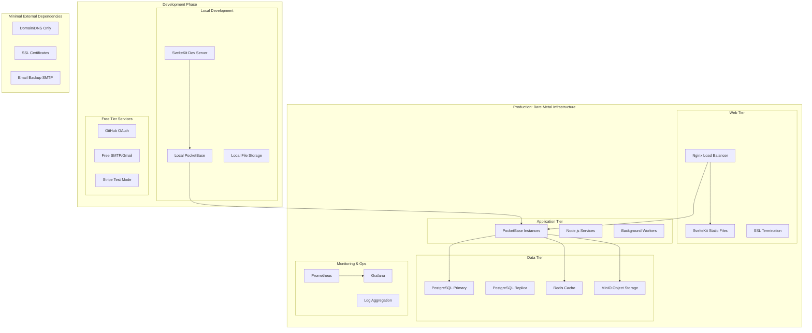

# Design Document

## Overview

홀로그래픽 효과 야구 카드 갤러리 커뮤니케이션 서비스는 사용자가 자신만의 디지털 홀로그래픽 카드를 제작하고 공유할 수 있는 종합적인 플랫폼입니다. 이 시스템은 고급 CSS 효과, 실시간 편집 도구, 소셜 네트워킹 기능, 그리고 수익화 모델을 통합하여 포토카드 문화의 디지털 생태계를 구축합니다.

## Architecture

### Bare Metal Self-Hosted Architecture



### Bare Metal Self-Hosted Technology Stack

#### Development Environment (로컬 개발)
**Frontend**
- **Framework**: SvelteKit with TypeScript
- **Styling**: CSS3 (Advanced Holographic Effects), Tailwind CSS
- **State Management**: Svelte Stores, Svelte Spring (Physics)
- **Image Processing**: Canvas API, WebGL for effects
- **Dev Server**: Vite dev server with HMR

**Backend (로컬 개발)**
- **Primary Backend**: PocketBase (단일 바이너리)
- **Database**: SQLite (개발용)
- **Authentication**: GitHub OAuth (무료)
- **File Storage**: 로컬 파일 시스템
- **Email**: Gmail SMTP (무료 한도)

#### Production Environment (베어메탈 서버)
**Web Tier**
- **Reverse Proxy**: Nginx with SSL termination
- **Static Assets**: SvelteKit static build
- **CDN**: Nginx caching + gzip compression
- **SSL**: Let's Encrypt (무료 인증서)

**Application Tier**
- **Backend**: PocketBase with PostgreSQL
- **Real-time**: PocketBase built-in WebSocket
- **Background Jobs**: PocketBase hooks + cron jobs
- **Image Processing**: Sharp.js integration

**Data Tier**
- **Primary Database**: PostgreSQL 15+
- **Cache**: Redis (세션, 캐시)
- **File Storage**: MinIO (S3-compatible)
- **Backup**: pg_dump + rsync to external storage

**Monitoring & Operations**
- **Monitoring**: Prometheus + Grafana
- **Logging**: systemd journal + logrotate
- **Process Management**: systemd services
- **Backup**: Automated scripts with retention policy

### Self-Hosted Service Architecture

#### Core Services Stack
```typescript
// 베어메탈 서버 서비스 구성
interface SelfHostedServices {
  webServer: NginxConfig
  application: PocketBaseConfig
  database: PostgreSQLConfig
  cache: RedisConfig
  storage: MinIOConfig
  monitoring: PrometheusConfig
}

const productionConfig: SelfHostedServices = {
  webServer: {
    port: 80,
    sslPort: 443,
    staticPath: '/var/www/holographic-cards',
    proxyPass: 'http://localhost:8090'
  },
  application: {
    port: 8090,
    database: 'postgresql://localhost:5432/holographic_cards',
    filesDir: '/var/lib/pocketbase/files',
    hooksDir: '/var/lib/pocketbase/hooks'
  },
  database: {
    port: 5432,
    dataDir: '/var/lib/postgresql/data',
    maxConnections: 100,
    sharedBuffers: '256MB'
  },
  cache: {
    port: 6379,
    maxMemory: '512MB',
    persistence: 'rdb'
  },
  storage: {
    port: 9000,
    dataDir: '/var/lib/minio/data',
    buckets: ['holographic-cards', 'user-avatars']
  }
}
```

#### Authentication Strategy
```typescript
// 최소 비용 인증 전략
interface AuthConfig {
  primary: 'github-oauth'  // 무료
  fallback: 'email-password'  // PocketBase 내장
  smtp: {
    host: 'smtp.gmail.com'  // Gmail 무료 한도 활용
    port: 587
    user: 'your-gmail@gmail.com'
    dailyLimit: 500  // Gmail 무료 한도
  }
}

// OAuth 설정 (무료 서비스 활용)
const oauthProviders = {
  github: {
    clientId: process.env.GITHUB_CLIENT_ID,
    clientSecret: process.env.GITHUB_CLIENT_SECRET,
    cost: 0  // 완전 무료
  },
  google: {
    clientId: process.env.GOOGLE_CLIENT_ID,
    clientSecret: process.env.GOOGLE_CLIENT_SECRET,
    cost: 0  // 무료 한도 내
  }
}
```

#### File Storage & CDN
```typescript
// 자체 호스팅 파일 관리
class SelfHostedStorage {
  private minioClient: MinIO.Client
  private nginxCacheDir = '/var/cache/nginx/holographic-cards'
  
  async uploadFile(file: File, path: string): Promise<string> {
    // MinIO에 파일 업로드
    await this.minioClient.putObject('holographic-cards', path, file)
    
    // Nginx 캐시 무효화
    await this.invalidateNginxCache(path)
    
    return `https://your-domain.com/files/${path}`
  }
  
  async optimizeImage(file: File): Promise<Buffer> {
    // Sharp.js로 이미지 최적화 (서버 내에서 처리)
    return sharp(file)
      .resize(660, 921, { fit: 'cover' })
      .webp({ quality: 85 })
      .toBuffer()
  }
}
```

### Cost Structure (베어메탈 기준)

#### 개발 단계 (무료)
- **도메인**: $10-15/년 (필수)
- **SSL 인증서**: $0 (Let's Encrypt)
- **OAuth**: $0 (GitHub/Google 무료)
- **이메일**: $0 (Gmail 무료 한도)
- **개발 도구**: $0 (오픈소스)
- **총 비용**: ~$15/년

#### 운영 단계 (최소 비용)
- **도메인**: $10-15/년
- **SSL 인증서**: $0 (Let's Encrypt 자동 갱신)
- **전력/인터넷**: 기존 인프라 활용
- **백업 스토리지**: $5-10/월 (외부 백업용)
- **모니터링**: $0 (자체 호스팅)
- **총 비용**: ~$75-135/년 ($6-11/월)

#### 확장 시 추가 비용
- **CDN**: Cloudflare 무료 플랜 활용
- **이메일**: Gmail → 자체 SMTP 서버 구축
- **결제**: Stripe (거래 수수료만)
- **인쇄**: 주문 시에만 비용 발생

### Deployment Strategy

#### 단계별 배포 계획
```bash
# Phase 1: 로컬 개발 환경
npm create svelte@latest holographic-cards
cd holographic-cards
npm install
# PocketBase 다운로드 및 실행
./pocketbase serve

# Phase 2: 베어메탈 서버 배포
# Docker 없이 직접 설치로 리소스 절약
sudo apt update && sudo apt install -y nginx postgresql redis-server
# PocketBase 바이너리 배포
# 정적 파일 빌드 및 배포
npm run build
sudo cp -r build/* /var/www/holographic-cards/

# Phase 3: 모니터링 및 백업 설정
# Prometheus + Grafana 설치
# 자동 백업 스크립트 설정
```

이제 베어메탈 인프라를 최대한 활용하면서 비용을 최소화하는 현실적인 아키텍처가 완성되었습니다!

## Backend-as-a-Service Integration

### PocketBase Configuration

#### Collections Schema
```javascript
// PocketBase Collections 정의
const collections = {
  users: {
    fields: {
      username: 'text',
      displayName: 'text', 
      avatar: 'file',
      grade: 'select',
      bio: 'text',
      stats: 'json',
      preferences: 'json'
    },
    auth: true,
    oauth2: ['google', 'github']
  },
  
  cards: {
    fields: {
      title: 'text',
      description: 'text',
      image: 'file',
      holographicEffect: 'json',
      elements: 'json',
      isPublic: 'bool',
      tags: 'relation',
      userId: 'relation'
    },
    indexes: ['userId', 'isPublic', 'created']
  },
  
  comments: {
    fields: {
      content: 'text',
      cardId: 'relation',
      userId: 'relation',
      parentId: 'relation'
    },
    realtime: true
  },
  
  likes: {
    fields: {
      cardId: 'relation',
      userId: 'relation'
    },
    unique: ['cardId', 'userId']
  }
}
```

#### Custom Business Logic Hooks
```javascript
// PocketBase hooks for custom logic
onRecordAfterCreateRequest((e) => {
  if (e.collection.name === 'cards') {
    // 카드 생성 시 사용자 통계 업데이트
    updateUserStats(e.record.userId, 'cardsCreated')
    
    // 홀로그래픽 효과 처리
    processHolographicEffect(e.record)
  }
}, 'cards')

onRecordAfterCreateRequest((e) => {
  if (e.collection.name === 'likes') {
    // 실시간 알림 발송
    sendNotification(e.record.cardId, 'like')
    
    // 사용자 등급 재계산
    recalculateUserGrade(e.record.userId)
  }
}, 'likes')
```

### External Service Integrations

#### Authentication Service Integration
```typescript
// @auth/sveltekit 설정
import { SvelteKitAuth } from "@auth/sveltekit"
import Google from "@auth/core/providers/google"
import GitHub from "@auth/core/providers/github"

export const { handle, signIn, signOut } = SvelteKitAuth({
  providers: [
    Google({
      clientId: GOOGLE_CLIENT_ID,
      clientSecret: GOOGLE_CLIENT_SECRET,
    }),
    GitHub({
      clientId: GITHUB_CLIENT_ID,
      clientSecret: GITHUB_CLIENT_SECRET,
    })
  ],
  callbacks: {
    async signIn({ user, account, profile }) {
      // PocketBase에 사용자 정보 동기화
      await syncUserToPocketBase(user, account, profile)
      return true
    }
  }
})
```

#### Payment Service Integration
```typescript
// Stripe 결제 처리
import Stripe from 'stripe'

class PaymentService {
  private stripe = new Stripe(STRIPE_SECRET_KEY)
  
  async createPaymentIntent(amount: number, cardId: string) {
    return await this.stripe.paymentIntents.create({
      amount: amount * 100, // cents
      currency: 'krw',
      metadata: { cardId }
    })
  }
  
  async handlePrintOrder(cardId: string, options: PrintOptions) {
    // Printful API 연동
    const printfulOrder = await this.createPrintfulOrder(cardId, options)
    
    // PocketBase에 주문 정보 저장
    await pb.collection('orders').create({
      cardId,
      printfulOrderId: printfulOrder.id,
      status: 'pending'
    })
  }
}
```

#### Email Service Integration
```typescript
// Resend 이메일 서비스
import { Resend } from 'resend'

class EmailService {
  private resend = new Resend(RESEND_API_KEY)
  
  async sendWelcomeEmail(user: User) {
    await this.resend.emails.send({
      from: 'welcome@holographic-cards.com',
      to: user.email,
      subject: '홀로그래픽 카드 커뮤니티에 오신 것을 환영합니다!',
      html: this.getWelcomeTemplate(user)
    })
  }
  
  async sendCardLikeNotification(cardOwner: User, liker: User, card: Card) {
    await this.resend.emails.send({
      from: 'notifications@holographic-cards.com',
      to: cardOwner.email,
      subject: `${liker.displayName}님이 회원님의 카드를 좋아합니다`,
      html: this.getLikeNotificationTemplate(cardOwner, liker, card)
    })
  }
}
```

#### Image Processing Service
```typescript
// Cloudinary 이미지 처리
import { v2 as cloudinary } from 'cloudinary'

class ImageService {
  constructor() {
    cloudinary.config({
      cloud_name: CLOUDINARY_CLOUD_NAME,
      api_key: CLOUDINARY_API_KEY,
      api_secret: CLOUDINARY_API_SECRET
    })
  }
  
  async optimizeCardImage(file: File): Promise<string> {
    const result = await cloudinary.uploader.upload(file, {
      folder: 'holographic-cards',
      transformation: [
        { width: 660, height: 921, crop: 'fill' },
        { quality: 'auto', format: 'auto' }
      ]
    })
    
    return result.secure_url
  }
  
  async generateThumbnail(imageUrl: string): Promise<string> {
    return cloudinary.url(imageUrl, {
      transformation: [
        { width: 200, height: 280, crop: 'fill' },
        { quality: 'auto', format: 'webp' }
      ]
    })
  }
}
```

## Components and Interfaces

### Core Components

#### 1. Card Editor Component
```typescript
interface CardEditor {
  // 이미지 업로드 및 처리
  uploadImage(file: File): Promise<string>
  
  // 홀로그래픽 효과 적용
  applyHolographicEffect(type: HolographicType): void
  
  // 텍스트 및 스티커 추가
  addTextElement(text: string, style: TextStyle): void
  addStickerElement(sticker: Sticker, position: Position): void
  
  // 실시간 미리보기
  renderPreview(): void
  
  // 카드 저장
  saveCard(): Promise<Card>
}

interface HolographicType {
  name: string
  cssClass: string
  parameters: EffectParameters
}

interface EffectParameters {
  intensity: number
  colorShift: number
  reflectionAngle: number
  animationSpeed: number
}
```

#### 2. Gallery Component
```typescript
interface Gallery {
  // 카드 목록 조회
  getCards(filter: GalleryFilter): Promise<Card[]>
  
  // 그리드 레이아웃 관리
  renderGrid(cards: Card[]): void
  
  // 무한 스크롤
  loadMoreCards(): Promise<Card[]>
  
  // 정렬 및 필터링
  sortCards(criteria: SortCriteria): void
  filterCards(filter: CardFilter): void
}

interface GalleryFilter {
  userId?: string
  isPublic?: boolean
  tags?: string[]
  dateRange?: DateRange
}
```

#### 3. Community Feed Component
```typescript
interface CommunityFeed {
  // 피드 조회
  getFeedItems(pagination: Pagination): Promise<FeedItem[]>
  
  // 상호작용 기능
  likeCard(cardId: string): Promise<void>
  commentOnCard(cardId: string, comment: string): Promise<void>
  shareCard(cardId: string): Promise<void>
  
  // 실시간 업데이트
  subscribeToUpdates(): void
}
```

#### 4. User Management Component
```typescript
interface UserManagement {
  // 사용자 등급 관리
  calculateUserGrade(userId: string): Promise<UserGrade>
  updateUserGrade(userId: string, grade: UserGrade): Promise<void>
  
  // 팔로우 시스템
  followUser(targetUserId: string): Promise<void>
  unfollowUser(targetUserId: string): Promise<void>
  
  // 프로필 관리
  updateProfile(profile: UserProfile): Promise<void>
}

enum UserGrade {
  GENERAL = "일반유저",
  PHOTOGRAPHER = "전문야구 찍사",
  JOURNALIST = "스포츠 기자",
  MASTER = "포토카드 장인"
}
```

## Data Models

### Card Model
```typescript
interface Card {
  id: string
  userId: string
  title: string
  description: string
  imageUrl: string
  holographicEffect: HolographicType
  elements: CardElement[]
  isPublic: boolean
  tags: string[]
  likes: number
  views: number
  createdAt: Date
  updatedAt: Date
}

interface CardElement {
  id: string
  type: 'text' | 'sticker' | 'shape'
  content: string
  position: Position
  style: ElementStyle
  zIndex: number
}
```

### User Model
```typescript
interface User {
  id: string
  email: string
  username: string
  displayName: string
  avatar: string
  grade: UserGrade
  bio: string
  stats: UserStats
  preferences: UserPreferences
  createdAt: Date
}

interface UserStats {
  cardsCreated: number
  totalLikes: number
  followers: number
  following: number
  gradePoints: number
}
```

### Community Model
```typescript
interface Comment {
  id: string
  cardId: string
  userId: string
  content: string
  parentId?: string
  likes: number
  createdAt: Date
}

interface Like {
  id: string
  cardId: string
  userId: string
  createdAt: Date
}

interface Follow {
  id: string
  followerId: string
  followingId: string
  createdAt: Date
}
```

## Error Handling

### Error Types
```typescript
enum ErrorType {
  VALIDATION_ERROR = "VALIDATION_ERROR",
  AUTHENTICATION_ERROR = "AUTHENTICATION_ERROR",
  AUTHORIZATION_ERROR = "AUTHORIZATION_ERROR",
  RESOURCE_NOT_FOUND = "RESOURCE_NOT_FOUND",
  RATE_LIMIT_EXCEEDED = "RATE_LIMIT_EXCEEDED",
  FILE_UPLOAD_ERROR = "FILE_UPLOAD_ERROR",
  PAYMENT_ERROR = "PAYMENT_ERROR"
}

interface AppError {
  type: ErrorType
  message: string
  details?: any
  timestamp: Date
}
```

### Error Handling Strategy
1. **Client-side Validation**: 사용자 입력 실시간 검증
2. **Server-side Validation**: API 레벨에서 데이터 무결성 보장
3. **Graceful Degradation**: 네트워크 오류 시 오프라인 모드 제공
4. **User-friendly Messages**: 기술적 오류를 사용자 친화적 메시지로 변환
5. **Error Logging**: 모든 오류를 로깅하여 모니터링 및 디버깅 지원

## Testing Strategy

### Testing Pyramid

#### Unit Tests (70%)
- 개별 컴포넌트 로직 테스트
- 홀로그래픽 효과 렌더링 테스트
- 데이터 모델 검증 테스트
- 유틸리티 함수 테스트

#### Integration Tests (20%)
- API 엔드포인트 테스트
- 데이터베이스 연동 테스트
- 파일 업로드/다운로드 테스트
- 실시간 기능 테스트

#### E2E Tests (10%)
- 사용자 시나리오 테스트
- 카드 제작 플로우 테스트
- 커뮤니티 상호작용 테스트
- 결제 프로세스 테스트

### Testing Tools
- **Unit Testing**: Vitest, Testing Library
- **E2E Testing**: Playwright
- **Visual Testing**: Chromatic
- **Performance Testing**: Lighthouse CI
- **API Testing**: Postman/Newman

## Design System & Look and Feel

### Civitai-Inspired Modern Design System

#### Visual Identity & Brand Guidelines

**Design Philosophy**: 전문적이고 세련된 AI 아트 커뮤니티의 미학을 홀로그래픽 카드 문화에 적용하여, 고급스럽고 현대적인 디지털 경험을 제공합니다.

#### Color System (Dark Theme Primary)
```typescript
const colorSystem = {
  // Primary Dark Theme (Civitai-inspired)
  dark: {
    background: {
      primary: '#0f0f23',      // 메인 배경 (진한 네이비)
      secondary: '#1a1b3e',    // 카드/섹션 배경
      tertiary: '#2d2d44',     // 호버/액티브 상태
      elevated: '#3a3b5c'      // 모달/드롭다운
    },
    surface: {
      primary: '#2d2d44',      // 카드 표면
      secondary: '#3a3b5c',    // 입력 필드
      tertiary: '#4a4b6c',     // 비활성 요소
      glass: 'rgba(45, 45, 68, 0.8)'  // 글래스모피즘
    },
    text: {
      primary: '#ffffff',      // 메인 텍스트
      secondary: '#b4b6cd',    // 보조 텍스트
      tertiary: '#8b8ca8',     // 비활성 텍스트
      accent: '#6366f1'        // 강조 텍스트
    },
    accent: {
      primary: '#6366f1',      // 메인 액센트 (인디고)
      secondary: '#8b5cf6',    // 보조 액센트 (보라)
      success: '#10b981',      // 성공 상태
      warning: '#f59e0b',      // 경고 상태
      error: '#ef4444',        // 오류 상태
      info: '#3b82f6'          // 정보 상태
    }
  },
  
  // Holographic Spectrum (기존 유지하되 다크 테마에 최적화)
  holographic: {
    rainbow: 'linear-gradient(135deg, #ff0080, #ff8c00, #40e0d0, #da70d6, #98fb98)',
    cosmic: 'linear-gradient(135deg, #667eea, #764ba2, #f093fb, #f5576c)',
    aurora: 'linear-gradient(135deg, #a8edea, #fed6e3, #d299c2, #fef9d7)',
    neon: 'linear-gradient(135deg, #12c2e9, #c471ed, #f64f59)',
    gold: 'linear-gradient(135deg, #ffd700, #ffed4e, #ffc107)',
    silver: 'linear-gradient(135deg, #c0c0c0, #e8e8e8, #b8b8b8)'
  }
}
```

#### Typography System
```typescript
const typography = {
  fontFamilies: {
    primary: '"Inter", -apple-system, BlinkMacSystemFont, "Segoe UI", sans-serif',
    secondary: '"Poppins", sans-serif',
    korean: '"Pretendard", "Noto Sans KR", sans-serif',
    mono: '"JetBrains Mono", "Fira Code", monospace'
  },
  
  scale: {
    // Fluid typography scale
    xs: 'clamp(0.75rem, 0.7rem + 0.25vw, 0.875rem)',
    sm: 'clamp(0.875rem, 0.8rem + 0.375vw, 1rem)',
    base: 'clamp(1rem, 0.9rem + 0.5vw, 1.125rem)',
    lg: 'clamp(1.125rem, 1rem + 0.625vw, 1.25rem)',
    xl: 'clamp(1.25rem, 1.1rem + 0.75vw, 1.5rem)',
    '2xl': 'clamp(1.5rem, 1.3rem + 1vw, 2rem)',
    '3xl': 'clamp(1.875rem, 1.6rem + 1.375vw, 2.5rem)',
    '4xl': 'clamp(2.25rem, 1.9rem + 1.75vw, 3rem)',
    '5xl': 'clamp(3rem, 2.5rem + 2.5vw, 4rem)'
  },
  
  weights: {
    light: 300,
    normal: 400,
    medium: 500,
    semibold: 600,
    bold: 700,
    extrabold: 800
  }
}
```

#### Spacing & Layout System
```typescript
const spacing = {
  // 8px base unit system
  px: '1px',
  0: '0',
  0.5: '0.125rem',  // 2px
  1: '0.25rem',     // 4px
  2: '0.5rem',      // 8px
  3: '0.75rem',     // 12px
  4: '1rem',        // 16px
  5: '1.25rem',     // 20px
  6: '1.5rem',      // 24px
  8: '2rem',        // 32px
  10: '2.5rem',     // 40px
  12: '3rem',       // 48px
  16: '4rem',       // 64px
  20: '5rem',       // 80px
  24: '6rem',       // 96px
  32: '8rem',       // 128px
  
  // Container sizes
  container: {
    sm: '640px',
    md: '768px',
    lg: '1024px',
    xl: '1280px',
    '2xl': '1536px'
  }
}
```

#### Border Radius & Shadows
```typescript
const borderRadius = {
  none: '0',
  sm: '0.25rem',    // 4px
  md: '0.375rem',   // 6px
  lg: '0.5rem',     // 8px
  xl: '0.75rem',    // 12px
  '2xl': '1rem',    // 16px
  '3xl': '1.5rem',  // 24px
  card: '1rem',     // 카드 기본
  full: '9999px'    // 완전 둥근
}

const shadows = {
  // Civitai-style elevated shadows
  sm: '0 1px 2px 0 rgba(0, 0, 0, 0.05)',
  md: '0 4px 6px -1px rgba(0, 0, 0, 0.1), 0 2px 4px -1px rgba(0, 0, 0, 0.06)',
  lg: '0 10px 15px -3px rgba(0, 0, 0, 0.1), 0 4px 6px -2px rgba(0, 0, 0, 0.05)',
  xl: '0 20px 25px -5px rgba(0, 0, 0, 0.1), 0 10px 10px -5px rgba(0, 0, 0, 0.04)',
  
  // Holographic glow effects
  holographic: {
    subtle: '0 0 20px rgba(99, 102, 241, 0.15)',
    medium: '0 0 40px rgba(99, 102, 241, 0.25)',
    strong: '0 0 60px rgba(99, 102, 241, 0.35)'
  },
  
  // Glass morphism
  glass: '0 8px 32px 0 rgba(31, 38, 135, 0.37)',
  
  // Inner shadows for depth
  inner: 'inset 0 2px 4px 0 rgba(0, 0, 0, 0.06)'
}
```

#### Component Design Tokens
```typescript
interface ComponentTokens {
  // Button System
  button: {
    primary: {
      background: 'linear-gradient(135deg, #6366f1, #8b5cf6)',
      hover: 'linear-gradient(135deg, #5855eb, #7c3aed)',
      text: '#ffffff',
      shadow: shadows.md,
      borderRadius: borderRadius.lg
    },
    secondary: {
      background: colorSystem.dark.surface.secondary,
      hover: colorSystem.dark.surface.tertiary,
      text: colorSystem.dark.text.primary,
      border: '1px solid rgba(255, 255, 255, 0.1)'
    },
    ghost: {
      background: 'transparent',
      hover: 'rgba(99, 102, 241, 0.1)',
      text: colorSystem.dark.accent.primary
    },
    holographic: {
      background: colorSystem.holographic.cosmic,
      hover: 'brightness(1.1)',
      text: '#ffffff',
      shadow: shadows.holographic.medium
    }
  },
  
  // Card System
  card: {
    default: {
      background: colorSystem.dark.surface.primary,
      border: '1px solid rgba(255, 255, 255, 0.08)',
      borderRadius: borderRadius.card,
      shadow: shadows.lg,
      hover: {
        transform: 'translateY(-2px)',
        shadow: shadows.xl
      }
    },
    elevated: {
      background: colorSystem.dark.surface.secondary,
      shadow: shadows.xl,
      backdrop: 'blur(20px)'
    },
    holographic: {
      background: 'linear-gradient(135deg, rgba(99, 102, 241, 0.1), rgba(139, 92, 246, 0.1))',
      border: '1px solid rgba(99, 102, 241, 0.2)',
      shadow: shadows.holographic.subtle
    }
  },
  
  // Input System
  input: {
    default: {
      background: colorSystem.dark.surface.secondary,
      border: '1px solid rgba(255, 255, 255, 0.1)',
      borderRadius: borderRadius.lg,
      text: colorSystem.dark.text.primary,
      placeholder: colorSystem.dark.text.tertiary,
      focus: {
        border: `1px solid ${colorSystem.dark.accent.primary}`,
        shadow: `0 0 0 3px rgba(99, 102, 241, 0.1)`
      }
    }
  },
  
  // Navigation System
  navigation: {
    background: 'rgba(15, 15, 35, 0.95)',
    backdrop: 'blur(20px)',
    border: '1px solid rgba(255, 255, 255, 0.08)',
    item: {
      default: colorSystem.dark.text.secondary,
      hover: colorSystem.dark.text.primary,
      active: colorSystem.dark.accent.primary
    }
  }
}
```

#### Animation & Interaction System
```typescript
const animations = {
  // Easing functions
  easing: {
    default: 'cubic-bezier(0.4, 0, 0.2, 1)',
    smooth: 'cubic-bezier(0.25, 0.46, 0.45, 0.94)',
    bounce: 'cubic-bezier(0.68, -0.55, 0.265, 1.55)',
    sharp: 'cubic-bezier(0.4, 0, 1, 1)'
  },
  
  // Duration scale
  duration: {
    fast: '150ms',
    normal: '250ms',
    slow: '350ms',
    slower: '500ms'
  },
  
  // Micro-interactions
  microInteractions: {
    buttonHover: {
      transform: 'translateY(-1px)',
      transition: `all ${animations.duration.fast} ${animations.easing.smooth}`
    },
    cardHover: {
      transform: 'translateY(-4px) scale(1.02)',
      transition: `all ${animations.duration.normal} ${animations.easing.smooth}`
    },
    holographicShimmer: {
      animation: 'shimmer 2s linear infinite',
      backgroundSize: '200% 200%'
    }
  }
}

// CSS Keyframes
const keyframes = `
@keyframes shimmer {
  0% { background-position: -200% 0; }
  100% { background-position: 200% 0; }
}

@keyframes holographicRotate {
  0% { transform: rotate(0deg); }
  100% { transform: rotate(360deg); }
}

@keyframes floatUp {
  0% { transform: translateY(0px); opacity: 0; }
  50% { opacity: 1; }
  100% { transform: translateY(-20px); opacity: 0; }
}
`
```

#### Layout Patterns
```typescript
interface LayoutPatterns {
  // Grid Systems
  gallery: {
    mobile: 'repeat(1, 1fr)',
    tablet: 'repeat(2, 1fr)',
    desktop: 'repeat(auto-fill, minmax(280px, 1fr))',
    gap: spacing[6]
  },
  
  masonry: {
    columns: {
      mobile: 1,
      tablet: 2,
      desktop: 3,
      wide: 4
    },
    gap: spacing[4]
  },
  
  // Container patterns
  pageContainer: {
    maxWidth: spacing.container.xl,
    margin: '0 auto',
    padding: `0 ${spacing[4]}`
  },
  
  sectionContainer: {
    padding: `${spacing[16]} 0`,
    marginBottom: spacing[12]
  }
}
```

### Responsive Design
- **Mobile First**: 모바일 우선 설계
- **Breakpoints**: 
  - Mobile: 320px - 768px
  - Tablet: 768px - 1024px
  - Desktop: 1024px+
- **Touch Interactions**: 터치 친화적 인터페이스

### Accessibility
- **WCAG 2.1 AA 준수**
- **키보드 네비게이션 지원**
- **스크린 리더 호환성**
- **고대비 모드 지원**
- **애니메이션 감소 옵션**

### Performance Considerations
- **이미지 최적화**: WebP, AVIF 포맷 지원
- **레이지 로딩**: 카드 이미지 지연 로딩
- **코드 스플리팅**: 라우트별 번들 분할
- **CDN 활용**: 정적 자산 캐싱
- **Progressive Enhancement**: 점진적 기능 향상

## Holographic Effect Core System

### CSS Holographic Engine

홀로그래픽 효과는 이 플랫폼의 핵심 기능으로, 기존 Pokémon Cards CSS Holographic Effect와 동일한 코어 기술을 활용합니다.

#### Core CSS Variables System
```css
:root {
  /* 마우스/터치 포인터 위치 */
  --pointer-x: 50%;
  --pointer-y: 50%;
  --pointer-from-center: 0;
  --pointer-from-top: 0;
  --pointer-from-left: 0;
  
  /* 카드 변형 */
  --card-scale: 1;
  --card-opacity: 0;
  --rotate-x: 0deg;
  --rotate-y: 0deg;
  --translate-x: 0px;
  --translate-y: 0px;
  
  /* 배경 및 효과 위치 */
  --background-x: var(--pointer-x);
  --background-y: var(--pointer-y);
  
  /* 홀로그래픽 효과 자산 */
  --grain: url("assets/grain.webp");
  --glitter: url("assets/glitter.png");
  --foil: url("dynamic-foil-image");
  --mask: url("dynamic-mask-image");
}
```

#### Holographic Effect Types
```typescript
enum HolographicEffectType {
  BASIC = "basic",                    // 기본 반사 효과
  REVERSE_HOLO = "reverse-holo",      // 리버스 홀로
  HOLO_RARE = "holo-rare",           // 홀로포일 레어
  COSMOS = "cosmos",                  // 갤럭시/코스모스
  AMAZING = "amazing",                // 어메이징 레어
  RADIANT = "radiant",               // 레디언트
  RAINBOW = "rainbow",                // 레인보우 레어
  SECRET_GOLD = "secret-gold",        // 시크릿 골드
  TRAINER_GALLERY = "trainer-gallery" // 트레이너 갤러리
}

interface HolographicConfig {
  type: HolographicEffectType
  intensity: number              // 효과 강도 (0-1)
  colorShift: number            // 색상 변화 정도
  reflectionAngle: number       // 반사 각도
  animationSpeed: number        // 애니메이션 속도
  customMask?: string          // 커스텀 마스크 이미지
  customFoil?: string          // 커스텀 포일 이미지
}
```

#### Interactive Physics System
```typescript
interface CardPhysics {
  // Svelte Spring 설정
  springInteractSettings: {
    stiffness: 0.066
    damping: 0.25
  }
  
  springPopoverSettings: {
    stiffness: 0.033
    damping: 0.45
  }
  
  // 마우스 상호작용 계산
  calculatePointerPosition(event: MouseEvent | TouchEvent, element: HTMLElement): {
    absolute: { x: number, y: number }
    percent: { x: number, y: number }
    center: { x: number, y: number }
  }
  
  // 3D 회전 계산
  calculateRotation(centerOffset: { x: number, y: number }): {
    x: number  // -17.5 ~ 17.5도
    y: number  // -25 ~ 25도
  }
  
  // 홀로그래픽 효과 위치 계산
  calculateEffectPosition(percent: { x: number, y: number }): {
    glare: { x: number, y: number, opacity: number }
    background: { x: number, y: number }
  }
}
```

#### CSS Effect Implementation
```css
.holographic-card {
  /* 3D 변형 공간 설정 */
  transform-style: preserve-3d;
  transform: 
    perspective(1000px)
    rotateX(var(--rotate-x))
    rotateY(var(--rotate-y))
    scale(var(--card-scale))
    translate3d(var(--translate-x), var(--translate-y), 0);
  
  /* 성능 최적화 */
  will-change: transform, opacity, background-image, background-position;
}

.card__shine {
  /* 기본 반사 효과 */
  background: linear-gradient(
    var(--angle, 133deg),
    transparent 0%,
    rgba(255, 255, 255, 0.1) 45%,
    rgba(255, 255, 255, 0.3) 50%,
    rgba(255, 255, 255, 0.1) 55%,
    transparent 100%
  );
  background-position: var(--pointer-x) var(--pointer-y);
  background-size: 300% 300%;
  mix-blend-mode: color-dodge;
  opacity: var(--card-opacity);
}

.card__glare {
  /* 글레어 효과 */
  background: radial-gradient(
    circle at var(--pointer-x) var(--pointer-y),
    rgba(255, 255, 255, 0.8) 0%,
    rgba(255, 255, 255, 0.2) 20%,
    transparent 60%
  );
  mix-blend-mode: overlay;
  opacity: calc(var(--pointer-from-center) * var(--card-opacity));
}

/* 홀로포일 효과 (마스크 적용) */
.card--holo-rare .card__foil {
  background: 
    var(--foil),
    linear-gradient(var(--angle), 
      var(--red) 0%, 
      var(--yellow) 25%, 
      var(--green) 50%, 
      var(--blue) 75%, 
      var(--violet) 100%
    );
  background-position: var(--background-x) var(--background-y);
  background-size: 200% 200%, 400% 400%;
  clip-path: var(--mask);
  mix-blend-mode: color-dodge;
}

/* 레인보우 효과 */
.card--rainbow .card__foil {
  background: 
    var(--glitter),
    linear-gradient(45deg, 
      hsl(0, 100%, 50%) 0%,
      hsl(60, 100%, 50%) 16.66%,
      hsl(120, 100%, 50%) 33.33%,
      hsl(180, 100%, 50%) 50%,
      hsl(240, 100%, 50%) 66.66%,
      hsl(300, 100%, 50%) 83.33%,
      hsl(360, 100%, 50%) 100%
    );
  background-size: var(--glittersize), 200% 200%;
  background-position: 
    calc(var(--background-x) * -1) calc(var(--background-y) * -1),
    var(--background-x) var(--background-y);
  mix-blend-mode: color-burn, color-dodge;
}
```

#### Dynamic Effect Generation System
```typescript
class HolographicEffectGenerator {
  // 사용자 업로드 이미지에서 마스크 생성
  generateMaskFromImage(imageData: ImageData, options: MaskOptions): string {
    // 이미지 분석하여 홀로그래픽 효과가 적용될 영역 결정
    // 얼굴, 유니폼, 특정 영역 등을 자동 감지
    return this.createSVGMask(detectedRegions)
  }
  
  // 동적 포일 패턴 생성
  generateFoilPattern(effectType: HolographicEffectType): string {
    switch(effectType) {
      case HolographicEffectType.COSMOS:
        return this.generateCosmosPattern()
      case HolographicEffectType.RAINBOW:
        return this.generateRainbowPattern()
      // ... 기타 패턴들
    }
  }
  
  // 실시간 효과 업데이트
  updateEffectVariables(
    element: HTMLElement, 
    pointerPosition: { x: number, y: number },
    config: HolographicConfig
  ): void {
    const cssVars = this.calculateCSSVariables(pointerPosition, config)
    Object.entries(cssVars).forEach(([key, value]) => {
      element.style.setProperty(key, value)
    })
  }
}
```

#### Mobile & Touch Optimization
```typescript
interface TouchHandler {
  // 터치 이벤트 처리
  handleTouchMove(event: TouchEvent): void {
    const touch = event.touches[0]
    this.updateHolographicEffect({
      clientX: touch.clientX,
      clientY: touch.clientY
    })
  }
  
  // 디바이스 방향 센서 활용
  handleDeviceOrientation(event: DeviceOrientationEvent): void {
    const { gamma, beta } = event
    this.updateEffectFromOrientation({ gamma, beta })
  }
  
  // 성능 최적화된 애니메이션
  optimizeForMobile(): void {
    // 모바일에서는 효과 강도 조절
    // 배터리 절약을 위한 프레임 레이트 제한
  }
}
```

### Image Processing Pipeline

#### Upload & Processing Flow
```typescript
interface ImageProcessor {
  // 1. 이미지 업로드 및 검증
  validateImage(file: File): Promise<ValidationResult>
  
  // 2. 이미지 최적화
  optimizeImage(file: File): Promise<{
    webp: Blob
    original: Blob
    thumbnail: Blob
  }>
  
  // 3. 홀로그래픽 영역 자동 감지
  detectHolographicRegions(imageData: ImageData): Promise<{
    faces: Region[]
    uniforms: Region[]
    backgrounds: Region[]
    suggested: Region[]
  }>
  
  // 4. 마스크 생성
  generateHolographicMask(regions: Region[], style: HolographicEffectType): Promise<string>
}
```

이 홀로그래픽 효과 시스템은 기존 Pokémon Cards CSS Holographic Effect의 검증된 기술을 기반으로 하여, 사용자가 업로드한 야구 사진에 실물 카드와 같은 홀로그래픽 효과를 적용할 수 있게 합니다.
#
## Page-Specific Design Specifications

#### 1. Landing Page (홈페이지) - Civitai-Inspired Hero Design

```typescript
interface LandingPageDesign {
  hero: {
    layout: 'full-screen-gradient',
    background: {
      primary: 'linear-gradient(135deg, #0f0f23 0%, #1a1b3e 50%, #2d2d44 100%)',
      overlay: 'radial-gradient(circle at 30% 70%, rgba(99, 102, 241, 0.15) 0%, transparent 50%)',
      particles: 'floating holographic particles animation'
    },
    content: {
      headline: {
        text: '홀로그래픽 야구카드의\n새로운 차원을 경험하세요',
        typography: typography.scale['5xl'],
        weight: typography.weights.bold,
        gradient: colorSystem.holographic.cosmic,
        animation: 'fadeInUp with stagger'
      },
      subtitle: {
        text: 'AI 기반 홀로그래픽 효과로 당신만의 특별한 야구카드를 제작하고\n전 세계 컬렉터들과 공유해보세요',
        typography: typography.scale.xl,
        color: colorSystem.dark.text.secondary,
        maxWidth: '600px'
      },
      cta: {
        primary: {
          text: '카드 제작 시작하기',
          style: ComponentTokens.button.holographic,
          size: 'large',
          icon: 'sparkles'
        },
        secondary: {
          text: '갤러리 둘러보기',
          style: ComponentTokens.button.secondary,
          size: 'large',
          icon: 'gallery'
        }
      }
    },
    showcase: {
      type: '3D holographic card carousel',
      cards: 'featured community cards with live holographic effects',
      interaction: 'mouse-follow 3D rotation',
      autoplay: true,
      interval: 4000
    }
  }
}
```

#### 2. Navigation System - Modern Sidebar + Top Bar

```typescript
interface NavigationDesign {
  topBar: {
    height: '64px',
    background: ComponentTokens.navigation.background,
    backdrop: ComponentTokens.navigation.backdrop,
    border: ComponentTokens.navigation.border,
    position: 'sticky',
    zIndex: 1000,
    
    content: {
      logo: {
        type: 'animated holographic logo',
        size: '32px',
        effect: 'subtle shimmer on hover'
      },
      search: {
        width: '400px',
        placeholder: '카드, 사용자, 태그 검색...',
        style: ComponentTokens.input.default,
        features: ['instant search', 'recent searches', 'suggestions']
      },
      userMenu: {
        avatar: 'circular with holographic border',
        dropdown: 'glass morphism style',
        items: ['프로필', '내 카드', '설정', '로그아웃']
      }
    }
  },
  
  sidebar: {
    width: {
      collapsed: '64px',
      expanded: '240px'
    },
    background: ComponentTokens.navigation.background,
    items: [
      { icon: 'home', label: '홈', route: '/' },
      { icon: 'gallery', label: '갤러리', route: '/gallery' },
      { icon: 'create', label: '카드 제작', route: '/create' },
      { icon: 'community', label: '커뮤니티', route: '/community' },
      { icon: 'trending', label: '트렌딩', route: '/trending' },
      { icon: 'collections', label: '내 컬렉션', route: '/collections' }
    ],
    activeIndicator: {
      type: 'holographic accent bar',
      color: colorSystem.dark.accent.primary,
      animation: 'smooth slide transition'
    }
  }
}
```

#### 3. Gallery Page - Masonry Layout with Advanced Filtering

```typescript
interface GalleryDesign {
  layout: {
    type: 'masonry grid',
    columns: LayoutPatterns.masonry.columns,
    gap: LayoutPatterns.masonry.gap,
    responsive: true
  },
  
  filters: {
    position: 'sticky top bar',
    background: 'glass morphism',
    categories: [
      { label: '전체', value: 'all' },
      { label: '홀로포일', value: 'holo' },
      { label: '레인보우', value: 'rainbow' },
      { label: '코스믹', value: 'cosmic' },
      { label: '골드', value: 'gold' }
    ],
    sorting: ['최신순', '인기순', '조회순', '좋아요순'],
    search: {
      placeholder: '카드 제목, 태그, 제작자 검색',
      realtime: true,
      filters: ['태그', '제작자', '효과 타입', '날짜 범위']
    }
  },
  
  cardItem: {
    aspectRatio: '66:92', // 실제 트레이딩 카드 비율
    borderRadius: borderRadius.card,
    shadow: shadows.md,
    hover: {
      transform: 'translateY(-8px) scale(1.05)',
      shadow: shadows.holographic.medium,
      transition: animations.duration.normal
    },
    overlay: {
      gradient: 'linear-gradient(transparent 60%, rgba(0,0,0,0.8) 100%)',
      content: {
        title: typography.scale.sm,
        author: typography.scale.xs,
        stats: ['likes', 'views', 'comments'],
        actions: ['like', 'bookmark', 'share']
      }
    },
    holographicPreview: {
      trigger: 'hover',
      intensity: 'medium',
      duration: animations.duration.slow
    }
  }
}
```

#### 4. Card Creation Studio - Professional Editor Interface

```typescript
interface CardEditorDesign {
  layout: {
    type: 'three-panel',
    panels: {
      toolbar: {
        width: '280px',
        position: 'left',
        background: ComponentTokens.card.elevated.background,
        sections: [
          'image upload',
          'holographic effects',
          'text elements',
          'stickers & shapes',
          'layers panel'
        ]
      },
      canvas: {
        flex: 1,
        background: 'checkered pattern',
        card: {
          size: 'responsive with fixed aspect ratio',
          maxWidth: '500px',
          shadow: shadows.xl,
          realTimePreview: true
        }
      },
      properties: {
        width: '320px',
        position: 'right',
        background: ComponentTokens.card.elevated.background,
        sections: [
          'effect parameters',
          'element properties',
          'export settings'
        ]
      }
    }
  },
  
  toolbar: {
    imageUpload: {
      dropzone: {
        style: 'dashed border with holographic accent',
        text: '이미지를 드래그하거나 클릭하여 업로드',
        acceptedFormats: ['JPG', 'PNG', 'WebP'],
        maxSize: '10MB'
      },
      preview: {
        thumbnail: 'rounded with edit overlay',
        actions: ['crop', 'rotate', 'filters']
      }
    },
    
    holographicEffects: {
      presets: [
        { name: '기본 홀로', preview: 'animated thumbnail' },
        { name: '레인보우', preview: 'animated thumbnail' },
        { name: '코스믹', preview: 'animated thumbnail' },
        { name: '골드 포일', preview: 'animated thumbnail' },
        { name: '커스텀', preview: 'user-defined' }
      ],
      customization: {
        intensity: 'slider with live preview',
        colorShift: 'color picker with gradient',
        pattern: 'pattern selector',
        animation: 'speed and direction controls'
      }
    },
    
    textElements: {
      presets: [
        'player name',
        'team name',
        'position',
        'stats',
        'custom text'
      ],
      styling: {
        font: 'dropdown with preview',
        size: 'slider',
        color: 'color picker with gradients',
        effects: ['shadow', 'outline', 'glow', 'holographic']
      }
    }
  }
}
```

#### 5. Community Feed - Social Media Style Layout

```typescript
interface CommunityFeedDesign {
  layout: {
    type: 'centered feed with sidebars',
    maxWidth: '800px',
    sidebars: {
      left: 'trending tags, featured creators',
      right: 'activity feed, suggestions'
    }
  },
  
  feedItem: {
    background: ComponentTokens.card.default.background,
    borderRadius: borderRadius.card,
    padding: spacing[6],
    marginBottom: spacing[6],
    
    header: {
      avatar: {
        size: '48px',
        border: 'holographic gradient',
        hover: 'subtle glow effect'
      },
      userInfo: {
        name: typography.scale.base,
        username: typography.scale.sm,
        timestamp: typography.scale.xs,
        badge: 'user grade indicator'
      },
      actions: ['follow', 'more options']
    },
    
    content: {
      card: {
        aspectRatio: '66:92',
        maxWidth: '400px',
        centerAligned: true,
        holographicPreview: 'on hover',
        fullscreenModal: 'on click'
      },
      description: {
        typography: typography.scale.base,
        maxLines: 3,
        expandable: true
      },
      tags: {
        style: 'pill-shaped with holographic accent',
        clickable: true,
        maxVisible: 5
      }
    },
    
    interactions: {
      stats: {
        layout: 'horizontal with icons',
        items: ['likes', 'comments', 'shares', 'bookmarks'],
        animations: 'count up on change'
      },
      actions: {
        like: {
          icon: 'heart with fill animation',
          color: colorSystem.dark.accent.error,
          haptic: 'light impact'
        },
        comment: {
          icon: 'chat bubble',
          expandInline: true
        },
        share: {
          icon: 'share with options dropdown',
          options: ['copy link', 'social media', 'embed']
        }
      }
    }
  }
}
```

#### 6. User Profile - Creator Showcase Design

```typescript
interface UserProfileDesign {
  layout: {
    type: 'cover + content',
    cover: {
      height: '300px',
      background: 'user-customizable gradient or image',
      overlay: 'subtle dark gradient for text readability'
    }
  },
  
  profileHeader: {
    avatar: {
      size: '120px',
      position: 'overlapping cover',
      border: '4px solid holographic gradient',
      hover: 'holographic shimmer effect'
    },
    
    info: {
      name: {
        typography: typography.scale['3xl'],
        weight: typography.weights.bold,
        color: colorSystem.dark.text.primary
      },
      username: {
        typography: typography.scale.lg,
        color: colorSystem.dark.text.secondary,
        prefix: '@'
      },
      grade: {
        badge: 'holographic badge with icon',
        tooltip: 'grade requirements and benefits'
      },
      bio: {
        typography: typography.scale.base,
        maxWidth: '600px',
        lineHeight: 1.6
      }
    },
    
    stats: {
      layout: 'horizontal grid',
      items: [
        { label: '카드', value: 'cardsCreated', format: 'number' },
        { label: '팔로워', value: 'followers', format: 'compact' },
        { label: '팔로잉', value: 'following', format: 'compact' },
        { label: '좋아요', value: 'totalLikes', format: 'compact' }
      ],
      style: {
        value: typography.scale.xl + ' ' + typography.weights.bold,
        label: typography.scale.sm + ' ' + colorSystem.dark.text.secondary
      }
    },
    
    actions: {
      follow: ComponentTokens.button.primary,
      message: ComponentTokens.button.secondary,
      share: ComponentTokens.button.ghost,
      more: 'dropdown menu'
    }
  },
  
  contentTabs: {
    tabs: ['카드', '컬렉션', '좋아요', '활동'],
    style: {
      background: 'transparent',
      border: 'bottom border only',
      active: {
        color: colorSystem.dark.accent.primary,
        border: `2px solid ${colorSystem.dark.accent.primary}`
      }
    }
  },
  
  cardGrid: {
    layout: LayoutPatterns.gallery,
    loadMore: 'infinite scroll with loading skeleton',
    emptyState: {
      illustration: 'holographic card placeholder',
      message: 'contextual empty state message'
    }
  }
}
```

#### 7. Authentication Pages - Minimalist & Secure

```typescript
interface AuthDesign {
  layout: {
    type: 'centered card',
    maxWidth: '400px',
    background: ComponentTokens.card.elevated.background,
    backdrop: 'blur(40px)',
    shadow: shadows.xl
  },
  
  signIn: {
    header: {
      logo: 'animated holographic logo',
      title: '홀로그래픽 카드 커뮤니티',
      subtitle: '로그인하여 나만의 카드를 만들어보세요'
    },
    
    socialAuth: {
      providers: [
        {
          name: 'GitHub',
          icon: 'github-logo',
          style: ComponentTokens.button.secondary,
          fullWidth: true
        },
        {
          name: 'Google',
          icon: 'google-logo',
          style: ComponentTokens.button.secondary,
          fullWidth: true
        }
      ],
      spacing: spacing[3]
    },
    
    divider: {
      text: '또는',
      style: 'line with centered text',
      color: colorSystem.dark.text.tertiary
    },
    
    emailForm: {
      fields: [
        {
          type: 'email',
          placeholder: '이메일 주소',
          style: ComponentTokens.input.default
        },
        {
          type: 'password',
          placeholder: '비밀번호',
          style: ComponentTokens.input.default,
          showToggle: true
        }
      ],
      submitButton: {
        text: '로그인',
        style: ComponentTokens.button.primary,
        fullWidth: true,
        loading: 'spinner with text change'
      }
    },
    
    footer: {
      links: [
        { text: '비밀번호 찾기', route: '/forgot-password' },
        { text: '계정이 없으신가요? 회원가입', route: '/signup' }
      ],
      style: {
        typography: typography.scale.sm,
        color: colorSystem.dark.text.secondary,
        textAlign: 'center'
      }
    }
  }
}
```

### Responsive Design Strategy

#### Breakpoint System
```typescript
const breakpoints = {
  xs: '320px',   // 최소 모바일
  sm: '640px',   // 모바일
  md: '768px',   // 태블릿
  lg: '1024px',  // 데스크톱
  xl: '1280px',  // 대형 데스크톱
  '2xl': '1536px' // 초대형 화면
}

interface ResponsivePatterns {
  navigation: {
    mobile: 'bottom tab bar',
    tablet: 'collapsible sidebar',
    desktop: 'persistent sidebar'
  },
  
  gallery: {
    mobile: '1 column with large cards',
    tablet: '2 columns',
    desktop: '3-4 columns with hover effects',
    large: '4-5 columns'
  },
  
  cardEditor: {
    mobile: 'single panel with tabs',
    tablet: 'two panel (canvas + floating toolbar)',
    desktop: 'three panel layout'
  }
}
```

### Accessibility & Performance

#### Accessibility Features
```typescript
interface AccessibilityFeatures {
  colorContrast: 'WCAG AA compliant (4.5:1 minimum)',
  focusManagement: 'visible focus indicators with holographic accent',
  keyboardNavigation: 'full keyboard support for all interactions',
  screenReader: 'semantic HTML with proper ARIA labels',
  reducedMotion: 'respect prefers-reduced-motion setting',
  
  holographicEffects: {
    toggle: 'accessibility setting to disable effects',
    alternatives: 'static versions for motion-sensitive users',
    descriptions: 'alt text for effect types'
  }
}
```

#### Performance Optimizations
```typescript
interface PerformanceStrategy {
  images: {
    formats: ['WebP', 'AVIF', 'fallback to JPEG'],
    lazyLoading: 'intersection observer based',
    responsive: 'srcset with multiple sizes',
    placeholder: 'blur-up technique'
  },
  
  holographicEffects: {
    gpuAcceleration: 'transform3d and will-change properties',
    throttling: 'requestAnimationFrame for smooth animations',
    levelOfDetail: 'reduce effect complexity on lower-end devices'
  },
  
  codeOptimization: {
    bundleSplitting: 'route-based code splitting',
    treeshaking: 'eliminate unused CSS and JS',
    compression: 'gzip and brotli compression'
  }
}
```

이 디자인 시스템은 Civitai의 세련되고 전문적인 미학을 홀로그래픽 카드 커뮤니티에 맞게 적용한 것입니다. 다크 테마 기반의 현대적인 UI와 홀로그래픽 효과가 조화롭게 어우러져 사용자들에게 프리미엄 경험을 제공할 것입니다.
