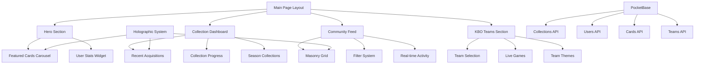

# Design Document

## Overview

포토카드 중심의 메인 화면 리뉴얼은 기존 SvelteKit + Tailwind CSS + PocketBase 아키텍처를 기반으로 Apple 수준의 프리미엄 디자인 시스템을 활용하여 구현됩니다. 홀로그래픽 카드 인터랙션, Civitai 스타일 커뮤니티 기능, KBO 팬 문화 시스템을 메인 화면에 통합하여 포토카드 수집과 자랑의 즐거움을 극대화하는 사용자 경험을 제공합니다.

## Architecture

### 기술 스택
- **Frontend**: SvelteKit 4.2.12 + TypeScript
- **Styling**: Tailwind CSS 3.3.6 + Apple Design System
- **Backend**: PocketBase (실시간 데이터베이스)
- **Authentication**: @auth/sveltekit
- **Effects**: 기존 홀로그래픽 CSS 시스템 확장
- **Build**: Vite 5.3.5

### 아키텍처 패턴


## Components and Interfaces

### 1. 메인 페이지 레이아웃 구조

#### MainPageLayout.svelte
```typescript
interface MainPageProps {
  user?: User;
  collections: Collection[];
  featuredCards: Card[];
  communityFeed: CommunityPost[];
  kboTeams: KBOTeam[];
  userStats: UserStats;
}

interface UserStats {
  totalCards: number;
  rareCards: number;
  completedCollections: number;
  fanLevel: string;
  favoriteTeam?: string;
}
```

### 2. 컬렉션 대시보드 컴포넌트

#### CollectionDashboard.svelte
```typescript
interface CollectionDashboardProps {
  recentCards: Card[];
  collectionProgress: CollectionProgress[];
  seasonCollections: SeasonCollection[];
  onCardClick: (card: Card) => void;
  onCollectionClick: (collection: Collection) => void;
}

interface CollectionProgress {
  id: string;
  name: string;
  totalCards: number;
  ownedCards: number;
  completionPercentage: number;
  theme: 'season' | 'team' | 'player' | 'special';
  rarity: 'common' | 'rare' | 'epic' | 'legendary';
}
```

### 3. Civitai 스타일 커뮤니티 피드

#### CommunityFeed.svelte
```typescript
interface CommunityFeedProps {
  posts: CommunityPost[];
  filters: FeedFilter;
  onFilterChange: (filter: FeedFilter) => void;
  onCardInteraction: (action: InteractionType, cardId: string) => void;
}

interface CommunityPost {
  id: string;
  card: Card;
  author: User;
  likes: number;
  comments: number;
  downloads: number;
  rating: number;
  tags: string[];
  createdAt: Date;
  isHolographic: boolean;
}

interface FeedFilter {
  timeRange: 'today' | 'week' | 'month' | 'all';
  category: 'featured' | 'hot' | 'new' | 'rising';
  team?: string;
  rarity?: string;
  searchQuery?: string;
}
```

### 4. 홀로그래픽 카드 컴포넌트 (기존 시스템 확장)

#### HolographicCard.svelte
```typescript
interface HolographicCardProps {
  card: Card;
  size: 'small' | 'medium' | 'large' | 'featured';
  interactive: boolean;
  showStats: boolean;
  onFlip?: () => void;
  onHover?: (isHovering: boolean) => void;
  customTheme?: KBOTeamTheme;
}

interface Card {
  id: string;
  title: string;
  image: string;
  backImage?: string;
  rarity: CardRarity;
  holographicEffect: HolographicEffect;
  stats: CardStats;
  metadata: CardMetadata;
}

interface HolographicEffect {
  type: 'rainbow' | 'cosmic' | 'aurora' | 'neon' | 'team-themed';
  intensity: number;
  animationSpeed: number;
  glowColor?: string;
}
```

### 5. KBO 팀 섹션 컴포넌트

#### KBOTeamsSection.svelte
```typescript
interface KBOTeamsSectionProps {
  teams: KBOTeam[];
  selectedTeam?: string;
  liveGames: LiveGame[];
  onTeamSelect: (teamId: string) => void;
  onGameClick: (gameId: string) => void;
}

interface KBOTeam {
  id: string;
  name: string;
  shortName: string;
  colors: {
    primary: string;
    secondary: string;
    holographic: string;
  };
  logo: string;
  fanCount: number;
  recentCards: Card[];
}

interface LiveGame {
  id: string;
  homeTeam: KBOTeam;
  awayTeam: KBOTeam;
  status: 'scheduled' | 'live' | 'finished';
  score?: { home: number; away: number };
  inning?: string;
  startTime: Date;
}
```

## Data Models

### 사용자 모델 확장
```typescript
interface User {
  id: string;
  username: string;
  email: string;
  avatar?: string;
  fanLevel: FanLevel;
  favoriteTeam?: string;
  collections: Collection[];
  stats: UserStats;
  preferences: UserPreferences;
  createdAt: Date;
  updatedAt: Date;
}

interface UserPreferences {
  theme: 'light' | 'dark' | 'auto';
  teamTheme: boolean;
  holographicEffects: boolean;
  notifications: NotificationSettings;
  privacy: PrivacySettings;
}

enum FanLevel {
  ROOKIE = 'rookie',
  OUTFIELD_FAN = 'outfield_fan',
  CHEERING_SQUAD = 'cheering_squad',
  SEASON_TICKET = 'season_ticket',
  CLUB_LEGEND = 'club_legend'
}
```

### 컬렉션 모델
```typescript
interface Collection {
  id: string;
  name: string;
  description: string;
  type: CollectionType;
  cards: Card[];
  totalCards: number;
  completionPercentage: number;
  theme: CollectionTheme;
  season?: string;
  team?: string;
  isPublic: boolean;
  createdAt: Date;
  updatedAt: Date;
}

enum CollectionType {
  SEASON = 'season',
  TEAM = 'team',
  PLAYER = 'player',
  SPECIAL_EVENT = 'special_event',
  USER_CUSTOM = 'user_custom'
}

interface CollectionTheme {
  primaryColor: string;
  secondaryColor: string;
  backgroundImage?: string;
  holographicEffect?: HolographicEffect;
}
```

### 카드 모델 확장
```typescript
interface Card {
  id: string;
  title: string;
  description?: string;
  image: string;
  backImage?: string;
  rarity: CardRarity;
  type: CardType;
  holographicEffect: HolographicEffect;
  stats: CardStats;
  metadata: CardMetadata;
  collections: string[];
  owner: string;
  isPublic: boolean;
  createdAt: Date;
  updatedAt: Date;
}

enum CardRarity {
  COMMON = 'common',
  UNCOMMON = 'uncommon',
  RARE = 'rare',
  EPIC = 'epic',
  LEGENDARY = 'legendary',
  MYTHIC = 'mythic'
}

enum CardType {
  PLAYER = 'player',
  TEAM = 'team',
  MOMENT = 'moment',
  STADIUM = 'stadium',
  SPECIAL = 'special'
}

interface CardStats {
  likes: number;
  views: number;
  downloads: number;
  comments: number;
  rating: number;
  ratingCount: number;
}

interface CardMetadata {
  player?: string;
  team?: string;
  season?: string;
  position?: string;
  gameDate?: Date;
  tags: string[];
  creator: string;
  template?: string;
}
```

## Error Handling

### 에러 처리 전략
```typescript
interface ErrorState {
  type: 'network' | 'validation' | 'auth' | 'server' | 'unknown';
  message: string;
  code?: string;
  retryable: boolean;
  timestamp: Date;
}

class ErrorHandler {
  static handleCardLoadError(error: Error): ErrorState {
    return {
      type: 'network',
      message: '카드를 불러오는 중 오류가 발생했습니다.',
      retryable: true,
      timestamp: new Date()
    };
  }
  
  static handleHolographicEffectError(error: Error): ErrorState {
    return {
      type: 'unknown',
      message: '홀로그래픽 효과를 적용할 수 없습니다.',
      retryable: false,
      timestamp: new Date()
    };
  }
}
```

### 로딩 상태 관리
```typescript
interface LoadingState {
  isLoading: boolean;
  loadingType: 'initial' | 'pagination' | 'refresh' | 'filter';
  progress?: number;
  message?: string;
}

// Apple 스타일 로딩 컴포넌트
interface LoadingSpinnerProps {
  size: 'small' | 'medium' | 'large';
  color?: string;
  message?: string;
  showProgress?: boolean;
  progress?: number;
}
```

## Testing Strategy

### 1. 단위 테스트 (Vitest)
```typescript
// 홀로그래픽 효과 테스트
describe('HolographicCard', () => {
  test('should apply holographic effect on hover', async () => {
    const { getByTestId } = render(HolographicCard, {
      props: { card: mockCard, interactive: true }
    });
    
    const cardElement = getByTestId('holographic-card');
    await fireEvent.mouseEnter(cardElement);
    
    expect(cardElement).toHaveClass('holographic-active');
  });
  
  test('should flip card on click', async () => {
    const onFlip = vi.fn();
    const { getByTestId } = render(HolographicCard, {
      props: { card: mockCard, onFlip }
    });
    
    const cardElement = getByTestId('holographic-card');
    await fireEvent.click(cardElement);
    
    expect(onFlip).toHaveBeenCalled();
    expect(cardElement).toHaveClass('card-flipped');
  });
});
```

### 2. 통합 테스트
```typescript
// 메인 페이지 통합 테스트
describe('MainPage Integration', () => {
  test('should load user collections and display dashboard', async () => {
    const mockUser = createMockUser();
    const mockCollections = createMockCollections();
    
    const { getByTestId } = render(MainPage, {
      props: { user: mockUser, collections: mockCollections }
    });
    
    expect(getByTestId('collection-dashboard')).toBeInTheDocument();
    expect(getByTestId('user-stats')).toBeInTheDocument();
  });
});
```

### 3. E2E 테스트 (Playwright)
```typescript
// 사용자 플로우 테스트
test('user can browse and interact with cards', async ({ page }) => {
  await page.goto('/');
  
  // 메인 페이지 로드 확인
  await expect(page.locator('[data-testid="main-page"]')).toBeVisible();
  
  // 카드 호버 효과 확인
  await page.hover('[data-testid="featured-card-0"]');
  await expect(page.locator('.holographic-active')).toBeVisible();
  
  // 카드 클릭 및 뒤집기 확인
  await page.click('[data-testid="featured-card-0"]');
  await expect(page.locator('.card-flipped')).toBeVisible();
});
```

### 4. 성능 테스트
```typescript
// 홀로그래픽 효과 성능 테스트
describe('Performance Tests', () => {
  test('holographic effects should maintain 60fps', async () => {
    const performanceObserver = new PerformanceObserver((list) => {
      const entries = list.getEntries();
      entries.forEach((entry) => {
        expect(entry.duration).toBeLessThan(16.67); // 60fps = 16.67ms per frame
      });
    });
    
    performanceObserver.observe({ entryTypes: ['measure'] });
    
    // 홀로그래픽 효과 트리거
    const card = render(HolographicCard, { props: mockCardProps });
    await fireEvent.mouseEnter(card.getByTestId('holographic-card'));
    
    // 성능 측정 완료 대기
    await new Promise(resolve => setTimeout(resolve, 1000));
  });
});
```

### 5. 접근성 테스트
```typescript
// 접근성 테스트
describe('Accessibility Tests', () => {
  test('should meet WCAG 2.1 AA standards', async () => {
    const { container } = render(MainPage, { props: mockProps });
    const results = await axe(container);
    
    expect(results).toHaveNoViolations();
  });
  
  test('should support keyboard navigation', async () => {
    const { getByTestId } = render(MainPage, { props: mockProps });
    
    // Tab 키로 네비게이션 테스트
    await userEvent.tab();
    expect(getByTestId('first-focusable-element')).toHaveFocus();
    
    // Enter 키로 카드 활성화 테스트
    await userEvent.keyboard('{Enter}');
    expect(getByTestId('card-modal')).toBeVisible();
  });
});
```

## 디자인 시스템 확장

### Apple 스타일 컴포넌트 라이브러리
```scss
// Apple Design System Variables
:root {
  // Apple Colors
  --apple-blue: #007aff;
  --apple-blue-dark: #0a84ff;
  --apple-gray: #8e8e93;
  --apple-gray-dark: #636366;
  
  // Apple Typography
  --apple-font-family: 'SF Pro Display', -apple-system, BlinkMacSystemFont;
  --apple-font-size-large-title: 34px;
  --apple-font-size-title-1: 28px;
  --apple-font-size-title-2: 22px;
  --apple-font-size-title-3: 20px;
  --apple-font-size-headline: 17px;
  --apple-font-size-body: 17px;
  --apple-font-size-callout: 16px;
  --apple-font-size-subheadline: 15px;
  --apple-font-size-footnote: 13px;
  --apple-font-size-caption-1: 12px;
  --apple-font-size-caption-2: 11px;
  
  // Apple Spacing
  --apple-spacing-xs: 4px;
  --apple-spacing-sm: 8px;
  --apple-spacing-md: 16px;
  --apple-spacing-lg: 24px;
  --apple-spacing-xl: 32px;
  --apple-spacing-2xl: 48px;
  
  // Apple Shadows
  --apple-shadow-sm: 0 1px 3px rgba(0, 0, 0, 0.1);
  --apple-shadow-md: 0 4px 6px rgba(0, 0, 0, 0.1);
  --apple-shadow-lg: 0 10px 15px rgba(0, 0, 0, 0.1);
  --apple-shadow-xl: 0 20px 25px rgba(0, 0, 0, 0.1);
  
  // Apple Transitions
  --apple-transition-fast: 0.2s cubic-bezier(0.25, 0.1, 0.25, 1);
  --apple-transition-smooth: 0.3s cubic-bezier(0.25, 0.1, 0.25, 1);
  --apple-transition-spring: 0.4s cubic-bezier(0.175, 0.885, 0.32, 1.275);
}
```

### 홀로그래픽 효과 시스템 확장
```scss
// Enhanced Holographic Effects
.holographic-card {
  position: relative;
  transform-style: preserve-3d;
  transition: all var(--apple-transition-smooth);
  
  &::before {
    content: '';
    position: absolute;
    top: 0;
    left: 0;
    right: 0;
    bottom: 0;
    background: linear-gradient(
      135deg,
      transparent 25%,
      rgba(255, 255, 255, 0.1) 50%,
      transparent 75%
    );
    opacity: 0;
    transition: opacity var(--apple-transition-fast);
    pointer-events: none;
    border-radius: inherit;
  }
  
  &:hover {
    transform: translateY(-8px) scale(1.02);
    box-shadow: var(--apple-shadow-xl);
    
    &::before {
      opacity: 1;
      animation: holographic-shimmer 2s ease-in-out infinite;
    }
  }
  
  &.card-flipped {
    transform: rotateY(180deg);
  }
}

@keyframes holographic-shimmer {
  0% { background-position: -200% 0; }
  100% { background-position: 200% 0; }
}
```

### 반응형 디자인 시스템
```scss
// Responsive Breakpoints (Apple Style)
$breakpoints: (
  'xs': 320px,   // iPhone SE
  'sm': 375px,   // iPhone 12 mini
  'md': 390px,   // iPhone 12/13/14
  'lg': 428px,   // iPhone 12/13/14 Pro Max
  'xl': 768px,   // iPad mini
  '2xl': 834px,  // iPad Air
  '3xl': 1024px, // iPad Pro 11"
  '4xl': 1194px, // iPad Pro 12.9"
  '5xl': 1440px  // Desktop
);

// Responsive Grid System
.masonry-grid {
  display: grid;
  gap: var(--apple-spacing-md);
  
  @media (min-width: 320px) {
    grid-template-columns: 1fr;
  }
  
  @media (min-width: 768px) {
    grid-template-columns: repeat(2, 1fr);
  }
  
  @media (min-width: 1024px) {
    grid-template-columns: repeat(3, 1fr);
  }
  
  @media (min-width: 1440px) {
    grid-template-columns: repeat(4, 1fr);
  }
}
```

이 디자인 문서는 기존 시스템을 최대한 활용하면서 Apple 수준의 프리미엄 사용자 경험을 제공하는 포토카드 중심 메인 화면을 구현하기 위한 상세한 설계를 담고 있습니다.