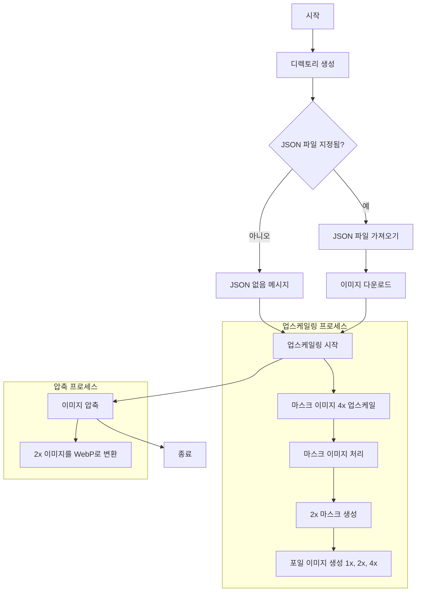

이 쉘 스크립트는 포켓몬 카드의 포일(foil) 이미지를 다운로드하고 처리하는 과정을 자동화합니다. 주요 기능을 단계별로 설명하겠습니다:

1. **디렉토리 생성** (`create_directories`):
   - 'foils'와 'masks' 디렉토리 및 그 하위에 'upscaled' 디렉토리를 생성합니다.

2. **JSON 파일 가져오기** (`fetch_json`):
   - 원격 JSON 파일의 URL이 제공된 경우, 해당 파일을 다운로드합니다.

3. **이미지 다운로드** (`download_images`):
   - JSON 데이터를 파싱하여 포일 이미지 URL을 추출합니다.
   - 각 이미지에 대해 새로운 파일 이름을 생성하고 다운로드합니다.

4. **업스케일링 및 이미지 처리** (`upscale`):
   - 다운로드한 각 마스크 이미지에 대해:
     a. Real-ESRGAN을 사용하여 4배로 업스케일합니다.
     b. ImageMagick을 사용하여 마스크 이미지를 처리합니다 (알파 채널 조정, 밝기 조정 등).
     c. 4배 크기의 마스크에서 2배 크기의 마스크를 생성합니다.
     d. 원본, 2배, 4배 크기의 그레이스케일 포일 이미지를 생성합니다.

5. **이미지 압축** (`compress`):
   - 2배 크기의 모든 PNG 이미지를 WebP 형식으로 변환하여 압축합니다.

이 스크립트는 포켓몬 카드의 포일 효과를 위한 이미지를 효율적으로 처리하고, 다양한 크기와 형식으로 준비하는 데 사용됩니다. 고품질의 업스케일된 이미지와 웹 최적화된 버전을 동시에 생성하여, 다양한 사용 사례에 대응할 수 있게 합니다.