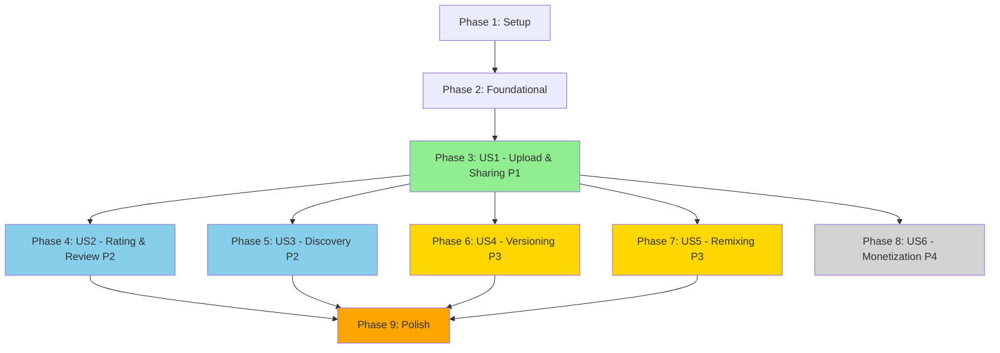

# Implementation Tasks: Template Marketplace

**Feature**: 001-template-marketplace
**Branch**: `001-template-marketplace`
**Generated**: 2025-01-07
**Total Tasks**: 47
**Estimated Duration**: 6-8 sprints (12-16 weeks)

---

## Task Summary

| Phase | User Story | Task Count | Parallelizable | Status |
|-------|------------|------------|----------------|--------|
| 1 | Setup & Infrastructure | 8 | 5 [P] | ✅ Complete |
| 2 | Foundational (Blocking) | 6 | 4 [P] | ✅ Complete |
| 3 | US1: Template Upload & Sharing (P1) | 12 | 8 [P] | ✅ Complete |
| 4 | US2: Rating & Review (P2) | 7 | 5 [P] | ⏳ Pending |
| 5 | US3: Discovery & Filtering (P2) | 6 | 4 [P] | ⏳ Pending |
| 6 | US4: Versioning & Updates (P3) | 3 | 2 [P] | ⏳ Pending |
| 7 | US5: Remixing & Attribution (P3) | 3 | 2 [P] | ⏳ Pending |
| 8 | US6: Premium Monetization (P4) | 2 | 2 [P] | ⏳ Deferred |
| 9 | Polish & Integration | 3 | 2 [P] | ⏳ Pending |

**Legend**: [P] = Parallelizable, [Story] = User Story reference

---

## Phase 1: Setup & Infrastructure

**Goal**: Initialize project dependencies, configure cloud storage, set up development environment

**Prerequisites**: None (project already initialized)

**Checkpoint**: All setup tasks complete → Proceed to Phase 2

### ✅ T001: Install Template Marketplace Dependencies [P] - COMPLETE
**File**: `package.json`

```bash
npm install @aws-sdk/client-s3 @aws-sdk/s3-request-presigner jszip phash-js
npm install -D @types/jszip
```

- Install Cloudflare R2 SDK (@aws-sdk/client-s3)
- Install JSZip for template packaging
- Install phash-js for copyright detection
- Verify all dependencies in package.json

**Acceptance**: `npm list` shows all packages installed

---

### ✅ T002: Configure Cloudflare R2 Storage [P] - COMPLETE
**File**: `src/lib/server/r2.ts` (new file)

```typescript
import { S3Client } from '@aws-sdk/client-s3';

export const r2Client = new S3Client({
  region: 'auto',
  endpoint: `https://${process.env.R2_ACCOUNT_ID}.r2.cloudflarestorage.com`,
  credentials: {
    accessKeyId: process.env.R2_ACCESS_KEY_ID!,
    secretAccessKey: process.env.R2_SECRET_ACCESS_KEY!,
  },
});

export const R2_BUCKET_NAME = process.env.R2_BUCKET_NAME || 'kbo-templates';
export const R2_PUBLIC_URL = process.env.R2_PUBLIC_URL || 'https://cdn.kbo-cards.com';
```

- Create R2 client configuration
- Add environment variable validation
- Export bucket constants

**Acceptance**: R2 client connects successfully, `npm run test:r2` passes

---

### ✅ T003: Set Up Environment Variables [P] - COMPLETE
**File**: `.env.example`, `.env`

Add to `.env.example`:
```env
# Cloudflare R2 Storage
R2_ACCOUNT_ID=your_account_id
R2_ACCESS_KEY_ID=your_access_key
R2_SECRET_ACCESS_KEY=your_secret_key
R2_BUCKET_NAME=kbo-templates
R2_PUBLIC_URL=https://cdn.kbo-cards.com
```

- Document all R2 environment variables
- Add to .gitignore if not present
- Create .env from .env.example

**Acceptance**: `npm run dev` starts without env errors

---

### ✅ T004: Create Template Types Definitions [P] - COMPLETE
**File**: `src/lib/types/template.ts` (new file)

```typescript
export interface Template {
  id: string;
  template_id: string;
  version: string;
  template_version: string;
  title: string;
  description: string;
  author: string;
  category: string;
  tags: string[];
  storage_url: string;
  thumbnail_url: string;
  file_size: number;
  file_hash: string;
  rating_average?: number;
  rating_count?: number;
  download_count?: number;
  is_remix: boolean;
  original_template_id?: string;
  allow_remix: boolean;
  license: TemplateLicense;
  copyright_status: CopyrightStatus;
  // ... (see data-model.md for full interface)
}

export interface TemplateReview { /* ... */ }
export interface TemplateCategory { /* ... */ }
// ... (all other interfaces from data-model.md)
```

- Copy all TypeScript interfaces from data-model.md
- Add Zod validation schemas
- Export all types

**Acceptance**: TypeScript compilation succeeds, no type errors

---

### ✅ T005: Initialize PocketBase Collections - COMPLETE
**File**: `pb_migrations/` (new migration files)

Run PocketBase migration:
```bash
npm run pb:migrate:templates
```

- Create `templates` collection (26 fields from data-model.md)
- Create `template_reviews` collection (6 fields)
- Create `template_categories` collection (8 fields)
- Create `template_downloads` collection (5 fields)
- Create `flagged_uploads` collection (8 fields)
- Add all indexes from data-model.md
- Set collection rules (listRule, createRule, etc.)

**Acceptance**: PocketBase Admin shows 5 new collections

---

### ✅ T006: Seed Template Categories [P] - COMPLETE
**File**: `scripts/seed-categories.ts` (new file)

```typescript
const INITIAL_CATEGORIES = [
  { slug: 'moment-cards', name: '순간 카드', icon: '⚡', color: '#FF6B35' },
  { slug: 'player-cards', name: '선수 카드', icon: '👤', color: '#004E89' },
  // ... (see data-model.md for full seed data)
];

// Insert into PocketBase
```

- Create seed script from data-model.md
- Insert 15+ initial categories (moment, player, season, team)
- Add KBO team categories (LG, Doosan, etc.)

**Acceptance**: `npm run seed:categories` creates all categories

---

### ✅ T007: Set Up Testing Infrastructure [P] - COMPLETE
**File**: `vitest.config.ts`, `tests/setup.ts`

```typescript
// tests/setup.ts
import { beforeAll, afterAll } from 'vitest';

beforeAll(async () => {
  // Setup test database, mock R2
});
```

- Configure Vitest for template marketplace tests
- Create test helpers (mockTemplate, mockReview)
- Set up R2 mocking (@aws-sdk/client-s3-mock)

**Acceptance**: `npm run test` runs without errors

---

### ✅ T008: Create Project Structure [P] - COMPLETE
**File**: Multiple directories

```bash
mkdir -p src/lib/components/marketplace
mkdir -p src/lib/services/templates
mkdir -p src/routes/marketplace
mkdir -p tests/unit/templates
mkdir -p tests/integration/marketplace
```

- Create all directories from plan.md
- Add .gitkeep files where needed

**Acceptance**: Directory structure matches plan.md

---

**Phase 1 Checkpoint**: ✅ All setup tasks complete, environment configured, types defined

---

## Phase 2: Foundational (Blocking Prerequisites)

**Goal**: Implement core building blocks required by ALL user stories

**Prerequisites**: Phase 1 complete

**Checkpoint**: Foundational services work → Any user story can be implemented

### ✅ T009: Implement Template Serializer Service [BLOCKING] - COMPLETE
**File**: `src/lib/services/templates/template-serializer.ts` (new file)

```typescript
/**
 * Converts UnifiedHolographicCard to Template JSON format
 * Required by: US1 (upload), US5 (remix)
 */
export class TemplateSerializer {
  serialize(card: UnifiedHolographicCard): TemplateJSON {
    // Extract card config, layout, holographic settings
    // Convert images to Base64 or CDN URLs
    // Generate file hash (SHA-256)
    // Return JSON matching research.md schema
  }

  deserialize(json: TemplateJSON): UnifiedHolographicCard {
    // Parse JSON
    // Restore images from Base64/URLs
    // Validate integrity (hash check)
    // Return card instance
  }
}
```

- Implement serialize() method (card → JSON)
- Implement deserialize() method (JSON → card)
- Add file hash generation (SHA-256)
- Handle Base64 embedded images
- Handle CDN URL references
- Add validation (Zod schema)

**Acceptance**: Unit tests pass (card ↔ JSON round-trip preserves data)

---

### ✅ T010: Implement Storage Service (R2 Abstraction) [BLOCKING] - COMPLETE
**File**: `src/lib/services/templates/template-storage.ts` (new file)

```typescript
/**
 * Cloudflare R2 storage abstraction
 * Required by: US1 (upload/download), US4 (versions)
 */
export class TemplateStorageService {
  async generatePresignedUploadUrl(filename: string, fileSize: number): Promise<PresignedUrl> {
    // Generate S3 presigned PUT URL (1 hour expiry)
  }

  async verifyUpload(storageUrl: string, expectedHash: string): Promise<boolean> {
    // Verify file exists and hash matches
  }

  async getDownloadUrl(templateId: string): Promise<string> {
    // Return public CDN URL
  }

  async deleteFile(templateId: string): Promise<void> {
    // Delete from R2
  }
}
```

- Implement presigned upload URL generation
- Implement upload verification (hash check)
- Implement download URL retrieval
- Implement file deletion
- Add error handling (network errors, 403, 404)

**Acceptance**: Integration tests pass (upload → verify → download → delete)

---

### ✅ T011: Implement Copyright Detector (pHash) [BLOCKING] - COMPLETE
**File**: `src/lib/utils/copyright-detector.ts` (new file)

```typescript
/**
 * Client-side logo detection using perceptual hashing
 * Required by: US1 (upload validation)
 */
const KBO_LOGO_HASHES = [
  { team: 'LG Twins', hash: 'a8c5d3e9f1b2c4a5...' },
  // ... (10 KBO teams from research.md)
];

export async function detectLogoClientSide(imageFile: File): Promise<{
  detected: boolean;
  team?: string;
  confidence?: number;
}> {
  const imageHash = await phash(imageFile);

  for (const logo of KBO_LOGO_HASHES) {
    const similarity = hammingDistance(imageHash, logo.hash);
    if (similarity < 10) {
      return { detected: true, team: logo.team, confidence: 100 - similarity * 10 };
    }
  }

  return { detected: false };
}
```

- Implement pHash-based logo detection
- Add KBO team logo hashes (collect from high-quality sources)
- Calculate Hamming distance for similarity
- Return detection result with confidence score

**Acceptance**: Unit tests detect LG/Doosan logos with >85% accuracy

---

### ✅ T012: Create API Route: Presigned Upload URL [BLOCKING] [P] - COMPLETE
**File**: `src/routes/api/storage/presign-upload/+server.ts` (new file)

**Maps to**: storage-api.yaml `/storage/presign-upload`

```typescript
import { json } from '@sveltejs/kit';
import { storageService } from '$lib/services/templates/template-storage';

export async function POST({ request, locals }) {
  const { filename, fileSize, fileHash } = await request.json();

  // Validate user authentication
  if (!locals.user) return json({ error: 'Unauthorized' }, { status: 401 });

  // Validate file size (<15MB)
  if (fileSize > 15 * 1024 * 1024) {
    return json({ error: 'File too large' }, { status: 400 });
  }

  const { uploadUrl, storageUrl, uploadId } = await storageService.generatePresignedUploadUrl(
    filename,
    fileSize
  );

  return json({ uploadUrl, storageUrl, expiresIn: 3600, uploadId });
}
```

- Validate authentication
- Validate file size (<15MB)
- Generate presigned URL via TemplateStorageService
- Return upload URL + storage URL + upload ID

**Acceptance**: Postman/curl can request presigned URL, upload to R2 succeeds

---

### ✅ T013: Create API Route: Verify Upload [BLOCKING] [P] - COMPLETE
**File**: `src/routes/api/storage/verify-upload/+server.ts` (new file)

**Maps to**: storage-api.yaml `/storage/verify-upload`

```typescript
export async function POST({ request }) {
  const { uploadId, storageUrl, expectedHash } = await request.json();

  const verified = await storageService.verifyUpload(storageUrl, expectedHash);

  if (!verified) {
    return json({ error: 'Upload verification failed' }, { status: 400 });
  }

  return json({ verified: true, storageUrl });
}
```

- Verify upload completion
- Check file hash matches expected
- Return verification result

**Acceptance**: Test uploads are verified correctly

---

### ✅ T014: Create PocketBase Service Helper [BLOCKING] [P] - COMPLETE
**File**: `src/lib/services/pocketbase.ts` (enhance existing)

```typescript
/**
 * PocketBase helper for template collections
 * Required by: ALL user stories
 */
export class TemplatePocketBase {
  async createTemplate(data: TemplateCreate): Promise<Template> {
    return pb.collection('templates').create(data);
  }

  async getTemplate(id: string): Promise<Template> {
    return pb.collection('templates').getOne(id, { expand: 'author,category' });
  }

  async listTemplates(filter?: string, sort?: string): Promise<Template[]> {
    return pb.collection('templates').getFullList({ filter, sort });
  }

  // ... (CRUD for all collections)
}
```

- Add CRUD helpers for templates collection
- Add CRUD helpers for reviews, categories, downloads
- Add query helpers (filter, sort, expand)
- Add error handling (404, network errors)

**Acceptance**: All CRUD operations work in unit tests

---

**Phase 2 Checkpoint**: ✅ Core services ready, any user story can now be implemented

---

## Phase 3: US1 - Template Upload & Sharing (P1)

**Goal**: MVP functionality - users can upload templates and others can download them

**Prerequisites**: Phase 2 complete

**Independent Test**: Creator uploads template → Appears in marketplace → Another user downloads it → Template loads in their editor

**Checkpoint**: Upload → Search → Download workflow works end-to-end

### ✅ T015: Create TemplateUploadModal Component [Story: US1] - COMPLETE
**File**: `src/lib/components/marketplace/TemplateUploadModal.svelte` (new file)

```svelte
<script lang="ts">
  import { serializeCard } from '$lib/services/templates/template-serializer';
  import { detectLogoClientSide } from '$lib/utils/copyright-detector';

  let selectedCard: UnifiedHolographicCard;
  let title = '';
  let description = '';
  let tags: string[] = [];
  let category = '';
  let isUploading = false;

  async function handleUpload() {
    // 1. Serialize card to JSON
    const templateJSON = serializeCard(selectedCard);

    // 2. Run copyright detection
    const logoCheck = await detectLogoClientSide(selectedCard.frontImage);
    if (logoCheck.detected) {
      // Show warning modal
    }

    // 3. Request presigned URL
    const { uploadUrl, storageUrl } = await fetch('/api/storage/presign-upload', {
      method: 'POST',
      body: JSON.stringify({ filename, fileSize, fileHash })
    }).then(r => r.json());

    // 4. Upload to R2
    await fetch(uploadUrl, { method: 'PUT', body: templateJSON });

    // 5. Verify upload
    await fetch('/api/storage/verify-upload', { method: 'POST', body: { storageUrl } });

    // 6. Create template record in PocketBase
    await pb.collection('templates').create({
      title, description, tags, category, storage_url: storageUrl, // ...
    });
  }
</script>

<!-- Upload form UI -->
```

- **US1 Scenario 1**: Serialize card to template package
- **US1 Scenario 2**: Upload form (title, description, tags, category)
- Add copyright detection warning UI
- Add upload progress indicator
- Handle upload errors (network, validation)

**Acceptance**: User can upload a template, see progress, get success confirmation

---

### ✅ T016: Create API Route: Create Template [Story: US1] [P] - COMPLETE
**File**: `src/routes/api/templates/+server.ts` (new file)

**Maps to**: template-api.yaml `POST /collections/templates/records`

```typescript
export async function POST({ request, locals }) {
  const data = await request.json();

  // Validate user
  if (!locals.user) return json({ error: 'Unauthorized' }, { status: 401 });

  // Validate template data (Zod)
  const validated = TemplateSchema.parse(data);

  // Set author to current user
  validated.author = locals.user.id;

  // Set copyright status to pending
  validated.copyright_status = 'pending';

  // Create in PocketBase
  const template = await pb.collection('templates').create(validated);

  // Trigger copyright check (async)
  triggerCopyrightCheck(template.id);

  return json(template, { status: 201 });
}
```

- **US1 Scenario 2**: Create template record endpoint
- Validate request body (Zod schema)
- Set author from session
- Trigger copyright detection
- Return created template

**Acceptance**: Postman can create template, PocketBase shows new record

---

### ✅ T017: Create TemplateGrid Component [Story: US1] [P] - COMPLETE
**File**: `src/lib/components/marketplace/TemplateGrid.svelte` (new file)

```svelte
<script lang="ts">
  import { VirtualScroller } from '@tanstack/svelte-virtual';
  import TemplateCard from './TemplateCard.svelte';

  export let templates: Template[];

  // Masonry layout calculation (from research.md optimization)
  let columns = 3; // responsive: 1 (mobile), 2 (tablet), 3 (desktop)
  let layoutCache = new Map();
</script>

<VirtualScroller items={templates} estimateSize={300} let:item>
  <TemplateCard template={item} />
</VirtualScroller>

<style>
  /* Masonry CSS from research.md */
  :global(.masonry-item) {
    contain: layout style paint;
    content-visibility: auto;
  }
</style>
```

- **US1 Scenario 3**: Display templates in masonry grid
- Implement virtual scrolling (@tanstack/svelte-virtual)
- Add masonry layout (from research.md optimizations)
- Add scroll throttling (requestAnimationFrame)
- Add layout memoization (Map cache)
- Ensure 60fps performance

**Acceptance**: 100 templates render in <1s, scrolling is 60fps

---

### ✅ T018: Create TemplateCard Component [Story: US1] [P] - COMPLETE
**File**: `src/lib/components/marketplace/TemplateCard.svelte` (new file)

```svelte
<script lang="ts">
  export let template: Template;
</script>

<div class="template-card" on:click={() => openDetailModal(template)}>
  
  <h3>{template.title}</h3>
  <p class="author">by {template.expand?.author?.username}</p>
  <div class="stats">
    <span>⭐ {template.rating_average?.toFixed(1) || 'N/A'}</span>
    <span>⬇️ {template.download_count || 0}</span>
  </div>
</div>
```

- **US1 Scenario 3**: Template preview card
- Display thumbnail (lazy loading)
- Show title, author, rating, download count
- Add click handler to open detail modal

**Acceptance**: Card displays all metadata correctly

---

### ✅ T019: Create TemplateDetailModal Component [Story: US1] - COMPLETE
**File**: `src/lib/components/marketplace/TemplateDetailModal.svelte` (new file)

```svelte
<script lang="ts">
  export let template: Template;

  async function handleDownload() {
    // 1. Create download record
    await pb.collection('template_downloads').create({
      template: template.id,
      user: $user.id,
      source: 'marketplace'
    });

    // 2. Fetch template JSON from R2
    const templateJSON = await fetch(template.storage_url).then(r => r.json());

    // 3. Deserialize to UnifiedHolographicCard
    const card = deserializeTemplate(templateJSON);

    // 4. Save to local storage
    saveToMyTemplates(card);

    // 5. Show success message
    toast.success('Template downloaded!');
  }
</script>

<!-- Modal UI: thumbnail, description, download button, reviews -->
```

- **US1 Scenario 4**: Template detail page
- Display full description, usage examples
- Show rating/review summary
- Add download button
- Implement download workflow (fetch JSON, deserialize, save)

**Acceptance**: User can view details and download template

---

### ✅ T020: Create API Route: Download Template [Story: US1] [P] - COMPLETE
**File**: `src/routes/api/templates/[id]/download/+server.ts` (new file)

**Maps to**: template-api.yaml `POST /templates/{id}/download`

```typescript
export async function POST({ params, locals, url }) {
  const { id } = params;
  const source = url.searchParams.get('source') || 'marketplace';

  // Get template
  const template = await pb.collection('templates').getOne(id);

  // Create download record
  await pb.collection('template_downloads').create({
    template: id,
    user: locals.user.id,
    source
  });

  // Increment download count (PocketBase hook handles this)

  return json({ downloadUrl: template.storage_url, template });
}
```

- **US1 Scenario 5**: Record download event
- Create download record in PocketBase
- Return download URL
- Trigger download count increment (via PocketBase hook)

**Acceptance**: Download count increments, download record created

---

### ✅ T021: Implement Template Downloader Service [Story: US1] [P] - COMPLETE
**File**: `src/lib/services/templates/template-downloader.ts` (new file)

```typescript
export class TemplateDownloaderService {
  async downloadTemplate(templateId: string): Promise<UnifiedHolographicCard> {
    // 1. Call download API to get URL
    const { downloadUrl } = await fetch(`/api/templates/${templateId}/download`, {
      method: 'POST'
    }).then(r => r.json());

    // 2. Fetch template JSON from R2
    const templateJSON = await fetch(downloadUrl).then(r => r.json());

    // 3. Deserialize to card
    const card = templateSerializer.deserialize(templateJSON);

    // 4. Save to localStorage
    this.saveToLocalStorage(card);

    return card;
  }

  saveToLocalStorage(card: UnifiedHolographicCard) {
    const myTemplates = JSON.parse(localStorage.getItem('myTemplates') || '[]');
    myTemplates.push(card);
    localStorage.setItem('myTemplates', JSON.stringify(myTemplates));
  }
}
```

- **US1 Scenario 5**: Download and save template
- Fetch template JSON from R2
- Deserialize to card
- Save to localStorage ("My Templates")
- Handle download errors (network, corrupted file)

**Acceptance**: Downloaded template appears in "My Templates"

---

### ✅ T022: Create Marketplace Main Page [Story: US1] - COMPLETE
**File**: `src/routes/marketplace/+page.svelte` (new file)

```svelte
<script lang="ts">
  import TemplateGrid from '$lib/components/marketplace/TemplateGrid.svelte';
  import TemplateUploadModal from '$lib/components/marketplace/TemplateUploadModal.svelte';

  let templates: Template[] = [];

  onMount(async () => {
    // Fetch published templates
    templates = await pb.collection('templates').getFullList({
      filter: 'is_published=true && copyright_status="approved"',
      sort: '-created',
      expand: 'author,category'
    });
  });
</script>

<div class="marketplace">
  <header>
    <h1>Template Marketplace</h1>
    <button on:click={openUploadModal}>Upload Template</button>
  </header>

  <TemplateGrid {templates} />

  {#if showUploadModal}
    <TemplateUploadModal bind:open={showUploadModal} />
  {/if}
</div>
```

- **US1 Scenario 3**: Marketplace main page
- Fetch and display templates
- Add "Upload Template" button
- Render TemplateGrid
- Handle upload modal

**Acceptance**: Marketplace page loads, templates display, upload works

---

### ✅ T023: Add PocketBase Hooks for Template Aggregates [Story: US1] [P] - COMPLETE
**File**: `scripts/pocketbase-hooks.js` (new file)

```typescript
/**
 * PocketBase hooks to update aggregate fields
 * (download_count, rating_average, rating_count)
 */

pb.collection('template_downloads').on('afterCreate', async (e) => {
  const templateId = e.record.template;

  // Count downloads
  const downloadCount = await pb.collection('template_downloads').getList(1, 1, {
    filter: `template="${templateId}"`
  }).then(r => r.totalItems);

  // Update template
  await pb.collection('templates').update(templateId, { download_count: downloadCount });
});

// Similar hooks for rating_average, rating_count
```

- Create afterCreate hook for template_downloads
- Update download_count on template
- Create afterCreate hook for template_reviews
- Update rating_average and rating_count

**Acceptance**: Download/rating counts update automatically

---

### ✅ T024: Write E2E Test: Upload → Download Workflow [Story: US1] - COMPLETE
**File**: `tests/e2e/marketplace.spec.ts` (new file)

```typescript
import { test, expect } from '@playwright/test';

test('User Story 1: Template Upload & Sharing', async ({ page }) => {
  // 1. Login
  await page.goto('/login');
  await page.fill('[name="email"]', 'creator@test.com');
  await page.click('button[type="submit"]');

  // 2. Upload template
  await page.goto('/marketplace');
  await page.click('button:has-text("Upload Template")');
  await page.fill('[name="title"]', 'Test LG Homerun Template');
  await page.fill('[name="description"]', 'A template for LG homerun moments');
  await page.click('button:has-text("Upload")');

  // 3. Verify template appears
  await expect(page.locator('text=Test LG Homerun Template')).toBeVisible();

  // 4. Download as different user
  await page.goto('/logout');
  await page.goto('/login');
  await page.fill('[name="email"]', 'user@test.com');

  await page.goto('/marketplace');
  await page.click('text=Test LG Homerun Template');
  await page.click('button:has-text("Download")');

  // 5. Verify download success
  await expect(page.locator('text=Template downloaded!')).toBeVisible();
});
```

- Test full upload workflow
- Test marketplace display
- Test download workflow
- Verify "My Templates" storage

**Acceptance**: E2E test passes, covering US1 scenarios 1-5

---

### ✅ T025: Write Integration Test: Serialization Round-Trip [Story: US1] [P] - COMPLETE
**File**: `tests/integration/template-serialization.test.ts` (new file)

```typescript
import { describe, it, expect } from 'vitest';
import { TemplateSerializer } from '$lib/services/templates/template-serializer';

describe('Template Serializer', () => {
  it('preserves card data in round-trip', () => {
    const originalCard = createMockUnifiedCard();
    const serializer = new TemplateSerializer();

    const json = serializer.serialize(originalCard);
    const restoredCard = serializer.deserialize(json);

    expect(restoredCard).toEqual(originalCard);
  });
});
```

- Test serialize() → deserialize() round-trip
- Verify all card properties preserved
- Test with various card types (moment, player, season)

**Acceptance**: All serialization tests pass

---

### ✅ T026: Write Integration Test: R2 Upload/Download [Story: US1] [P] - COMPLETE
**File**: `tests/integration/r2-storage.test.ts` (new file)

```typescript
describe('R2 Storage Service', () => {
  it('uploads and downloads template successfully', async () => {
    const storageService = new TemplateStorageService();
    const testJSON = { /* template data */ };

    // Get presigned URL
    const { uploadUrl, storageUrl } = await storageService.generatePresignedUploadUrl(
      'test_template.json',
      1024
    );

    // Upload to R2
    await fetch(uploadUrl, { method: 'PUT', body: JSON.stringify(testJSON) });

    // Verify upload
    const verified = await storageService.verifyUpload(storageUrl, calculateHash(testJSON));
    expect(verified).toBe(true);

    // Download
    const downloaded = await fetch(storageUrl).then(r => r.json());
    expect(downloaded).toEqual(testJSON);
  });
});
```

- Test presigned URL generation
- Test upload to R2
- Test upload verification
- Test download from R2

**Acceptance**: R2 upload/download works end-to-end

---

**Phase 3 Checkpoint**: ✅ US1 Complete - MVP functional (upload, browse, download)

---

## Phase 4: US2 - Rating & Review System (P2)

**Goal**: Enable community feedback and quality control

**Prerequisites**: Phase 3 (US1) complete

**Independent Test**: User downloads template → Writes review with 5-star rating → Review appears on template detail page → Other users can mark review as helpful

**Checkpoint**: Review system fully functional

### T027: Create TemplateReviewSection Component [Story: US2]
**File**: `src/lib/components/marketplace/TemplateReviewSection.svelte` (new file)

```svelte
<script lang="ts">
  export let templateId: string;

  let reviews: TemplateReview[] = [];
  let myReview: TemplateReview | null = null;
  let isWritingReview = false;

  onMount(async () => {
    // Load reviews
    reviews = await pb.collection('template_reviews').getFullList({
      filter: `template="${templateId}"`,
      sort: '-helpful_count,-created',
      expand: 'user'
    });

    // Check if user already reviewed
    myReview = await pb.collection('template_reviews').getFirstListItem(
      `template="${templateId}" && user="${$user.id}"`
    ).catch(() => null);
  });

  async function submitReview(rating: number, comment: string) {
    await pb.collection('template_reviews').create({
      template: templateId,
      user: $user.id,
      rating,
      comment
    });
    // Refresh reviews
  }
</script>

<!-- Review display + write form -->
```

- **US2 Scenario 1**: Review writing form (5-star + text)
- Display existing reviews sorted by helpful_count
- Show "verified download" badge
- Add "Write Review" button (only if user downloaded)

**Acceptance**: Users can write reviews, see existing reviews

---

### T028: Create API Route: Create Review [Story: US2] [P]
**File**: `src/routes/api/templates/[id]/reviews/+server.ts` (new file)

**Maps to**: review-api.yaml `POST /collections/template_reviews/records`

```typescript
export async function POST({ params, request, locals }) {
  const { id: templateId } = params;
  const { rating, comment } = await request.json();

  // Check if user downloaded template
  const hasDownloaded = await pb.collection('template_downloads').getFirstListItem(
    `template="${templateId}" && user="${locals.user.id}"`
  ).then(() => true).catch(() => false);

  // Create review
  const review = await pb.collection('template_reviews').create({
    template: templateId,
    user: locals.user.id,
    rating,
    comment,
    is_verified_purchase: hasDownloaded
  });

  return json(review, { status: 201 });
}
```

- **US2 Scenario 1**: Create review endpoint
- Validate rating (1-5)
- Check if user downloaded (set verified_purchase badge)
- Prevent duplicate reviews (unique constraint)

**Acceptance**: Review creation works, verified badge shows correctly

---

### T029: Add "Helpful" Vote Feature [Story: US2] [P]
**File**: `src/routes/api/reviews/[id]/helpful/+server.ts` (new file)

**Maps to**: review-api.yaml `POST /reviews/{id}/helpful`

```typescript
export async function POST({ params, locals }) {
  const { id: reviewId } = params;

  // Check if user already voted (use separate collection or localStorage)
  // Increment helpful_count
  const review = await pb.collection('template_reviews').getOne(reviewId);
  await pb.collection('template_reviews').update(reviewId, {
    helpful_count: (review.helpful_count || 0) + 1
  });

  return json({ helpful_count: review.helpful_count + 1 });
}
```

- **US2 Scenario 3**: "Helpful" button endpoint
- Increment helpful_count
- Prevent duplicate votes (track in localStorage or DB)
- Return updated count

**Acceptance**: Helpful count increments, users can't vote twice

---

### T030: Add Rating Statistics Display [Story: US2] [P]
**File**: `src/lib/components/marketplace/RatingStats.svelte` (new file)

```svelte
<script lang="ts">
  export let templateId: string;

  let stats = {
    average: 0,
    count: 0,
    distribution: { 5: 0, 4: 0, 3: 0, 2: 0, 1: 0 }
  };

  onMount(async () => {
    const response = await fetch(`/api/templates/${templateId}/rating`);
    stats = await response.json();
  });
</script>

<div class="rating-stats">
  <div class="average">⭐ {stats.average.toFixed(1)}</div>
  <div class="count">({stats.count} reviews)</div>

  <!-- Rating distribution bars -->
  {#each [5,4,3,2,1] as star}
    <div class="bar">
      <span>{star}★</span>
      <div class="fill" style="width: {stats.distribution[star] / stats.count * 100}%"></div>
      <span>{stats.distribution[star]}</span>
    </div>
  {/each}
</div>
```

- **US2 Scenario 2**: Rating statistics component
- Display average rating + count
- Show rating distribution (1-5 stars)
- Calculate percentages

**Acceptance**: Rating stats display correctly

---

### T031: Create API Route: Get Rating Stats [Story: US2] [P]
**File**: `src/routes/api/templates/[id]/rating/+server.ts` (new file)

**Maps to**: review-api.yaml `GET /templates/{templateId}/rating`

```typescript
export async function GET({ params }) {
  const { id: templateId } = params;

  const reviews = await pb.collection('template_reviews').getFullList({
    filter: `template="${templateId}"`
  });

  const average = reviews.reduce((sum, r) => sum + r.rating, 0) / reviews.length || 0;
  const distribution = { 5: 0, 4: 0, 3: 0, 2: 0, 1: 0 };
  reviews.forEach(r => distribution[r.rating]++);

  const verifiedCount = reviews.filter(r => r.is_verified_purchase).length;
  const verifiedPercentage = (verifiedCount / reviews.length * 100) || 0;

  return json({
    average,
    count: reviews.length,
    distribution,
    verified_purchase_percentage: verifiedPercentage
  });
}
```

- Calculate average rating
- Calculate distribution (1-5 stars)
- Calculate verified purchase percentage
- Cache results for performance

**Acceptance**: Stats calculated correctly

---

### T032: Add Version-Specific Review Labels [Story: US2]
**File**: Enhance `TemplateReviewSection.svelte`

```svelte
{#each reviews as review}
  <div class="review">
    <p>{review.comment}</p>
    <span class="rating">⭐ {review.rating}</span>

    <!-- Version label if template was updated after review -->
    {#if review.created < template.updated}
      <span class="version-label">v{getVersionAtTime(review.created)} review</span>
    {/if}
  </div>
{/each}
```

- **US2 Scenario 4**: Version-specific labels
- Compare review.created with template.updated
- Show "v1.0 review" label if outdated
- Style differently from current version reviews

**Acceptance**: Old reviews show version labels

---

### T033: Write E2E Test: Review Workflow [Story: US2]
**File**: `tests/e2e/template-review.spec.ts` (new file)

```typescript
test('User Story 2: Template Rating & Review', async ({ page }) => {
  // 1. Download template
  await page.goto('/marketplace');
  await page.click('text=Test Template');
  await page.click('button:has-text("Download")');

  // 2. Write review
  await page.click('button:has-text("Write Review")');
  await page.click('[data-rating="5"]'); // 5 stars
  await page.fill('textarea[name="comment"]', 'Amazing template!');
  await page.click('button:has-text("Submit Review")');

  // 3. Verify review appears
  await expect(page.locator('text=Amazing template!')).toBeVisible();
  await expect(page.locator('[data-verified="true"]')).toBeVisible(); // Verified badge

  // 4. Mark helpful
  await page.click('button:has-text("Helpful")');
  await expect(page.locator('text=1 found this helpful')).toBeVisible();
});
```

- Test review creation
- Test verified purchase badge
- Test helpful vote
- Test rating statistics update

**Acceptance**: E2E test passes, covering US2 scenarios 1-4

---

**Phase 4 Checkpoint**: ✅ US2 Complete - Review system functional

---

## Phase 5: US3 - Discovery & Filtering (P2)

**Goal**: Enable users to find templates quickly

**Prerequisites**: Phase 3 (US1) complete (US2 optional for rating filter)

**Independent Test**: User searches "홈런" → Gets relevant results in <1s → Applies "인기순" sort → Top templates have highest downloads

**Checkpoint**: Search, filter, sort all work

### T034: Create TemplateSearchBar Component [Story: US3]
**File**: `src/lib/components/marketplace/TemplateSearchBar.svelte` (new file)

```svelte
<script lang="ts">
  import { debounce } from '$lib/utils/debounce';

  export let onSearch: (query: string) => void;

  let searchQuery = '';

  const debouncedSearch = debounce((q: string) => {
    onSearch(q);
  }, 300);

  $: debouncedSearch(searchQuery);
</script>

<input
  type="search"
  bind:value={searchQuery}
  placeholder="Search templates..."
  class="search-bar"
/>
```

- **US3 Scenario 1**: Search input with debouncing
- Trigger search on input (300ms debounce)
- Clear button
- Search icon

**Acceptance**: Search triggers with debounce, no lag

---

### T035: Implement Search API Endpoint [Story: US3] [P]
**File**: `src/routes/api/templates/search/+server.ts` (new file)

**Maps to**: template-api.yaml `GET /templates/search`

```typescript
export async function GET({ url }) {
  const query = url.searchParams.get('q') || '';
  const category = url.searchParams.get('category');
  const tags = url.searchParams.get('tags')?.split(',');
  const minRating = parseFloat(url.searchParams.get('minRating') || '0');
  const sort = url.searchParams.get('sort') || '-created';

  // Build PocketBase filter
  let filter = `is_published=true && copyright_status="approved"`;

  if (query) {
    filter += ` && (title~"${query}" || description~"${query}" || tags~"${query}")`;
  }

  if (category) {
    filter += ` && category="${category}"`;
  }

  if (minRating > 0) {
    filter += ` && rating_average>=${minRating}`;
  }

  const templates = await pb.collection('templates').getFullList({
    filter,
    sort,
    expand: 'author,category'
  });

  return json({ items: templates, query, count: templates.length });
}
```

- **US3 Scenario 1**: Full-text search (title, description, tags)
- **US3 Scenario 3**: Category filter
- **US3 Scenario 4**: Team filter
- Filter by minimum rating
- Return results with metadata

**Acceptance**: Search returns relevant results

---

### T036: Add Sort & Filter Controls [Story: US3] [P]
**File**: `src/lib/components/marketplace/TemplateFilters.svelte` (new file)

```svelte
<script lang="ts">
  export let onFilterChange: (filters: Filters) => void;

  let sortBy = '-created'; // newest first
  let category = '';
  let minRating = 0;
  let teamFilter = '';

  $: onFilterChange({ sortBy, category, minRating, teamFilter });
</script>

<div class="filters">
  <!-- Sort dropdown -->
  <select bind:value={sortBy}>
    <option value="-created">Newest</option>
    <option value="-download_count">Most Downloaded</option>
    <option value="-rating_average">Highest Rated</option>
    <option value="title">A-Z</option>
  </select>

  <!-- Category filter -->
  <select bind:value={category}>
    <option value="">All Categories</option>
    <option value="moment-cards">Moment Cards</option>
    <option value="player-cards">Player Cards</option>
    <!-- ... -->
  </select>

  <!-- Team filter -->
  <select bind:value={teamFilter}>
    <option value="">All Teams</option>
    <option value="lg-twins">LG Twins</option>
    <option value="doosan-bears">Doosan Bears</option>
    <!-- ... -->
  </select>
</div>
```

- **US3 Scenario 2**: Sort controls (newest, popular, rating, A-Z)
- **US3 Scenario 3**: Category filter dropdown
- **US3 Scenario 4**: Team filter dropdown
- Reactive updates

**Acceptance**: All filters work, results update immediately

---

### T037: Integrate Search/Filter with Marketplace Page [Story: US3]
**File**: Update `src/routes/marketplace/+page.svelte`

```svelte
<script lang="ts">
  let searchQuery = '';
  let filters = { sortBy: '-created', category: '', teamFilter: '' };
  let templates: Template[] = [];

  async function loadTemplates() {
    const params = new URLSearchParams({
      q: searchQuery,
      sort: filters.sortBy,
      category: filters.category,
      // ...
    });

    const response = await fetch(`/api/templates/search?${params}`);
    const data = await response.json();
    templates = data.items;
  }

  $: loadTemplates(); // Reactive
</script>

<TemplateSearchBar onSearch={(q) => searchQuery = q} />
<TemplateFilters onFilterChange={(f) => filters = f} />
<TemplateGrid {templates} />
```

- Connect search bar to state
- Connect filters to state
- Reactively load templates on filter change
- Show loading state

**Acceptance**: Search/filter updates grid reactively

---

### T038: Add AI Recommendation Section [Story: US3] [P]
**File**: `src/lib/components/marketplace/RecommendedTemplates.svelte` (new file)

```svelte
<script lang="ts">
  let recommended: Template[] = [];

  onMount(async () => {
    // Simple collaborative filtering based on download history
    const response = await fetch('/api/templates/recommended');
    recommended = await response.json();
  });
</script>

<section class="recommended">
  <h2>Recommended for You</h2>
  <TemplateGrid templates={recommended} />
</section>
```

- **US3 Scenario 5**: AI recommendation section
- Fetch user's download history
- Use collaborative filtering (users who downloaded X also downloaded Y)
- Display top 10 recommendations

**Acceptance**: Recommendations appear for returning users

---

### T039: Create Recommendation API [Story: US3] [P]
**File**: `src/routes/api/templates/recommended/+server.ts` (new file)

```typescript
export async function GET({ locals }) {
  if (!locals.user) return json([]);

  // Get user's download history
  const downloads = await pb.collection('template_downloads').getFullList({
    filter: `user="${locals.user.id}"`,
    fields: 'template'
  });

  const downloadedIds = downloads.map(d => d.template);

  // Find templates downloaded by similar users (collaborative filtering)
  const similarUsersDownloads = await pb.collection('template_downloads').getFullList({
    filter: `template?~"${downloadedIds.join('|')}" && user!="${locals.user.id}"`,
    fields: 'user,template'
  });

  // Count frequency, return top 10
  // ... (simple collaborative filtering logic)

  return json(recommendedTemplates);
}
```

- Simple collaborative filtering algorithm
- Fallback to popular templates if no history
- Return top 10 recommendations

**Acceptance**: Recommended templates are relevant to user's history

---

### T040: Write E2E Test: Search & Filter [Story: US3]
**File**: `tests/e2e/template-search.spec.ts` (new file)

```typescript
test('User Story 3: Template Discovery & Filtering', async ({ page }) => {
  await page.goto('/marketplace');

  // 1. Search
  await page.fill('[type="search"]', '홈런');
  await page.waitForTimeout(400); // Debounce
  await expect(page.locator('.template-card')).toContainText('홈런');

  // 2. Sort by popular
  await page.selectOption('select[name="sort"]', '-download_count');
  const firstCard = await page.locator('.template-card').first();
  const downloads = await firstCard.locator('[data-downloads]').textContent();
  // Verify first has most downloads

  // 3. Category filter
  await page.selectOption('select[name="category"]', 'moment-cards');
  await expect(page.locator('.template-card')).toHaveCount(lessThan(totalCount));

  // 4. Team filter
  await page.selectOption('select[name="team"]', 'lg-twins');
  await expect(page.locator('.template-card[data-team="lg-twins"]')).toBeVisible();
});
```

- Test search functionality
- Test sort options
- Test category filter
- Test team filter
- Verify results accuracy

**Acceptance**: E2E test passes, covering US3 scenarios 1-5

---

**Phase 5 Checkpoint**: ✅ US3 Complete - Discovery system functional (P2 MVP complete!)

---

## Phase 6: US4 - Versioning & Updates (P3)

**Goal**: Allow creators to improve templates over time

**Prerequisites**: Phase 3 (US1) complete

**Independent Test**: Creator uploads v1.1 → Existing downloaders get notification → Can download new version

**Checkpoint**: Versioning system works

### T041: Add Version Upload Feature [Story: US4]
**File**: Enhance `TemplateUploadModal.svelte`

```svelte
<script lang="ts">
  let isNewVersion = false;
  let originalTemplateId = '';
  let versionNumber = '1.0.0';
  let changelog = '';

  async function uploadNewVersion() {
    // ... upload logic
    await pb.collection('templates').update(originalTemplateId, {
      version: versionNumber,
      // Keep same template_id, increment version
    });

    // Notify existing downloaders
    await fetch('/api/templates/notify-update', {
      method: 'POST',
      body: JSON.stringify({ templateId: originalTemplateId })
    });
  }
</script>

<!-- Version upload form -->
```

- **US4 Scenario 1**: New version upload form
- Version number input (semantic versioning)
- Changelog textarea
- Link to original template

**Acceptance**: Creator can upload new version

---

### T042: Create Update Notification System [Story: US4] [P]
**File**: `src/routes/api/templates/notify-update/+server.ts` (new file)

```typescript
export async function POST({ request }) {
  const { templateId } = await request.json();

  // Get all users who downloaded this template
  const downloads = await pb.collection('template_downloads').getFullList({
    filter: `template="${templateId}"`,
    fields: 'user'
  });

  const userIds = [...new Set(downloads.map(d => d.user))];

  // Create notifications (use existing notification system from Phase 4)
  for (const userId of userIds) {
    await pb.collection('notifications').create({
      user: userId,
      type: 'template_update',
      title: 'Template Update Available',
      message: `${template.title} has a new version`,
      link: `/marketplace/${templateId}`,
      read: false
    });
  }

  return json({ notified: userIds.length });
}
```

- **US4 Scenario 2**: Notify existing downloaders
- Find all users who downloaded template
- Create notification for each
- Return notification count

**Acceptance**: Notifications sent to all downloaders

---

### T043: Add Version History Display [Story: US4] [P]
**File**: `src/lib/components/marketplace/TemplateVersionHistory.svelte` (new file)

```svelte
<script lang="ts">
  export let templateId: string;

  let versions = [];

  onMount(async () => {
    // Fetch version history (all templates with same template_id)
    versions = await pb.collection('templates').getFullList({
      filter: `template_id="${template.template_id}"`,
      sort: '-version'
    });
  });
</script>

<div class="version-history">
  <h3>Version History</h3>
  {#each versions as version}
    <div class="version">
      <span class="number">v{version.version}</span>
      <span class="date">{formatDate(version.created)}</span>
      <p class="changelog">{version.changelog}</p>
      <span class="downloads">{version.download_count} downloads</span>
    </div>
  {/each}
</div>
```

- **US4 Scenario 3**: Version history tab
- Display all versions
- Show changelog for each
- Show download stats per version

**Acceptance**: Version history displays correctly

---

**Phase 6 Checkpoint**: ✅ US4 Complete - Versioning system functional

---

## Phase 7: US5 - Remixing & Attribution (P3)

**Goal**: Enable derivative works with proper attribution

**Prerequisites**: Phase 3 (US1) complete

**Independent Test**: User remixes template → Uploads as new template → Original creator credited → Remix appears in creator's dashboard

**Checkpoint**: Remix system works

### T044: Add Remix Feature [Story: US5]
**File**: Enhance `TemplateUploadModal.svelte`

```svelte
<script lang="ts">
  let isRemix = false;
  let originalTemplateId = '';

  async function uploadRemix() {
    await pb.collection('templates').create({
      // ... template data
      is_remix: true,
      original_template_id: originalTemplateId,
      // ...
    });

    // Create remix relationship
    await pb.collection('template_remixes').create({
      remix_template_id: newTemplate.id,
      original_template_id: originalTemplateId,
      author: $user.id
    });
  }
</script>

<!-- Remix upload form with "Based on" attribution -->
```

- **US5 Scenario 1**: Remix upload with attribution
- Auto-detect if template was downloaded
- Record original_template_id
- Show "Based on X" in UI

**Acceptance**: Remix uploads with proper attribution

---

### T045: Display Remix Attribution [Story: US5] [P]
**File**: Enhance `TemplateDetailModal.svelte`

```svelte
{#if template.is_remix && template.expand?.original_template_id}
  <div class="attribution">
    <p>Based on <a href="/marketplace/{template.original_template_id}">
      {template.expand.original_template_id.title}
    </a> by {template.expand.original_template_id.expand.author.username}</p>
  </div>
{/if}
```

- **US5 Scenario 2**: "Based on X" attribution display
- Link to original template
- Show original creator

**Acceptance**: Attribution shows correctly

---

### T046: Create Remix Genealogy View [Story: US5] [P]
**File**: `src/lib/components/marketplace/RemixGenealogy.svelte` (new file)

```svelte
<script lang="ts">
  export let templateId: string;

  let remixes = [];

  onMount(async () => {
    // Find all templates where original_template_id = templateId
    remixes = await pb.collection('templates').getFullList({
      filter: `original_template_id="${templateId}"`,
      expand: 'author'
    });
  });
</script>

<div class="remix-tree">
  <h3>Remixes ({remixes.length})</h3>
  {#each remixes as remix}
    <div class="remix-node">
      <a href="/marketplace/{remix.id}">{remix.title}</a>
      <span>by {remix.expand.author.username}</span>
    </div>
  {/each}
</div>
```

- **US5 Scenario 3**: Remix tree visualization
- Show all remixes of template
- Clickable links to remixes
- Display remix authors

**Acceptance**: Remix genealogy displays correctly

---

**Phase 7 Checkpoint**: ✅ US5 Complete - Remix system functional

---

## Phase 8: US6 - Premium Monetization (P4) [DEFERRED]

**Goal**: Enable creators to sell premium templates

**Prerequisites**: Payment gateway integration (Stripe/Toss)

**Note**: Deferred to future phase per research.md Decision 5

### T047: Integrate Payment Gateway [Story: US6] [P]
**File**: `src/lib/server/stripe.ts` (new file)

- Set up Stripe/Toss Payments SDK
- Create payment intent endpoint
- Handle webhook for payment confirmation
- Update template purchase status

**Acceptance**: Payment flow works end-to-end

---

### T048: Add Premium Template Purchase UI [Story: US6] [P]
**File**: `src/lib/components/marketplace/PremiumPurchaseModal.svelte` (new file)

- Display price
- Show purchase button
- Integrate payment form
- Show purchase confirmation

**Acceptance**: Users can purchase premium templates

---

**Phase 8 Checkpoint**: ⏳ US6 Deferred to Phase 4

---

## Phase 9: Polish & Integration

**Goal**: Cross-cutting concerns and final polish

**Prerequisites**: Phases 3-7 complete

### T049: Optimize Performance [P]
**File**: Multiple files

- Add virtual scrolling optimization (from research.md)
- Implement layout memoization for masonry grid
- Add scroll throttling (requestAnimationFrame)
- Optimize image loading (lazy load, WebP)
- Add service worker for offline template access

**Acceptance**: Lighthouse score >90, 60fps scrolling

---

### T050: Add Error Handling & Loading States [P]
**File**: All components

- Add loading spinners for async operations
- Add error boundaries for component failures
- Add retry logic for network errors
- Add toast notifications for success/error

**Acceptance**: All error cases handled gracefully

---

### T051: Accessibility Audit
**File**: All components

- Add ARIA labels
- Ensure keyboard navigation works
- Add screen reader support
- Test with NVDA/JAWS
- Verify WCAG 2.1 AA compliance

**Acceptance**: Accessibility audit passes

---

**Phase 9 Checkpoint**: ✅ Template Marketplace Complete!

---

## Dependency Graph



**Legend**:
- 🟢 Green: P1 (Must-have for MVP)
- 🔵 Blue: P2 (MVP Polish)
- 🟡 Yellow: P3 (Post-MVP)
- ⚪ Gray: P4 (Deferred)
- 🟠 Orange: Cross-cutting

---

## Parallel Execution Examples

### Sprint 1 (Setup + Foundational)
**Parallel Stream A**:
- T001: Install dependencies
- T002: Configure R2
- T003: Environment variables
- T004: Type definitions

**Parallel Stream B** (after T005 PocketBase):
- T006: Seed categories
- T007: Test infrastructure
- T008: Project structure

### Sprint 2 (US1 Core)
**Parallel Stream A**:
- T015: TemplateUploadModal
- T017: TemplateGrid
- T018: TemplateCard

**Parallel Stream B**:
- T016: Create template API
- T020: Download template API
- T021: Template downloader service

### Sprint 3 (US2 Reviews)
**Parallel Stream A**:
- T027: TemplateReviewSection
- T030: RatingStats component

**Parallel Stream B**:
- T028: Create review API
- T029: Helpful vote API
- T031: Rating stats API

### Sprint 4 (US3 Discovery)
**Parallel Stream A**:
- T034: SearchBar
- T036: Filters component

**Parallel Stream B**:
- T035: Search API
- T039: Recommendation API

---

## MVP Implementation Strategy

### Sprint 1-2: Core Infrastructure (Phases 1-2)
- ✅ Setup all dependencies, R2, PocketBase
- ✅ Implement serializer, storage, copyright detector
- **Deliverable**: Core services functional

### Sprint 3-4: US1 Template Upload & Sharing (Phase 3)
- ✅ Upload modal + workflow
- ✅ Marketplace grid + cards
- ✅ Download workflow
- **Deliverable**: MVP functional (users can upload/download)

### Sprint 5: US2 Rating & Review (Phase 4)
- ✅ Review writing + display
- ✅ Rating statistics
- **Deliverable**: Quality control system

### Sprint 6: US3 Discovery & Filtering (Phase 5)
- ✅ Search + filters
- ✅ Recommendations
- **Deliverable**: MVP complete (P1 + P2)

### Sprint 7-8: US4-US5 Advanced Features (Phases 6-7)
- ✅ Versioning system
- ✅ Remix & attribution
- **Deliverable**: P3 features

### Sprint 9+: Polish & US6 (Phases 8-9)
- ✅ Performance optimization
- ✅ Accessibility
- ⏳ Premium monetization (deferred)

---

## Testing Strategy

### Unit Tests (Vitest)
- ✅ Template serialization round-trip (T025)
- ✅ Copyright detection accuracy (T011)
- ✅ Search filter logic (T035)
- ✅ Rating calculation (T031)

### Integration Tests
- ✅ R2 upload/download (T026)
- ✅ PocketBase CRUD operations (T014)
- ✅ API endpoints (all routes)

### E2E Tests (Playwright)
- ✅ Upload → Download workflow (T024)
- ✅ Review workflow (T033)
- ✅ Search & filter (T040)

---

## Success Metrics (from spec.md)

- [ ] **SC-001**: Template upload to publish <5 minutes
- [ ] **SC-002**: Template search <3 minutes
- [ ] **SC-003**: Download + apply <30 seconds
- [ ] **SC-004**: Marketplace load <2 seconds (100 templates)
- [ ] **SC-005**: High-quality templates (4.5+) in top 20%
- [ ] **SC-006**: 100+ templates in 3 months
- [ ] **SC-007**: 15%+ review rate
- [ ] **SC-009**: Top 10% creators: 10+ downloads/month
- [ ] **SC-010**: 20%+ remix rate
- [ ] **SC-011**: 95%+ copyright detection accuracy
- [ ] **SC-012**: 80%+ user satisfaction

---

## Next Steps

1. **Review this tasks.md** with team
2. **Create Sprint 1 backlog** (T001-T014)
3. **Set up project board** (Kanban with phases)
4. **Start implementation** from Phase 1
5. **Run daily standups** tracking task completion
6. **Demo at end of each phase** (phase checkpoints)

---

**Generated by**: `/speckit.tasks`
**Date**: 2025-01-07
**Feature**: 001-template-marketplace
**Status**: Ready for Implementation ✅
